# FAQIR Questionnaire Ontology

## Website

[https://faqirinstitute.github.io/questionnaire_ontology/](https://faqirinstitute.github.io/questionnaire_ontology/) -> _Has to be enabled in the settings_

## Repository Structure

* [examples/](examples/) - example data
* [project/](project/) - project files (do not edit these)
* [src/](src/) - source files (edit these)
  * [questionnaire_ontology](src/questionnaire_ontology)
    * [schema](src/questionnaire_ontology/schema) -- LinkML schema
      (edit this)
    * [datamodel](src/questionnaire_ontology/datamodel) -- generated
      Python datamodel
* [tests/](tests/) - Python tests

## Developer Documentation

To run commands you can use the command runner [just](https://github.com/casey/just/).

Helpful `just` commands:
* `just test`: Test schema, pytests and examples
* `just testdoc`: Generate documentation site locally
* `just --list`: list all pre-defined tasks

## Credits

This project was made with
[linkml-project-cookiecutter](https://github.com/linkml/linkml-project-cookiecutter).

---
# PACSOI - FAQIR Data Model Implementation 

## Table of Contents
1. [Overview](#overview)
2. [Key Classes](#key-classes)
    * [Questionnaire Management](#questionnaire-management)
        * [Questionnaire](#questionnaire)
        * [Question](#question)
            * [OrderedQuestion](#orderedquestion)
        * [Section](#section)
            * [OrderedSection](#orderedsection)
    * [Response Handling](#response-handling)
        * [QuestionnaireResponse](#questionnaireresponse)
        * [Answer](#answer)
    * [Scoring System](#scoring-system)
        * [ScoreDefinition](#scoredefinition)
        * [ScoreParameter](#scoreparameter)
        * [ScoreValue](#scorevalue)
3. [Supporting Classes](#supporting-classes)
    * [Organization](#organization)
    * [Procedure](#procedure)
    * [Vault](#vault)
4. [Key Features](#key-features)

## Overview 
The FAQIR Questionnaire Data Model provides a structured framework for:
- Designing and managing questionnaires with complex structures
- Capturing and storing questionnaire responses
- Storing scores calculated externally from responses using defined formulas
- Managing organizational authorship and provenance
- Maintaining versioning and status tracking

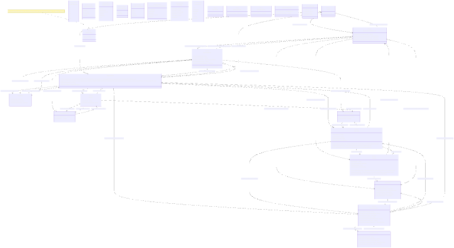

## Key Classes
### Questionnaire management:
#### Questionnaire 
Container for ordered questions with versioning and status tracking.
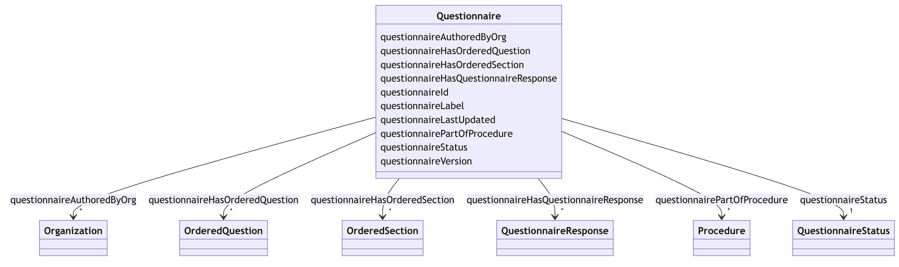

Attributes:
* ```questionnaireId```: Identifier. Unique valid urorcurie. Required.
* ```questionnaireLabel```: Title of the questionnaire. Required.
* ```questionnaireStatus```: FHIR inspired. Required. Valid QuestionnaireStatus values:
    * ```draft```
    * ```active```
    * ```retired```
    * ```unknown```
* ```questionnaireVersion```: Pattern ```^\\d+\\.\\d+\\.\\d+$```. Required.
* ```questionnaireLastUpdated```: xsd:dateTime. The date and time value in ISO 8601 format. Required.

Relationships:
* ```questionnaireHasQuestionnaireResponse```:
    * [Questionnaire](#Questionnaire) --> [QuestionnaireResponse](#QuestionnaireResponse)
    * Not required
    * Multivalued
    * Inverse: [```questionnaireResponseToQuestionnaire```](#questionnaireResponseToQuestionnaire)
* ```questionnaireHasOrderedQuestion```:
    * [Questionnaire](#Questionnaire) --> [OrderedQuestion](#OrderedQuestion)
    * Not required
    * Multivalued & inlined (ordered)
    * Inverse: [```orderedQuestionPartOfQuestionnaire```](#orderedQuestionPartOfQuestionnaire)
* ```questionnaireHasOrderedSection```:
    * [Questionnaire](#Questionnaire) --> [OrderedSection](#OrderedSection)
    * Not required
    * Multivalued & inlined (ordered)
    * Inverse: [```orderedSectionPartOfQuestionnaire```](#orderedSectionPartOfQuestionnaire)
* ```questionnaireUsesScoreDefinition```:
    * [Questionnaire](#Questionnaire) --> [ScoreDefinition](#ScoreDefinition)
    * Not required
    * Multivalued 
    * Inverse: [```scoreDefinitionUsedByQuestionnare```](#scoreDefinitionUsedByQuestionnare)
* ```questionnaireAuthoredByOrg```:
    * [Questionnaire](#Questionnaire) --> [Organization](#Organization)
    * Not required
    * Multivalued
    * Inverse: [```organizationAuthorsQuestionnaire```](#organizationAuthorsQuestionnaire)
* ```questionnairePartOfProcedure```:
    * [Questionnaire](#Questionnaire) --> [Procedure](#Procedure)
    * Not required.
    * Multivalued
    * Inverse: [```procedureHasQuestionnaire```](#procedureHasQuestionnaire)

#### Question 
Individual questions with type-specific parameters and validation rules
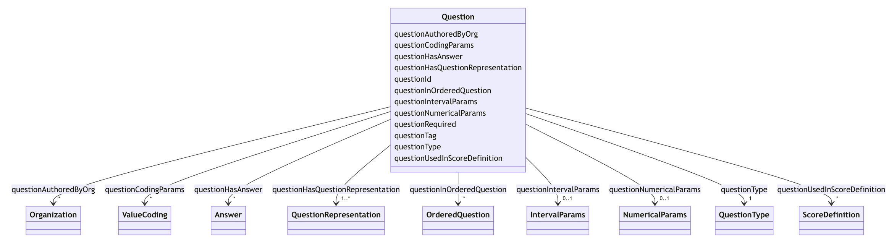

Attributes: 
* ```questionId```: Identifier. Unique valid urorcurie. Required.
* ```questionTag```: String. Internal English identifier, e.g., 'q_pain_level'. Required.
* ```questionLabel```: String. The text of the question itself, which is displayed to the user. Required.
* ```questionRequired```: Boolean. Indicates whether answering this question is mandatory (true) or it's optional (false). If absent, false.
* ```questionType```: Required. Not multivalued. Valid QuestionType values:
    * ```choice```: Predefined options (single or multiple selection)
    * ```openChoice```: Predefined options plus free-text "Other"
    * ```numberInterval```: Numeric values within min/max bounds
    * ```decimal```: General numeric values
    * ```dateTime```: Datetime values
    * ```text```: Free-text responses
* ```questionNumericalParams```: Required if *questionType* is *numberInterval* or *decimal*. Subattributes:
    * ```numericalUnit```: String. The unit of measure for the quantitative value, from UCUM standard.
        * Not required
        * Not multivalued
        * Valid UnitOfMeasure values:
            * ```kg```: ucum:hg
            * ```g```: Grams. ucum:g
            * ```lb```: Pounds. ucum:lb_av
            * ```cm```: ucum:cm
            * ```m```: Meters. ucum:m
            * ```h```: Hours. ucum:h
            * ```min```: Minutes. ucum:min
    * ```numericalPrecision```: Integer. The precision of the quantitative value, e.g. number of decimal places.
        * Not required
        * Not multivalued
        * Minimum value: 0
* ```questionCodingParams```: ValueCoding. Code and Display of each option offered as answer to the choice or open-choice question. Required if *questionType* is *choice* or *open-choice*. Subattributes:
    * ```code```: String. The code representing the value (e.g. code '1' for value 'Yes').
        * Required
        * Not multivalued
    * ```display```: String. The human-readable display text for the code (e.g. code '1' for display 'Yes').
        * Required
        * Not multivalued
* ```questionIntervalParams```: Minimum and Maximum limiting the range the answer must be in for the question. Required if *questionType* is *numberInterval*. Subattributes:
    * ```minValue```: Float. The minimum value of the interval.
        * Required.
        * Not multivalued.
    * ```minLabel```: String. The label for the minimum value of the interval.
        * Not required
        * Not multivalued
    * ```maxValue```: Float. The maximum value of the interval.
        * Required.
        * Not multivalued. The label for the maximum value of the interval.
    * ```maxLabel```: String. 
        * Not required
        * Not multivalued

Relationships:
* ```questionAuthoredByOrg```: 
    * [Question](#Question) --> [Organization](#Organization)
    * Not required
    * Multivalued
    * Inverse: [```organizationAuthorsQuestion```](#organizationAuthorsQuestion)
* ```questionInOrderedQuestion```:
    * [Question](#Question) --> [OrderedQuestion](#OrderedQuestion)
    * Not required
    * Multivalued
    * Inverse: [```orderedQuestionHasQuestion```](#orderedQuestionHasQuestion) 
* ```questionHasAnswer```: 
    * [Question](#Question) --> [Answer](#Answer)
    * Not required
    * Multivalued
    * Inverse: [```answerToQuestion```](#answerToQuestion)
* ```questionUsedInScoreDefinition```: 
    * [Question](#Question) --> [ScoreDefinition](#ScoreDefinition)
    * Not required
    * Multivalued
    * Inverse: [```scoreDefinitionUsesQuestion```](#scoreDefinitionUsesQuestion)

##### OrderedQuestion 
Question wrapper. States the question's relative position within a questionnaire or section. Question order values must be unique per questionnaire or section.
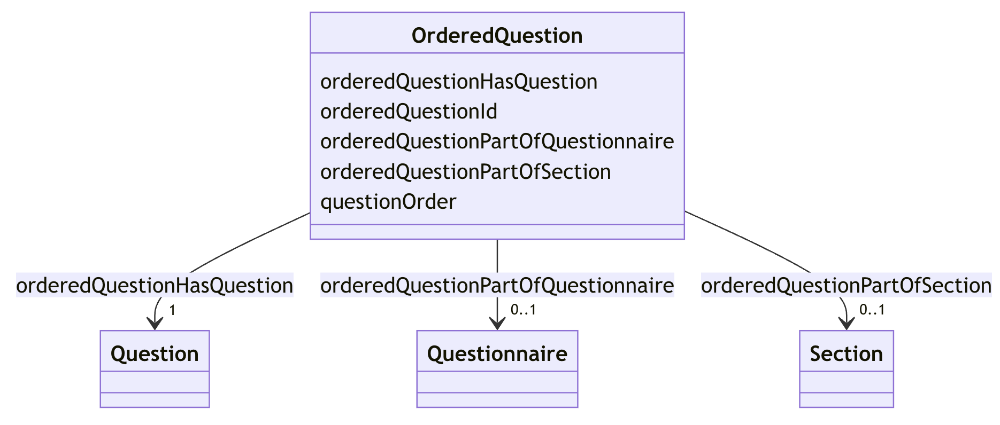

Attributes:
* ```orderedQuestionId```: Identifier. Unique valid urorcurie. Required.
* ```questionOrder```: Integer (1-based index). Required. 

Relationships:
* ```orderedQuestionHasQuestion```:
    * [OrderedQuestion](#OrderedQuestion) --> [Question](#Question)
    * Required
    * Not Multivalued
    * Inverse: [```questionInOrderedQuestion```](#questionInOrderedQuestion)
* ```orderedQuestionPartOfQuestionnaire```:
    * [OrderedQuestion](#OrderedQuestion) --> [Questionnaire](#Questionnaire)
    * Not required
    * Not Multivalued
    * Inverse: [```questionnaireHasOrderedQuestion```](#questionnaireHasOrderedQuestion)
* ```orderedQuestionPartOfSection```:
    * [OrderedQuestion](#OrderedQuestion) --> [Section](#Section)
    * Not required
    * Not Multivalued
    * Inverse: [```sectionHasOrderedQuestion```](#sectionHasOrderedQuestion)

#### Section 
Organizational grouping for questions within questionnaires.
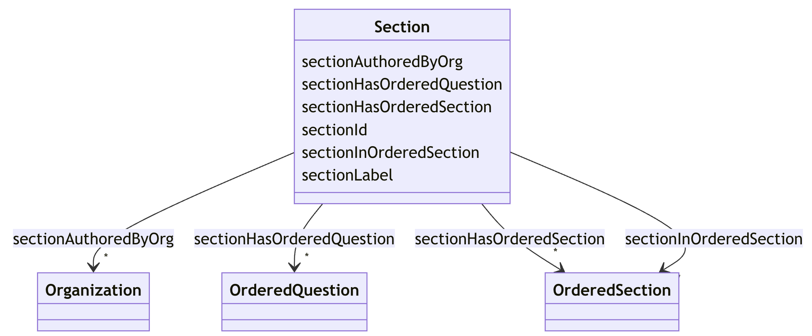

Attributes:
* ```sectionId```: Identifier. Unique valid urorcurie. Required.
* ```sectionLabel```: The label or title of the section, which is displayed to the user. Required

Relationships:
* ```sectionHasOrderedQuestion```: 
    * [Section](#Section) --> [OrderedQuestion](#OrderedQuestion)
    * Not required
    * Multivalued & inlined
    * Inverse: [```orderedQuestionPartOfSection```](#orderedQuestionPartOfSection)
* ```sectionHasOrderedSection```: For Sections nested inside this Section.
    * [Section](#Section) --> [OrderedSection](#OrderedSection)
    * Not required
    * Multivalued & inlined
    * Inverse: [```orderedSectionPartOfSection```](#orderedSectionPartOfSection)
* ```sectionInOrderedSection```: Points back to the wrapper OrderedSections.
    * [Section](#Section) --> [OrderedSection](#OrderedSection)
    * Not required
    * Multivalued
    * Inverse: [```orderedSectionHasSection```](#orderedSectionHasSection)
* ```sectionUsesScoreDefinition```: Points back to the wrapper OrderedSections.
    * [Section](#Section) --> [ScoreDefinition](#ScoreDefinition)
    * Not required
    * Multivalued
    * Inverse: [```scoreDefinitionUsedBySection```](#scoreDefinitionUsedBySection)
* ```sectionAuthoredByOrg```: 
    * [Section](#Section) --> [Organization](#Organization)
    * Not required
    * Multivalued
    * Inverse: [```organizationAuthorsSection```](#organizationAuthorsSection)

##### OrderedSection
Section wrapper. States the section's relative position within a questionnaire or nesting section. Section order values must be unique per questionnaire or section.
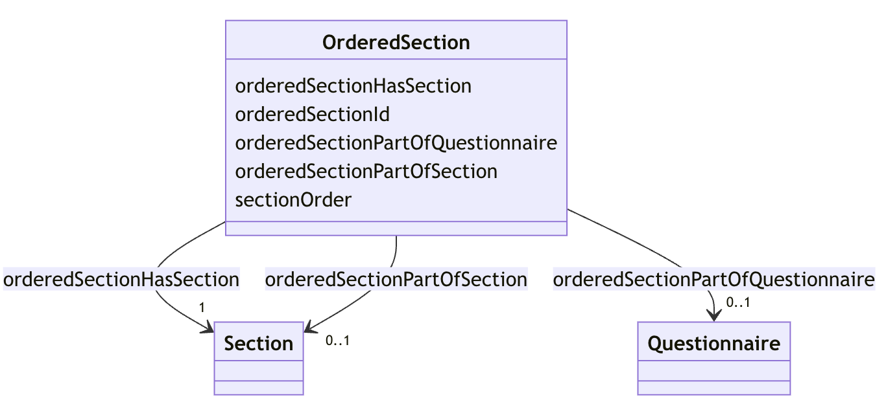

Attributes: 
* ```orderedSectionId```: Identifier. Unique valid urorcurie. Required.
* ```sectionOrder```: Integer (1-based index). Required. 

Relationships:
* ```orderedSectionHasSection```:
    * [OrderedSection](#OrderedSection) --> [Section](#Section)
    * Not required
    * Multivalued
    * Inverse: [```sectionInOrderedSection```](#sectionInOrderedSection)
* ```orderedSectionPartOfQuestionnaire```:
    * [OrderedSection](#OrderedSection) --> [Questionnaire](#Questionnaire)
    * Not required
    * Not multivalued
    * Inverse: [```questionnaireHasOrderedSection```](#questionnaireHasOrderedSection)
* ```orderedSectionPartOfSection```:
    * [OrderedSection](#OrderedSection) --> [Section](#Section)
    * Not required
    * Not multivalued
    * Inverse: [```sectionHasOrderedSection```](#sectionHasOrderedSection)

### Response Handling
#### QuestionnaireResponse: 
Complete response instance to a questionnaire (collection of answers) with status tracking.
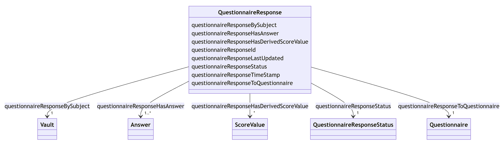

Attributes:
* ```questionnaireResponseId```: Identifier. Unique valid urorcurie. Required.
* ```questionnaireResponseStatus```: The status of the questionnaire response. Required. Valid QuestionnaireResponseStatus values:
    * ```in-progress```
    * ```completed```
    * ```amended```: This QuestionnaireResponse has been filled out with answers, then marked as complete, yet changes or additions have been made to it afterwards.
    * ```entered-in-error```: This QuestionnaireResponse was entered in error and voided.
    * ```stopped```: This QuestionnaireResponse has been partially filled out with answers but has been abandoned. No subsequent changes can be made.
* ```questionnaireResponseTimeStamp```: xsd:dateTime. The date and time when the questionnaire response was created (when the questionnaire starts to be answered, not when it's finished). ISO 8601 format. Required.
* ```questionnaireResponseLastUpdated```: xsd:dateTime. The date and time when the questionnaire response was last updated. ISO 8601 format. Required.

Relationships:
* ```questionnaireResponseBySubject```: The subject that has authored this response, pointing to its vault.
    * [QuestionnaireResponse](#QuestionnaireResponse) --> [Vault](#Vault)
    * Required
    * Not multivalued
    * Inverse: [```hasQuestionnaireResponse```](#hasQuestionnaireResponse)
* ```questionnaireResponseToQuestionnaire```:
    * [QuestionnaireResponse](#QuestionnaireResponse) --> [Questionnaire](#Questionnaire)
    * Required
    * Not multivalued
    * Inverse: [```questionnaireHasQuestionnaireResponse```](#questionnaireHasQuestionnaireResponse)
* ```questionnaireResponseHasAnswer```:
    * [QuestionnaireResponse](#QuestionnaireResponse) --> [Answer](#Answer)
    * Required
    * Multivalued
    * Inverse: [```answerInQuestionnaireResponse```](#answerInQuestionnaireResponse)
* ```questionnaireResponseHasDerivedScoreValue```: The ScoreValue that is calculated from this QuestionnaireResponse's answers.
    * [QuestionnaireResponse](#QuestionnaireResponse) --> [ScoreValue](#ScoreValue)
    * Not required
    * Multivalued
    * Inverse: [```scoreValueDerivedFromQuestionnaireResponse```](#scoreValueDerivedFromQuestionnaireResponse)

#### Answer: 
Individual answers in the questionnaire response to questions with type-specific value storage.
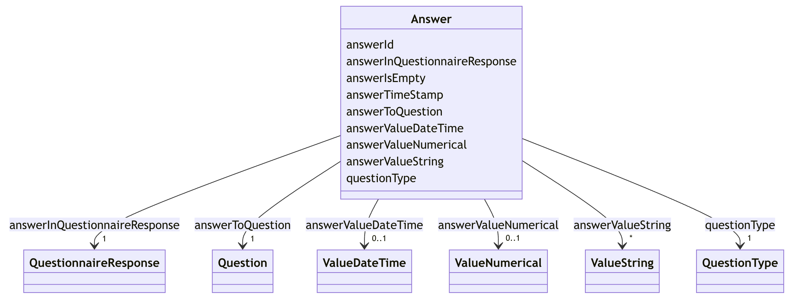

Attributes:
* ```answerId```: Identifier. Unique valid urorcurie. Required.
* ```answerTimeStamp```: xsd:dateTime. ISO 8601 format. The exact date and time when the answer was provided. Required. 
* ```answerIsEmpty```: Boolean. True if the answer was left intentionally empty (question not responded intentionally). If absent, False.
* ```questionType```: Type of the question this is answer for. Required. Not multivalued. [Temporary value to facilitate validation]
* ```answerValueNumerical```: ValueNumerical. Required if `questionType` is `decimal` or `numberInterval`.  Subattributes:
    * `numericalValue`: decimal. Required.
* ```answerValueString```: ValueString. Required if `questionType` is `choice`, `openChoice` or `text`, which is a stringValue. Subattributes:
    * `stringValue`: String. Required.
* ```answerValueDateTime```: Datetime. Required if `questionType` is `dateTime`. Subattributes:
    * `dateTimeVale`: xsd:dateTime. The date and time value in ISO 8601 format.

Relationships:
* ```answerInQuestionnaireResponse```:
    * [Answer](#Answer) --> [QuestionnaireResponse](#QuestionnaireResponse)
    * Required
    * Not multivalued
    * Inverse: [```questionnaireResponseHasAnswer```](#questionnaireResponseHasAnswer)
* ```answerToQuestion```:
    * [Answer](#Answer) --> [Question](#Question)
    * Required
    * Not multivalued
    * Inverse: [```questionHasAnswer```](#questionHasAnswer)

### Scoring System
#### ScoreDefinition 
Formulas and parameters for calculating scores from question's answers.
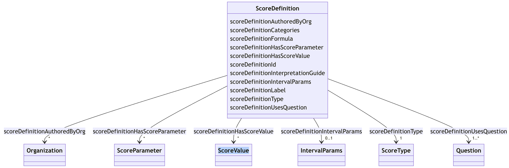

Attributes:
* ```scoreDefinitionId```: Identifier. Unique valid urorcurie. Required.
* ```scoreDefinitionLabel```: String. Label or title of the score. Required.
* ```scoreDefinitionType```: String. Type of score, determines valid score values. Required. Valid ScoreDefinitionType values:
    * ```numerical_continuous```: Continuous numerical score (e.g., 0.785, 82.5). ScoreValue will be Float.
    * ```numerical_integer```: Integer numerical score (e.g., 5, 10, 27). ScoreValue will be Integer.
    * ```numerical_percentage```: Percentage score (0-100%). ScoreValue will be a Float in a 0 to 100 interval.
    * ```numerical_z_score```: Standardized Z-score (mean=0, std=1). ScoreValue will be Float.
    * ```numerical_t_score```: Standardized T-score (mean=50, std=10). ScoreValue will be Float.
    * ```categorical```: Ordinal categories (e.g., Low, Medium, High or Yes, No or Type a, Type b). ScoreValue will be a string list (xsd:NMTOKENS).
* ```scoreDefinitionFormula```: String. Formula used to calculate the score. Required.
* ```scoreDefinitionIntervalParams```: Minimum and maximum values for numerical_percentage and numerical_z_score scores. Required if `scoreDefinitionType` is `numerical_percentage` or `numerical_z_score`. Subattributes:
    * ```minValue```: Float. The minimum value of the interval.
        * Required.
        * Not multivalued.
    * ```minLabel```: String. The label for the minimum value of the interval.
        * Not required
        * Not multivalued
    * ```maxValue```: Float. The maximum value of the interval.
        * Required.
        * Not multivalued. The label for the maximum value of the interval.
    * ```maxLabel```: String. 
        * Not required
        * Not multivalued
* ```scoreDefinitionCategories```: String array. List of categories. Required if `scoreDefinitionType` is `categorical`.
* ```scoreDefinitionInterpretationGuide```: String. Explanation of how to interpret the score. Not required. 

Relationships:
* ```scoreDefinitionHasScoreParameter```: ScoreParameter that is required for this ScoreDefinition.
    * [ScoreDefinition](#ScoreDefinition) --> [ScoreParameter](#ScoreParameter)
    * Not required
    * Multivalued
    * Inverse: [```scoreParameterPartOfScoreDefinition```](#scoreParameterPartOfScoreDefinition)
* ```scoreDefinitionUsesQuestion```: The Question(s) that this ScoreDefinition is based on.
    * [ScoreDefinition](#ScoreDefinition) --> [Question](#Question)
    * Required
    * Multivalued
    * Inverse: [```questionUsedInScoreDefinition```](#questionUsedInScoreDefinition)
* ```scoreDefinitionUsedByQuestionnaire```: Questionnaires that this ScoreDefinition is applied in.
    * [ScoreDefinition](#ScoreDefinition) --> [Questionnaire](#Questionnaire)
    * Not required
    * Multivalued
    * Inverse: [```questionnaireUsesScoreDefinition```](#questionnaireUsesScoreDefinition)
* ```scoreDefinitionUsedBySection```: Sections that this ScoreDefinition is applied in.
    * [ScoreDefinition](#ScoreDefinition) --> [Section](#Section)
    * Not required
    * Multivalued
    * Inverse: [```sectionUsesScoreDefinition```](#sectionUsesScoreDefinition)
* ```scoreDefinitionHasScoreValue```:
    * [ScoreDefinition](#ScoreDefinition) --> [ScoreValue](#ScoreValue)
    * Not required
    * Multivalued
    * Inverse: [```scoreValueBasedOnScoreDefinition```](#scoreValueBasedOnScoreDefinition)
* ```scoreDefinitionAuthoredByOrg```:
    * [ScoreDefinition](#ScoreDefinition) --> [Organization](#Organization)
    * Not required
    * Multivalued
    * Inverse: [```organizationAuthorsScoreDefinition```](#organizationAuthorsScoreDefinition)

#### ScoreParameter 
Parameters for score definitions, such as min/max values, categories or constants needed.
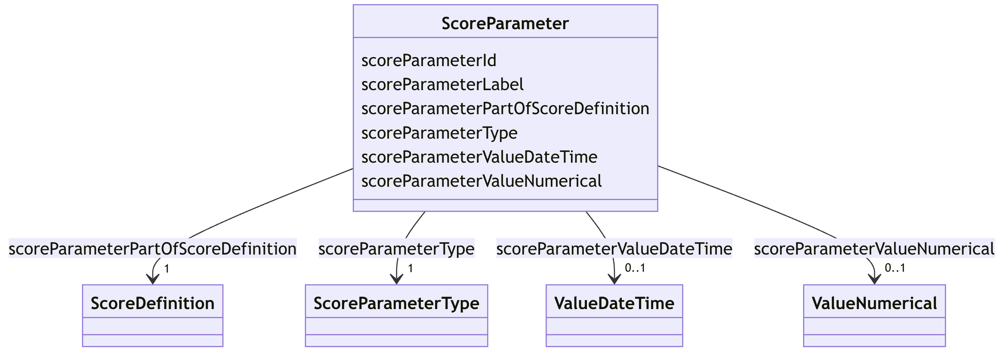

Attributes:
* ```scoreParameterId```: Identifier. Unique valid urorcurie. Required.
* ```scoreParameterLabel```: String. Label or title of the parameter. Required.
* ```scoreParameterType```: String. Required. Valid ParameterType values:
    * ```numerical```: Numerical parameter (e.g., 0.785, 82).
    * ```dateTime```: xsd:dateTime parameter in ISO 8601 format.
* ```scoreParameterValueNumerical```: ValueNumerical. Numerical value parameter (e.g., 0.785, 82). Required if ```scoreParameterType``` is ```numerical```. Subattributes:
    * `numericalValue`: decimal. Required.
* ```scoreParameterValueDateTime```: ValueDateTime. Required if ```scoreParameterType``` is ```dateTime```. Subattributes:
    * `dateTimeValue`: The date and time value in ISO 8601 format. Required.

Relationships:
* ```scoreParameterPartOfScoreDefinition```: 
    * [ScoreParameter](#ScoreParameter) --> [ScoreDefinition](#ScoreDefinition)
    * Required
    * Not multivalued
    * Inverse: [```scoreDefinitionHasScoreParameter```](#scoreDefinitionHasScoreParameter)

#### ScoreValue 
The score value calculated from a QuestionnaireResponse following a ScoreDefinition.
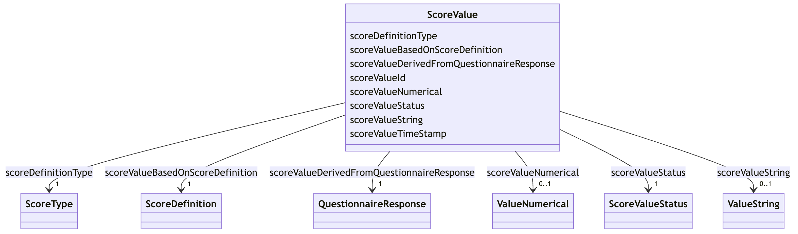

Attributes:
* ```scoreValueId```: Identifier. Unique valid urorcurie. Required.
* ```scoreDefinitionType```: String. Type of score this is a value for, determines valid score values. Required. [Temporary value to facilitate validation]
* ```scoreValueString```: ValueString representation of the score value, used for categorical scores. Required if `scoreDefinitionType` is `categorical`. Subattributes:
    * `stringValue`: String. Required.
* ```scoreValueNumerical```: ValueNumerical of the score, used for numerical scores. Required if `scoreDefinitionType` is `numerical_continuous`', `numerical_integer`', `numerical_percentage`', `numerical_z_score`' or `numerical_t_score`'. Subattributes:
    * `numericalValue`: Decimal. Required.
* ```scoreValueTimeStamp```: Timestamp when the score value was calculated. Datetime in ISO 8601 format.
* ```scoreValueStatus```: String. Status of the score value. Valid ScoreValueStatus values:
    * `valid`: Score is valid and complete.
    * `incomplete`: Score calculated with missing optional data.
    * `estimated`: Score is an estimate due to missing data.
    * `warning`: Score calculated with warnings or anomalies.
    * `error`: Score calculation error or invalid data.
    * `pending`: Score calculation is pending.
    * `amended`: Score has been amended after initial calculation.

Relationships:
* ```scoreValueBasedOnScoreDefinition```:
    * [ScoreValue](#ScoreValue) --> [ScoreDefinition](#ScoreDefinition)
    * Required
    * Not multivalued
    * Inverse: [```scoreDefinitionHasScoreValue```](#scoreDefinitionHasScoreValue)
* ```scoreValueDerivedFromQuestionnaireResponse```:
    * [ScoreValue](#ScoreValue) --> [QuestionnaireResponse](#QuestionnaireResponse)
    * Required
    * Multivalued
    * Inverse: [```questionnaireResponseHasDerivedScoreValue```](#questionnaireResponseHasDerivedScoreValue)

## Supporting Classes
### Organization: 
Entities that create and manage resources. I.e: FAQIR, MoveUp, ByteFlies...
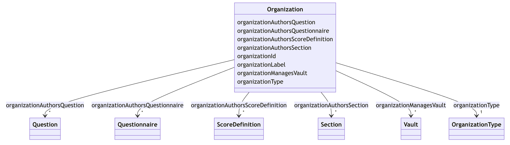

Attributes:
* ```organizationId```: Identifier. Unique valid urorcurie. Required.
* ```organizationlabel```: String. Name of the organization. Required.
* ```organizationType```: String. Required. Valid OrganizationType values:
    * ```hospital```
    * ```government```
    * ```professional```
    * ```research```
    * ```serviceProvider```

Relationships:
* ```organizationAuthorsQuestionnaire```:
    * [Organization](#Organization) --> [Questionnaire](#Questionnaire)
    * Not required
    * Multivalued
    * Inverse: [```questionnaireAuthoredByOrg```](#questionnaireAuthoredByOrg)
* ```organizationAuthorsSection```:
    * [Organization](#Organization) --> [Section](#Section)
    * Not required
    * Multivalued
    * Inverse: [```sectionAuthoredByOrg```](#sectionAuthoredByOrg)
* ```organizationAuthorsQuestion```:
    * [Organization](#Organization) --> [Question](#Question)
    * Not required
    * Multivalued
    * Inverse: [```questionAuthoredByOrg```](#questionAuthoredByOrg)
* ```organizationAuthorsScoreDefinition```:
    * [Organization](#Organization) --> [ScoreDefinition](#ScoreDefinition)
    * Not required
    * Multivalued
    * Inverse: [```scoreDefinitionAuthoredByOrg```](#scoreDefinitionAuthoredByOrg)
* ```organizationManagesVault```:
    * [Organization](#Organization) --> [Vault](#Vault)
    * Not required
    * Multivalued
    * Inverse: [```vaultManagedByOrg```](#vaultManagedByOrg)
* ```organizationPerformsProcedure```:
    * [Organization](#Organization) --> [Procedure](#Procedure)
    * Not required
    * Multivalued
    * Inverse: [```procedurePerformedByOrg```](#procedurePerformedByOrg)

### Procedure: 
Clinical or administrative processes using resources like questionnaires.
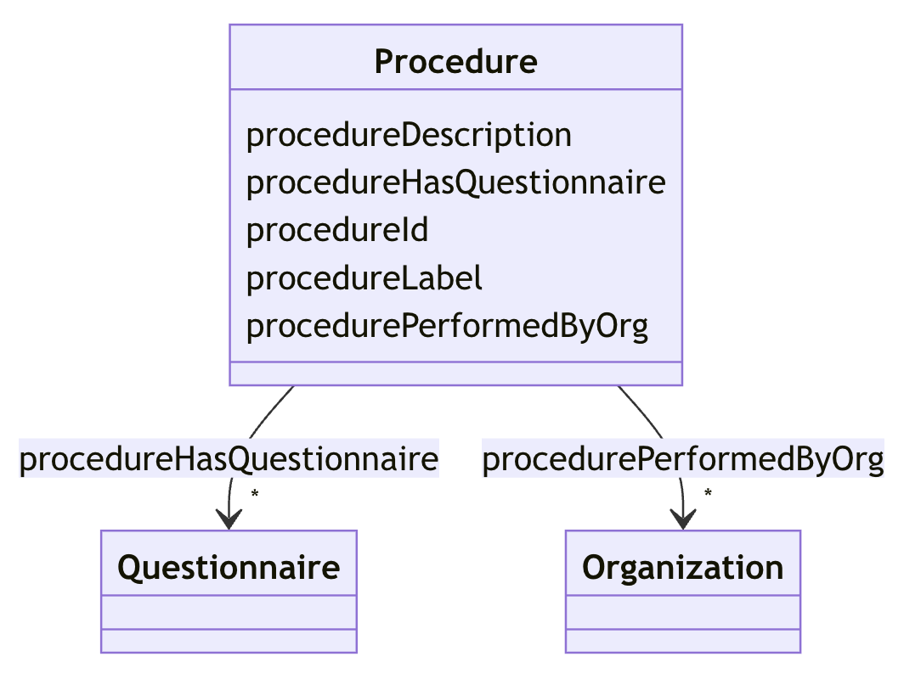

Attributes:
* ```procedureId```: Identifier. Unique valid urorcurie. Required.
* ```procedureLabel```: String. Name of the procedure. Required.
* ```procedureDescription```: String. Not required.

Relationships:
* ```procedurePerformedByOrg```:
    * [Procedure](#Procedure) --> [Organization](#Organization)
    * Not required
    * Multivalued
    * Inverse: [```organizationPerformsProcedure```](#organizationPerformsProcedure)
* ```procedureHasQuestionnaire```:
    * [Procedure](#Procedure) --> [Questionnaire](#Questionnaire)
    * Not required
    * Multivalued
    * Inverse: [```questionnairePartOfProcedure```](#questionnairePartOfProcedure)

### Vault: 
FAQIR data storage containers. Acts as user id.
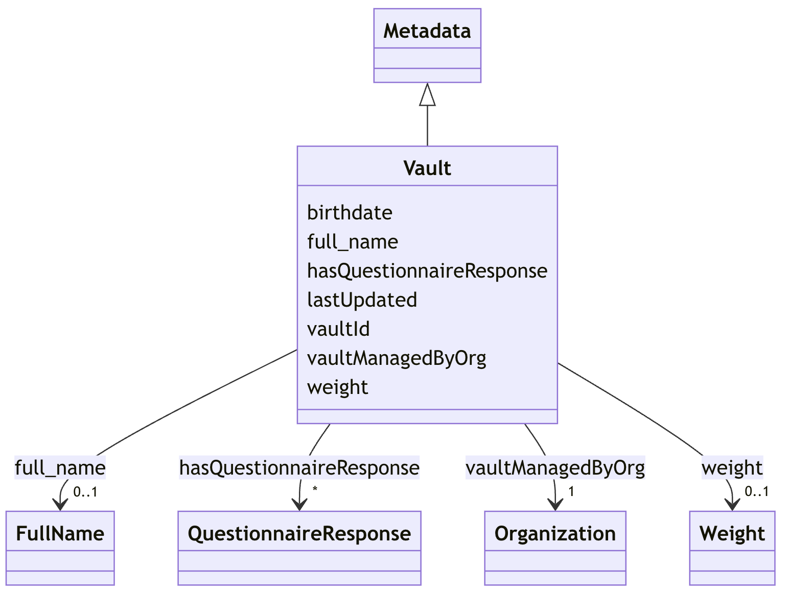

Attributes:
* ```vaultId```: Identifier. Unique valid urorcurie. Required.

Relationships:
* ```hasQuestionnaireResponse```:
    * [Vault](#Vault) --> [QuestionnaireResponse](#QuestionnaireResponse)
    * Not required
    * Multivalued
    * Inverse: [```questionnaireResponseBySubject```](#questionnaireResponseBySubject)
* ```vaultManagedByOrg```:
    * [Vault](#Vault) --> [Organization](#Organization)
    * Required
    * Not multivalued
    * Inverse: [```organizationManagesVault```](#organizationManagesVault)

## Key Features
- Type-specific validation rules.
- Required field enforcement.
- Value range checking for numerical responses.
- Coding validation for choice-based questions.
- Explicit ordering of questions and sections within questionnaires.
- Support for nested sections.
- Unique ordering constraints per container.
- Organizational authorship for all components.
- Timestamp tracking for responses and answers.
- Version management for questionnaires.
- Support for both numerical and categorical scoring.
- Parameterized scoring with configurable constants.
- Interpretation guides for score values.
- Comprehensive bidirectional relationships.