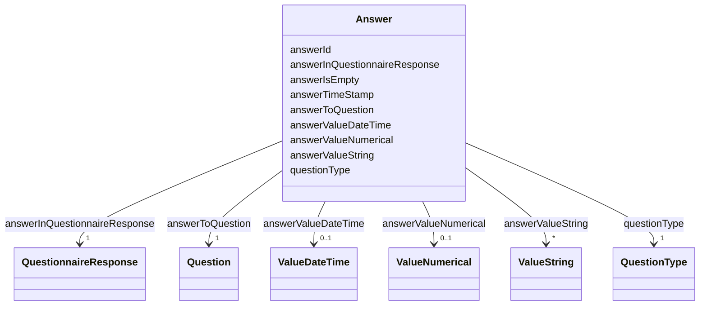

# Class: Answer 


_Answer in the questionnaire response._


URI: [faqir:Answer](https://faqir.org/datamodel/Answer)





<!-- no inheritance hierarchy -->


## Slots

| Name | Cardinality and Range | Description | Inheritance |
| ---  | --- | --- | --- |
| [answerInQuestionnaireResponse](answerInQuestionnaireResponse.md) | 1 <br/> [QuestionnaireResponse](QuestionnaireResponse.md) | The QuestionnaireResponse that this Answer is part of | direct |
| [answerToQuestion](answerToQuestion.md) | 1 <br/> [Question](Question.md) | The Question that this Answer is for | direct |
| [questionType](questionType.md) | 1 <br/> [QuestionType](QuestionType.md) | Type of the question (e | direct |
| [answerId](answerId.md) | 1 <br/> [Uriorcurie](Uriorcurie.md) | The unique identifier for an answer in the questionnaire response | direct |
| [answerValueNumerical](answerValueNumerical.md) | 0..1 <br/> [ValueNumerical](ValueNumerical.md) | The value of the answer to a decimal or numberInterval type of question, whic... | direct |
| [answerValueString](answerValueString.md) | * <br/> [ValueString](ValueString.md) | The value of the answer to a choice, openChoice or text type of question, whi... | direct |
| [answerValueDateTime](answerValueDateTime.md) | 0..1 <br/> [ValueDateTime](ValueDateTime.md) | The value of the answer to a dateTime type of question, which is a datetime v... | direct |
| [answerIsEmpty](answerIsEmpty.md) | 0..1 <br/> [Boolean](Boolean.md) | True if the answer is intentionally empty | direct |
| [answerTimeStamp](answerTimeStamp.md) | 1 <br/> [Datetime](Datetime.md) | The exact date and time when the answer was provided | direct |


## Usages

| used by | used in | type | used |
| ---  | --- | --- | --- |
| [QuestionnaireResponse](QuestionnaireResponse.md) | [questionnaireResponseHasAnswer](questionnaireResponseHasAnswer.md) | range | [Answer](Answer.md) |
| [Answer](Answer.md) | [answerInQuestionnaireResponse](answerInQuestionnaireResponse.md) | domain | [Answer](Answer.md) |
| [Answer](Answer.md) | [answerToQuestion](answerToQuestion.md) | domain | [Answer](Answer.md) |
| [Question](Question.md) | [questionHasAnswer](questionHasAnswer.md) | range | [Answer](Answer.md) |


## Identifier and Mapping Information


### Schema Source


* from schema: https://w3id.org/faqir/datamodel


## Mappings

| Mapping Type | Mapped Value |
| ---  | ---  |
| self | faqir:Answer |
| native | https://w3id.org/faqir/datamodel/Answer |
| undefined | fhir:QuestionnaireResponse.item.answer |


## LinkML Source

<!-- TODO: investigate https://stackoverflow.com/questions/37606292/how-to-create-tabbed-code-blocks-in-mkdocs-or-sphinx -->

### Direct

<details>
```yaml
name: Answer
description: Answer in the questionnaire response.
from_schema: https://w3id.org/faqir/datamodel
mappings:
- fhir:QuestionnaireResponse.item.answer
slots:
- answerInQuestionnaireResponse
- answerToQuestion
- questionType
attributes:
  answerId:
    name: answerId
    description: The unique identifier for an answer in the questionnaire response.
    from_schema: https://w3id.org/faqir/datamodel/questionnaire/classes
    rank: 1000
    identifier: true
    domain_of:
    - Answer
    range: uriorcurie
    required: true
  answerValueNumerical:
    name: answerValueNumerical
    description: The value of the answer to a decimal or numberInterval type of question,
      which is a numeric value.
    from_schema: https://w3id.org/faqir/datamodel/questionnaire/classes
    mappings:
    - fhir:QuestionnaireResponse.item.answer.valueDecimal
    rank: 1000
    domain_of:
    - Answer
    range: ValueNumerical
    required: false
    multivalued: false
  answerValueString:
    name: answerValueString
    description: The value of the answer to a choice, openChoice or text type of question,
      which is a stringValue.
    from_schema: https://w3id.org/faqir/datamodel/questionnaire/classes
    mappings:
    - fhir:QuestionnaireResponse.item.answer.valueString
    rank: 1000
    domain_of:
    - Answer
    range: ValueString
    required: false
    multivalued: true
  answerValueDateTime:
    name: answerValueDateTime
    description: The value of the answer to a dateTime type of question, which is
      a datetime value.
    from_schema: https://w3id.org/faqir/datamodel/questionnaire/classes
    mappings:
    - fhir:QuestionnaireResponse.item.answer.valueDateTime
    rank: 1000
    domain_of:
    - Answer
    range: ValueDateTime
    required: false
    multivalued: false
  answerIsEmpty:
    name: answerIsEmpty
    description: True if the answer is intentionally empty.
    from_schema: https://w3id.org/faqir/datamodel/questionnaire/classes
    rank: 1000
    ifabsent: 'False'
    domain_of:
    - Answer
    range: boolean
  answerTimeStamp:
    name: answerTimeStamp
    description: The exact date and time when the answer was provided.
    from_schema: https://w3id.org/faqir/datamodel/questionnaire/classes
    rank: 1000
    domain_of:
    - Answer
    range: datetime
    required: true
class_uri: faqir:Answer
rules:
- preconditions:
    slot_conditions:
      answerIsEmpty:
        name: answerIsEmpty
        id_prefixes:
        - 'False'
      questionType:
        name: questionType
        equals_string_in:
        - decimal
        - numberInterval
  postconditions:
    slot_conditions:
      answerValueNumerical:
        name: answerValueNumerical
        comments:
        - JsonObj(Validation='numberInterval answerValueNumerical must be between
          minValue and maxValue')
        required: true
        multivalued: false
  description: If questionType is 'decimal' or 'numberInterval', answerValueNumerical
    is required.
- preconditions:
    slot_conditions:
      answerIsEmpty:
        name: answerIsEmpty
        id_prefixes:
        - 'False'
      questionType:
        name: questionType
        equals_string_in:
        - choice
        - openChoice
        - text
  postconditions:
    slot_conditions:
      answerValueString:
        name: answerValueString
        comments:
        - 'JsonObj(Validation="if choice/openChoice, answerValueString must be a list
          of strings representing the selected options: codes from the Question''s
          ValueCoding.")'
        required: true
        multivalued: true
  description: If questionType is 'choice', 'openChoice', or 'text', answerValueString
    is required.
- preconditions:
    slot_conditions:
      answerIsEmpty:
        name: answerIsEmpty
        id_prefixes:
        - 'False'
      questionType:
        name: questionType
        equals_string_in:
        - dateTime
  postconditions:
    slot_conditions:
      answerValueDateTime:
        name: answerValueDateTime
        required: true
        multivalued: false
  description: If questionType is 'dateTime', answerValueDateTime is required.

```
</details>

### Induced

<details>
```yaml
name: Answer
description: Answer in the questionnaire response.
from_schema: https://w3id.org/faqir/datamodel
mappings:
- fhir:QuestionnaireResponse.item.answer
attributes:
  answerId:
    name: answerId
    description: The unique identifier for an answer in the questionnaire response.
    from_schema: https://w3id.org/faqir/datamodel/questionnaire/classes
    rank: 1000
    identifier: true
    alias: answerId
    owner: Answer
    domain_of:
    - Answer
    range: uriorcurie
    required: true
  answerValueNumerical:
    name: answerValueNumerical
    description: The value of the answer to a decimal or numberInterval type of question,
      which is a numeric value.
    from_schema: https://w3id.org/faqir/datamodel/questionnaire/classes
    mappings:
    - fhir:QuestionnaireResponse.item.answer.valueDecimal
    rank: 1000
    alias: answerValueNumerical
    owner: Answer
    domain_of:
    - Answer
    range: ValueNumerical
    required: false
    multivalued: false
  answerValueString:
    name: answerValueString
    description: The value of the answer to a choice, openChoice or text type of question,
      which is a stringValue.
    from_schema: https://w3id.org/faqir/datamodel/questionnaire/classes
    mappings:
    - fhir:QuestionnaireResponse.item.answer.valueString
    rank: 1000
    alias: answerValueString
    owner: Answer
    domain_of:
    - Answer
    range: ValueString
    required: false
    multivalued: true
  answerValueDateTime:
    name: answerValueDateTime
    description: The value of the answer to a dateTime type of question, which is
      a datetime value.
    from_schema: https://w3id.org/faqir/datamodel/questionnaire/classes
    mappings:
    - fhir:QuestionnaireResponse.item.answer.valueDateTime
    rank: 1000
    alias: answerValueDateTime
    owner: Answer
    domain_of:
    - Answer
    range: ValueDateTime
    required: false
    multivalued: false
  answerIsEmpty:
    name: answerIsEmpty
    description: True if the answer is intentionally empty.
    from_schema: https://w3id.org/faqir/datamodel/questionnaire/classes
    rank: 1000
    ifabsent: 'False'
    alias: answerIsEmpty
    owner: Answer
    domain_of:
    - Answer
    range: boolean
  answerTimeStamp:
    name: answerTimeStamp
    description: The exact date and time when the answer was provided.
    from_schema: https://w3id.org/faqir/datamodel/questionnaire/classes
    rank: 1000
    alias: answerTimeStamp
    owner: Answer
    domain_of:
    - Answer
    range: datetime
    required: true
  answerInQuestionnaireResponse:
    name: answerInQuestionnaireResponse
    description: The QuestionnaireResponse that this Answer is part of.
    from_schema: https://w3id.org/faqir/datamodel
    mappings:
    - fhir:QuestionnaireResponse.item.answer
    rank: 1000
    domain: Answer
    slot_uri: faqir:answerInQuestionnaireResponse
    alias: answerInQuestionnaireResponse
    owner: Answer
    domain_of:
    - Answer
    inverse: questionnaireResponseHasAnswer
    range: QuestionnaireResponse
    required: true
    multivalued: false
  answerToQuestion:
    name: answerToQuestion
    description: The Question that this Answer is for.
    from_schema: https://w3id.org/faqir/datamodel
    mappings:
    - fhir:QuestionnaireResponse.item.answer.question
    rank: 1000
    domain: Answer
    slot_uri: faqir:answerToQuestion
    alias: answerToQuestion
    owner: Answer
    domain_of:
    - Answer
    inverse: questionHasAnswer
    range: Question
    required: true
    multivalued: false
  questionType:
    name: questionType
    description: Type of the question (e.g., choice, openChoice, numberInterval, decimal,
      dateTime, text). Determines valid answers.
    from_schema: https://w3id.org/faqir/datamodel
    rank: 1000
    slot_uri: faqir:questionType
    alias: questionType
    owner: Answer
    domain_of:
    - Answer
    - Question
    range: QuestionType
    required: true
class_uri: faqir:Answer
rules:
- preconditions:
    slot_conditions:
      answerIsEmpty:
        name: answerIsEmpty
        id_prefixes:
        - 'False'
      questionType:
        name: questionType
        equals_string_in:
        - decimal
        - numberInterval
  postconditions:
    slot_conditions:
      answerValueNumerical:
        name: answerValueNumerical
        comments:
        - JsonObj(Validation='numberInterval answerValueNumerical must be between
          minValue and maxValue')
        required: true
        multivalued: false
  description: If questionType is 'decimal' or 'numberInterval', answerValueNumerical
    is required.
- preconditions:
    slot_conditions:
      answerIsEmpty:
        name: answerIsEmpty
        id_prefixes:
        - 'False'
      questionType:
        name: questionType
        equals_string_in:
        - choice
        - openChoice
        - text
  postconditions:
    slot_conditions:
      answerValueString:
        name: answerValueString
        comments:
        - 'JsonObj(Validation="if choice/openChoice, answerValueString must be a list
          of strings representing the selected options: codes from the Question''s
          ValueCoding.")'
        required: true
        multivalued: true
  description: If questionType is 'choice', 'openChoice', or 'text', answerValueString
    is required.
- preconditions:
    slot_conditions:
      answerIsEmpty:
        name: answerIsEmpty
        id_prefixes:
        - 'False'
      questionType:
        name: questionType
        equals_string_in:
        - dateTime
  postconditions:
    slot_conditions:
      answerValueDateTime:
        name: answerValueDateTime
        required: true
        multivalued: false
  description: If questionType is 'dateTime', answerValueDateTime is required.

```
</details>