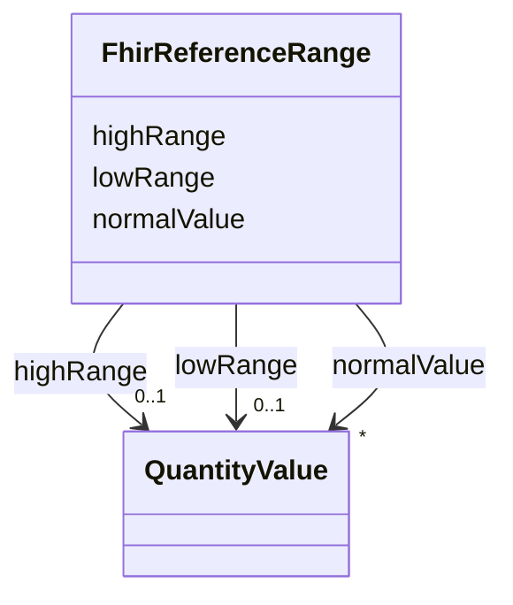

# Class: FhirReferenceRange 


_Guidance on how to interpret the value by comparison to a normal or recommended range. Multiple reference ranges are interpreted as an 'OR'. In other words, to represent two distinct target populations, two referenceRange elements would be used._


URI: [http://hl7.org/fhir/Observation.referenceRange](http://hl7.org/fhir/Observation.referenceRange)





<!-- no inheritance hierarchy -->


## Slots

| Name | Cardinality and Range | Description | Inheritance |
| ---  | --- | --- | --- |
| [lowRange](lowRange.md) | 0..1 <br/> [QuantityValue](QuantityValue.md) | Low range, if relevant | direct |
| [highRange](highRange.md) | 0..1 <br/> [QuantityValue](QuantityValue.md) | High range, if relevant | direct |
| [normalValue](normalValue.md) | * <br/> [QuantityValue](QuantityValue.md) | Normal value, if relevant | direct |


## Usages

| used by | used in | type | used |
| ---  | --- | --- | --- |
| [SarefProperty](SarefProperty.md) | [fhir_referenceRange](fhir_referenceRange.md) | range | [FhirReferenceRange](FhirReferenceRange.md) |
| [SarefPropertyValue](SarefPropertyValue.md) | [fhir_valueRange](fhir_valueRange.md) | range | [FhirReferenceRange](FhirReferenceRange.md) |
| [QoQuestionnaireStatus](QoQuestionnaireStatus.md) | [fhir_valueRange](fhir_valueRange.md) | range | [FhirReferenceRange](FhirReferenceRange.md) |
| [QoQuestionnaireResponseStatus](QoQuestionnaireResponseStatus.md) | [fhir_valueRange](fhir_valueRange.md) | range | [FhirReferenceRange](FhirReferenceRange.md) |


## Identifier and Mapping Information


### Schema Source


* from schema: https://ns.faqir.org/q-o


## Mappings

| Mapping Type | Mapped Value |
| ---  | ---  |
| self | http://hl7.org/fhir/Observation.referenceRange |
| native | qo:FhirReferenceRange |


## LinkML Source

<!-- TODO: investigate https://stackoverflow.com/questions/37606292/how-to-create-tabbed-code-blocks-in-mkdocs-or-sphinx -->

### Direct

<details>
```yaml
name: fhir_ReferenceRange
description: Guidance on how to interpret the value by comparison to a normal or recommended
  range. Multiple reference ranges are interpreted as an 'OR'. In other words, to
  represent two distinct target populations, two referenceRange elements would be
  used.
from_schema: https://ns.faqir.org/q-o
attributes:
  lowRange:
    name: lowRange
    description: Low range, if relevant.
    from_schema: https://ns.faqir.org/q-o
    rank: 1000
    slot_uri: phro:lowRange
    domain_of:
    - fhir_ReferenceRange
    range: QuantityValue
    required: false
    multivalued: false
  highRange:
    name: highRange
    description: High range, if relevant.
    from_schema: https://ns.faqir.org/q-o
    rank: 1000
    slot_uri: phro:highRange
    domain_of:
    - fhir_ReferenceRange
    range: QuantityValue
    required: false
    multivalued: false
  normalValue:
    name: normalValue
    description: Normal value, if relevant.
    from_schema: https://ns.faqir.org/q-o
    rank: 1000
    slot_uri: phro:normalValue
    domain_of:
    - fhir_ReferenceRange
    range: QuantityValue
    required: false
    multivalued: true
class_uri: http://hl7.org/fhir/Observation.referenceRange

```
</details>

### Induced

<details>
```yaml
name: fhir_ReferenceRange
description: Guidance on how to interpret the value by comparison to a normal or recommended
  range. Multiple reference ranges are interpreted as an 'OR'. In other words, to
  represent two distinct target populations, two referenceRange elements would be
  used.
from_schema: https://ns.faqir.org/q-o
attributes:
  lowRange:
    name: lowRange
    description: Low range, if relevant.
    from_schema: https://ns.faqir.org/q-o
    rank: 1000
    slot_uri: phro:lowRange
    alias: lowRange
    owner: fhir_ReferenceRange
    domain_of:
    - fhir_ReferenceRange
    range: QuantityValue
    required: false
    multivalued: false
  highRange:
    name: highRange
    description: High range, if relevant.
    from_schema: https://ns.faqir.org/q-o
    rank: 1000
    slot_uri: phro:highRange
    alias: highRange
    owner: fhir_ReferenceRange
    domain_of:
    - fhir_ReferenceRange
    range: QuantityValue
    required: false
    multivalued: false
  normalValue:
    name: normalValue
    description: Normal value, if relevant.
    from_schema: https://ns.faqir.org/q-o
    rank: 1000
    slot_uri: phro:normalValue
    alias: normalValue
    owner: fhir_ReferenceRange
    domain_of:
    - fhir_ReferenceRange
    range: QuantityValue
    required: false
    multivalued: true
class_uri: http://hl7.org/fhir/Observation.referenceRange

```
</details>