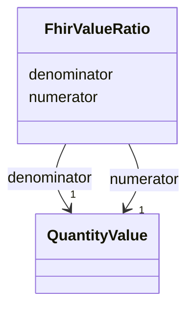

# Class: FhirValueRatio 


_A ratio of two Quantity values - a numerator and a denominator_


URI: [fhir:Ratio](http://hl7.org/fhir/Ratio)





<!-- no inheritance hierarchy -->


## Slots

| Name | Cardinality and Range | Description | Inheritance |
| ---  | --- | --- | --- |
| [numerator](numerator.md) | 1 <br/> [QuantityValue](QuantityValue.md) |  | direct |
| [denominator](denominator.md) | 1 <br/> [QuantityValue](QuantityValue.md) |  | direct |


## Usages

| used by | used in | type | used |
| ---  | --- | --- | --- |
| [SarefPropertyValue](SarefPropertyValue.md) | [fhir_valueRatio](fhir_valueRatio.md) | range | [FhirValueRatio](FhirValueRatio.md) |
| [QoQuestionnaireStatus](QoQuestionnaireStatus.md) | [fhir_valueRatio](fhir_valueRatio.md) | range | [FhirValueRatio](FhirValueRatio.md) |
| [QoQuestionnaireResponseStatus](QoQuestionnaireResponseStatus.md) | [fhir_valueRatio](fhir_valueRatio.md) | range | [FhirValueRatio](FhirValueRatio.md) |


## Identifier and Mapping Information


### Schema Source


* from schema: https://ns.faqir.org/q-o


## Mappings

| Mapping Type | Mapped Value |
| ---  | ---  |
| self | fhir:Ratio |
| native | qo:FhirValueRatio |


## LinkML Source

<!-- TODO: investigate https://stackoverflow.com/questions/37606292/how-to-create-tabbed-code-blocks-in-mkdocs-or-sphinx -->

### Direct

<details>
```yaml
name: fhir_ValueRatio
description: A ratio of two Quantity values - a numerator and a denominator
from_schema: https://ns.faqir.org/q-o
attributes:
  numerator:
    name: numerator
    from_schema: https://ns.faqir.org/q-o
    rank: 1000
    slot_uri: fhir:numerator
    domain_of:
    - fhir_ValueRatio
    range: QuantityValue
    required: true
    multivalued: false
  denominator:
    name: denominator
    from_schema: https://ns.faqir.org/q-o
    rank: 1000
    slot_uri: fhir:denominator
    domain_of:
    - fhir_ValueRatio
    range: QuantityValue
    required: true
    multivalued: false
class_uri: fhir:Ratio

```
</details>

### Induced

<details>
```yaml
name: fhir_ValueRatio
description: A ratio of two Quantity values - a numerator and a denominator
from_schema: https://ns.faqir.org/q-o
attributes:
  numerator:
    name: numerator
    from_schema: https://ns.faqir.org/q-o
    rank: 1000
    slot_uri: fhir:numerator
    alias: numerator
    owner: fhir_ValueRatio
    domain_of:
    - fhir_ValueRatio
    range: QuantityValue
    required: true
    multivalued: false
  denominator:
    name: denominator
    from_schema: https://ns.faqir.org/q-o
    rank: 1000
    slot_uri: fhir:denominator
    alias: denominator
    owner: fhir_ValueRatio
    domain_of:
    - fhir_ValueRatio
    range: QuantityValue
    required: true
    multivalued: false
class_uri: fhir:Ratio

```
</details>