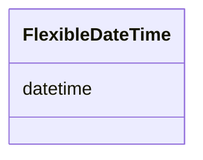

# Class: FlexibleDateTime 


_The Extended Date/Time Format (EDTF / ISO 8601-2). It is natively typed as a string literal but explicitly structured to support partial dates (2026, 2026-06), uncertain dates (2026?), or intervals. Level 0 and Level 1_


URI: [phro:EDTF](https://ns.faqir.org/phr-o#EDTF)





<!-- no inheritance hierarchy -->


## Slots

| Name | Cardinality and Range | Description | Inheritance |
| ---  | --- | --- | --- |
| [datetime](datetime.md) | 0..1 <br/> [String](String.md) |  | direct |


## Usages

| used by | used in | type | used |
| ---  | --- | --- | --- |
| [QoQuestionnaireResponse](QoQuestionnaireResponse.md) | [prov_generatedAtTime](prov_generatedAtTime.md) | range | [FlexibleDateTime](FlexibleDateTime.md) |
| [QoQuestionnaireResponseStatus](QoQuestionnaireResponseStatus.md) | [prov_atTime](prov_atTime.md) | range | [FlexibleDateTime](FlexibleDateTime.md) |
| [QoQuestionnaireResponseStatus](QoQuestionnaireResponseStatus.md) | [prov_generatedAtTime](prov_generatedAtTime.md) | range | [FlexibleDateTime](FlexibleDateTime.md) |
| [QoAnswer](QoAnswer.md) | [prov_generatedAtTime](prov_generatedAtTime.md) | range | [FlexibleDateTime](FlexibleDateTime.md) |
| [QoOrderedQuestion](QoOrderedQuestion.md) | [prov_generatedAtTime](prov_generatedAtTime.md) | range | [FlexibleDateTime](FlexibleDateTime.md) |
| [QoQuestion](QoQuestion.md) | [prov_generatedAtTime](prov_generatedAtTime.md) | range | [FlexibleDateTime](FlexibleDateTime.md) |
| [QoQuestionnaire](QoQuestionnaire.md) | [prov_generatedAtTime](prov_generatedAtTime.md) | range | [FlexibleDateTime](FlexibleDateTime.md) |
| [QoQuestionnaireStatus](QoQuestionnaireStatus.md) | [prov_atTime](prov_atTime.md) | range | [FlexibleDateTime](FlexibleDateTime.md) |
| [QoQuestionnaireStatus](QoQuestionnaireStatus.md) | [prov_generatedAtTime](prov_generatedAtTime.md) | range | [FlexibleDateTime](FlexibleDateTime.md) |
| [QoOrderedSection](QoOrderedSection.md) | [prov_generatedAtTime](prov_generatedAtTime.md) | range | [FlexibleDateTime](FlexibleDateTime.md) |
| [QoSection](QoSection.md) | [prov_generatedAtTime](prov_generatedAtTime.md) | range | [FlexibleDateTime](FlexibleDateTime.md) |
| [QoScoreDefinition](QoScoreDefinition.md) | [prov_generatedAtTime](prov_generatedAtTime.md) | range | [FlexibleDateTime](FlexibleDateTime.md) |
| [QoScoreParameter](QoScoreParameter.md) | [prov_generatedAtTime](prov_generatedAtTime.md) | range | [FlexibleDateTime](FlexibleDateTime.md) |
| [QoScoreValue](QoScoreValue.md) | [prov_atTime](prov_atTime.md) | range | [FlexibleDateTime](FlexibleDateTime.md) |
| [QoScoreValue](QoScoreValue.md) | [prov_generatedAtTime](prov_generatedAtTime.md) | range | [FlexibleDateTime](FlexibleDateTime.md) |
| [QoScoreValueStatus](QoScoreValueStatus.md) | [prov_atTime](prov_atTime.md) | range | [FlexibleDateTime](FlexibleDateTime.md) |
| [QoScoreValueStatus](QoScoreValueStatus.md) | [prov_generatedAtTime](prov_generatedAtTime.md) | range | [FlexibleDateTime](FlexibleDateTime.md) |
| [FoafAgent](FoafAgent.md) | [prov_generatedAtTime](prov_generatedAtTime.md) | range | [FlexibleDateTime](FlexibleDateTime.md) |
| [FoafPerson](FoafPerson.md) | [prov_generatedAtTime](prov_generatedAtTime.md) | range | [FlexibleDateTime](FlexibleDateTime.md) |
| [ProvOrganization](ProvOrganization.md) | [prov_generatedAtTime](prov_generatedAtTime.md) | range | [FlexibleDateTime](FlexibleDateTime.md) |
| [ProvEntity](ProvEntity.md) | [prov_generatedAtTime](prov_generatedAtTime.md) | range | [FlexibleDateTime](FlexibleDateTime.md) |
| [SosaFeatureOfInterest](SosaFeatureOfInterest.md) | [prov_generatedAtTime](prov_generatedAtTime.md) | range | [FlexibleDateTime](FlexibleDateTime.md) |
| [SarefProperty](SarefProperty.md) | [prov_generatedAtTime](prov_generatedAtTime.md) | range | [FlexibleDateTime](FlexibleDateTime.md) |
| [SarefPropertyValue](SarefPropertyValue.md) | [prov_atTime](prov_atTime.md) | range | [FlexibleDateTime](FlexibleDateTime.md) |
| [SarefPropertyValue](SarefPropertyValue.md) | [prov_generatedAtTime](prov_generatedAtTime.md) | range | [FlexibleDateTime](FlexibleDateTime.md) |
| [OwlThing](OwlThing.md) | [prov_generatedAtTime](prov_generatedAtTime.md) | range | [FlexibleDateTime](FlexibleDateTime.md) |
| [TimeInterval](TimeInterval.md) | [prov_startedAtTime](prov_startedAtTime.md) | range | [FlexibleDateTime](FlexibleDateTime.md) |
| [TimeInterval](TimeInterval.md) | [prov_endedAtTime](prov_endedAtTime.md) | range | [FlexibleDateTime](FlexibleDateTime.md) |
| [SuloProcess](SuloProcess.md) | [prov_generatedAtTime](prov_generatedAtTime.md) | range | [FlexibleDateTime](FlexibleDateTime.md) |
| [S4ehawActivity](S4ehawActivity.md) | [prov_generatedAtTime](prov_generatedAtTime.md) | range | [FlexibleDateTime](FlexibleDateTime.md) |
| [FhirProcedure](FhirProcedure.md) | [prov_generatedAtTime](prov_generatedAtTime.md) | range | [FlexibleDateTime](FlexibleDateTime.md) |


## Identifier and Mapping Information


### Schema Source


* from schema: https://ns.faqir.org/q-o


## Mappings

| Mapping Type | Mapped Value |
| ---  | ---  |
| self | phro:EDTF |
| native | qo:FlexibleDateTime |


## LinkML Source

<!-- TODO: investigate https://stackoverflow.com/questions/37606292/how-to-create-tabbed-code-blocks-in-mkdocs-or-sphinx -->

### Direct

<details>
```yaml
name: FlexibleDateTime
description: The Extended Date/Time Format (EDTF / ISO 8601-2). It is natively typed
  as a string literal but explicitly structured to support partial dates (2026, 2026-06),
  uncertain dates (2026?), or intervals. Level 0 and Level 1
from_schema: https://ns.faqir.org/q-o
attributes:
  datetime:
    name: datetime
    from_schema: https://ns.faqir.org/phr-o/core/value_types
    rank: 1000
    slot_uri: phro:edtf
    domain_of:
    - FlexibleDateTime
    range: string
    required: false
    multivalued: false
    pattern: ^(?:(?:\d{4})(?:-\d{2})?(?:-\d{2})?(?:T\d{2}:\d{2}:\d{2}(?:Z|[+-]\d{2}:\d{2})?)?)(?:\/(?:(?:\d{4})(?:-\d{2})?(?:-\d{2})?(?:T\d{2}:\d{2}:\d{2}(?:Z|[+-]\d{2}:\d{2})?)?))?$
class_uri: phro:EDTF

```
</details>

### Induced

<details>
```yaml
name: FlexibleDateTime
description: The Extended Date/Time Format (EDTF / ISO 8601-2). It is natively typed
  as a string literal but explicitly structured to support partial dates (2026, 2026-06),
  uncertain dates (2026?), or intervals. Level 0 and Level 1
from_schema: https://ns.faqir.org/q-o
attributes:
  datetime:
    name: datetime
    from_schema: https://ns.faqir.org/phr-o/core/value_types
    rank: 1000
    slot_uri: phro:edtf
    alias: datetime
    owner: FlexibleDateTime
    domain_of:
    - FlexibleDateTime
    range: string
    required: false
    multivalued: false
    pattern: ^(?:(?:\d{4})(?:-\d{2})?(?:-\d{2})?(?:T\d{2}:\d{2}:\d{2}(?:Z|[+-]\d{2}:\d{2})?)?)(?:\/(?:(?:\d{4})(?:-\d{2})?(?:-\d{2})?(?:T\d{2}:\d{2}:\d{2}(?:Z|[+-]\d{2}:\d{2})?)?))?$
class_uri: phro:EDTF

```
</details>