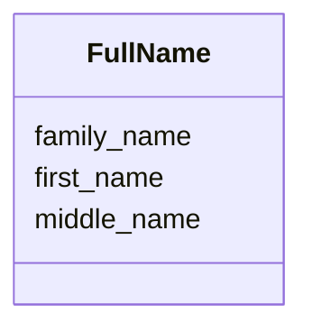

# Class: FullName 


_Structured full name._


URI: [https://w3id.org/faqir/datamodel/FullName](https://w3id.org/faqir/datamodel/FullName)





<!-- no inheritance hierarchy -->


## Slots

| Name | Cardinality and Range | Description | Inheritance |
| ---  | --- | --- | --- |
| [first_name](first_name.md) | 0..1 <br/> [String](String.md) | Given or first name | direct |
| [middle_name](middle_name.md) | 0..1 <br/> [String](String.md) | Middle name | direct |
| [family_name](family_name.md) | 0..1 <br/> [String](String.md) | Family or last name | direct |


## Usages

| used by | used in | type | used |
| ---  | --- | --- | --- |
| [Vault](Vault.md) | [full_name](full_name.md) | range | [FullName](FullName.md) |


## Identifier and Mapping Information


### Schema Source


* from schema: https://w3id.org/faqir/datamodel


## Mappings

| Mapping Type | Mapped Value |
| ---  | ---  |
| self | https://w3id.org/faqir/datamodel/FullName |
| native | https://w3id.org/faqir/datamodel/FullName |


## LinkML Source

<!-- TODO: investigate https://stackoverflow.com/questions/37606292/how-to-create-tabbed-code-blocks-in-mkdocs-or-sphinx -->

### Direct

<details>
```yaml
name: FullName
description: Structured full name.
from_schema: https://w3id.org/faqir/datamodel
attributes:
  first_name:
    name: first_name
    description: Given or first name.
    from_schema: https://w3id.org/faqir/datamodel/vault
    rank: 1000
    domain_of:
    - FullName
    range: string
  middle_name:
    name: middle_name
    description: Middle name.
    from_schema: https://w3id.org/faqir/datamodel/vault
    rank: 1000
    domain_of:
    - FullName
    range: string
  family_name:
    name: family_name
    description: Family or last name.
    from_schema: https://w3id.org/faqir/datamodel/vault
    rank: 1000
    domain_of:
    - FullName
    range: string

```
</details>

### Induced

<details>
```yaml
name: FullName
description: Structured full name.
from_schema: https://w3id.org/faqir/datamodel
attributes:
  first_name:
    name: first_name
    description: Given or first name.
    from_schema: https://w3id.org/faqir/datamodel/vault
    rank: 1000
    alias: first_name
    owner: FullName
    domain_of:
    - FullName
    range: string
  middle_name:
    name: middle_name
    description: Middle name.
    from_schema: https://w3id.org/faqir/datamodel/vault
    rank: 1000
    alias: middle_name
    owner: FullName
    domain_of:
    - FullName
    range: string
  family_name:
    name: family_name
    description: Family or last name.
    from_schema: https://w3id.org/faqir/datamodel/vault
    rank: 1000
    alias: family_name
    owner: FullName
    domain_of:
    - FullName
    range: string

```
</details>