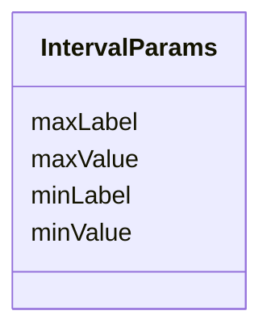

# Class: IntervalParams 


_Parameters for interval values, including minimum and maximum values._


URI: [faqir:IntervalParams](https://faqir.org/datamodel/IntervalParams)





<!-- no inheritance hierarchy -->


## Slots

| Name | Cardinality and Range | Description | Inheritance |
| ---  | --- | --- | --- |
| [minValue](minValue.md) | 1 <br/> [Float](Float.md) | The minimum value of the interval | direct |
| [minLabel](minLabel.md) | 0..1 <br/> [String](String.md) | The label for the minimum value of the interval | direct |
| [maxValue](maxValue.md) | 1 <br/> [Float](Float.md) | The maximum value of the interval | direct |
| [maxLabel](maxLabel.md) | 0..1 <br/> [String](String.md) | The label for the maximum value of the interval | direct |


## Usages

| used by | used in | type | used |
| ---  | --- | --- | --- |
| [Question](Question.md) | [questionIntervalParams](questionIntervalParams.md) | range | [IntervalParams](IntervalParams.md) |
| [ScoreDefinition](ScoreDefinition.md) | [scoreDefinitionIntervalParams](scoreDefinitionIntervalParams.md) | range | [IntervalParams](IntervalParams.md) |


## Identifier and Mapping Information


### Schema Source


* from schema: https://w3id.org/faqir/datamodel


## Mappings

| Mapping Type | Mapped Value |
| ---  | ---  |
| self | faqir:IntervalParams |
| native | https://w3id.org/faqir/datamodel/IntervalParams |


## LinkML Source

<!-- TODO: investigate https://stackoverflow.com/questions/37606292/how-to-create-tabbed-code-blocks-in-mkdocs-or-sphinx -->

### Direct

<details>
```yaml
name: IntervalParams
description: Parameters for interval values, including minimum and maximum values.
from_schema: https://w3id.org/faqir/datamodel
attributes:
  minValue:
    name: minValue
    description: The minimum value of the interval.
    from_schema: https://w3id.org/faqir/datamodel/core/types
    rank: 1000
    domain_of:
    - IntervalParams
    range: float
    required: true
  minLabel:
    name: minLabel
    description: The label for the minimum value of the interval.
    from_schema: https://w3id.org/faqir/datamodel/core/types
    rank: 1000
    domain_of:
    - IntervalParams
    range: string
    required: false
  maxValue:
    name: maxValue
    description: The maximum value of the interval.
    from_schema: https://w3id.org/faqir/datamodel/core/types
    rank: 1000
    domain_of:
    - IntervalParams
    range: float
    required: true
  maxLabel:
    name: maxLabel
    description: The label for the maximum value of the interval.
    from_schema: https://w3id.org/faqir/datamodel/core/types
    rank: 1000
    domain_of:
    - IntervalParams
    range: string
    required: false
class_uri: faqir:IntervalParams

```
</details>

### Induced

<details>
```yaml
name: IntervalParams
description: Parameters for interval values, including minimum and maximum values.
from_schema: https://w3id.org/faqir/datamodel
attributes:
  minValue:
    name: minValue
    description: The minimum value of the interval.
    from_schema: https://w3id.org/faqir/datamodel/core/types
    rank: 1000
    alias: minValue
    owner: IntervalParams
    domain_of:
    - IntervalParams
    range: float
    required: true
  minLabel:
    name: minLabel
    description: The label for the minimum value of the interval.
    from_schema: https://w3id.org/faqir/datamodel/core/types
    rank: 1000
    alias: minLabel
    owner: IntervalParams
    domain_of:
    - IntervalParams
    range: string
    required: false
  maxValue:
    name: maxValue
    description: The maximum value of the interval.
    from_schema: https://w3id.org/faqir/datamodel/core/types
    rank: 1000
    alias: maxValue
    owner: IntervalParams
    domain_of:
    - IntervalParams
    range: float
    required: true
  maxLabel:
    name: maxLabel
    description: The label for the maximum value of the interval.
    from_schema: https://w3id.org/faqir/datamodel/core/types
    rank: 1000
    alias: maxLabel
    owner: IntervalParams
    domain_of:
    - IntervalParams
    range: string
    required: false
class_uri: faqir:IntervalParams

```
</details>