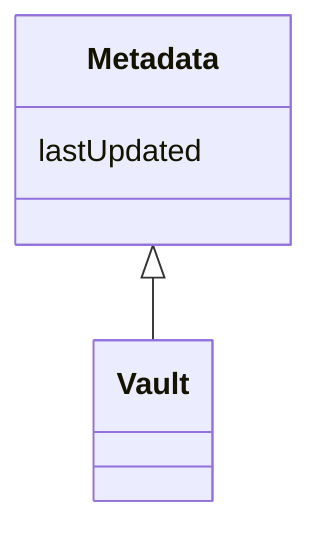

# Class: Metadata 


_Base class for metadata tracking (e.g. schema versioning & last updated)._


URI: [faqir:Metadata](https://faqir.org/datamodel/Metadata)





## Inheritance
* **Metadata**
    * [Vault](Vault.md)


## Slots

| Name | Cardinality and Range | Description | Inheritance |
| ---  | --- | --- | --- |
| [lastUpdated](lastUpdated.md) | 1 <br/> [Datetime](Datetime.md) | The date and time when the entity was last updated | direct |


## Identifier and Mapping Information


### Schema Source


* from schema: https://w3id.org/faqir/datamodel


## Mappings

| Mapping Type | Mapped Value |
| ---  | ---  |
| self | faqir:Metadata |
| native | https://w3id.org/faqir/datamodel/Metadata |


## LinkML Source

<!-- TODO: investigate https://stackoverflow.com/questions/37606292/how-to-create-tabbed-code-blocks-in-mkdocs-or-sphinx -->

### Direct

<details>
```yaml
name: Metadata
description: Base class for metadata tracking (e.g. schema versioning & last updated).
from_schema: https://w3id.org/faqir/datamodel
attributes:
  lastUpdated:
    name: lastUpdated
    description: The date and time when the entity was last updated.
    from_schema: https://w3id.org/faqir/datamodel/core/versions
    rank: 1000
    domain_of:
    - Metadata
    range: datetime
    required: true
class_uri: faqir:Metadata

```
</details>

### Induced

<details>
```yaml
name: Metadata
description: Base class for metadata tracking (e.g. schema versioning & last updated).
from_schema: https://w3id.org/faqir/datamodel
attributes:
  lastUpdated:
    name: lastUpdated
    description: The date and time when the entity was last updated.
    from_schema: https://w3id.org/faqir/datamodel/core/versions
    rank: 1000
    alias: lastUpdated
    owner: Metadata
    domain_of:
    - Metadata
    range: datetime
    required: true
class_uri: faqir:Metadata

```
</details>