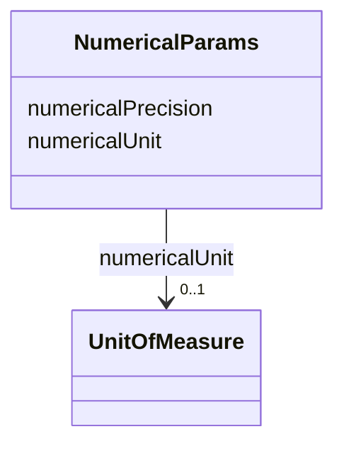

# Class: NumericalParams 


_Parameters for quantitative values, including unit and precision._


URI: [faqir:NumericalParams](https://faqir.org/datamodel/NumericalParams)





<!-- no inheritance hierarchy -->


## Slots

| Name | Cardinality and Range | Description | Inheritance |
| ---  | --- | --- | --- |
| [numericalUnit](numericalUnit.md) | 0..1 <br/> [UnitOfMeasure](UnitOfMeasure.md) | The unit of measure for the quantitative value, from UCUM standard | direct |
| [numericalPrecision](numericalPrecision.md) | 0..1 <br/> [Integer](Integer.md) | The precision of the quantitative value, e | direct |


## Usages

| used by | used in | type | used |
| ---  | --- | --- | --- |
| [Question](Question.md) | [questionNumericalParams](questionNumericalParams.md) | range | [NumericalParams](NumericalParams.md) |


## Identifier and Mapping Information


### Schema Source


* from schema: https://w3id.org/faqir/datamodel


## Mappings

| Mapping Type | Mapped Value |
| ---  | ---  |
| self | faqir:NumericalParams |
| native | https://w3id.org/faqir/datamodel/NumericalParams |


## LinkML Source

<!-- TODO: investigate https://stackoverflow.com/questions/37606292/how-to-create-tabbed-code-blocks-in-mkdocs-or-sphinx -->

### Direct

<details>
```yaml
name: NumericalParams
description: Parameters for quantitative values, including unit and precision.
from_schema: https://w3id.org/faqir/datamodel
attributes:
  numericalUnit:
    name: numericalUnit
    description: The unit of measure for the quantitative value, from UCUM standard.
    from_schema: https://w3id.org/faqir/datamodel/core/types
    rank: 1000
    slot_uri: ucum:units
    domain_of:
    - NumericalParams
    range: UnitOfMeasure
    required: false
  numericalPrecision:
    name: numericalPrecision
    description: The precision of the quantitative value, e.g. number of decimal places.
    from_schema: https://w3id.org/faqir/datamodel/core/types
    rank: 1000
    domain_of:
    - NumericalParams
    range: integer
    required: false
    minimum_value: 0
class_uri: faqir:NumericalParams

```
</details>

### Induced

<details>
```yaml
name: NumericalParams
description: Parameters for quantitative values, including unit and precision.
from_schema: https://w3id.org/faqir/datamodel
attributes:
  numericalUnit:
    name: numericalUnit
    description: The unit of measure for the quantitative value, from UCUM standard.
    from_schema: https://w3id.org/faqir/datamodel/core/types
    rank: 1000
    slot_uri: ucum:units
    alias: numericalUnit
    owner: NumericalParams
    domain_of:
    - NumericalParams
    range: UnitOfMeasure
    required: false
  numericalPrecision:
    name: numericalPrecision
    description: The precision of the quantitative value, e.g. number of decimal places.
    from_schema: https://w3id.org/faqir/datamodel/core/types
    rank: 1000
    alias: numericalPrecision
    owner: NumericalParams
    domain_of:
    - NumericalParams
    range: integer
    required: false
    minimum_value: 0
class_uri: faqir:NumericalParams

```
</details>