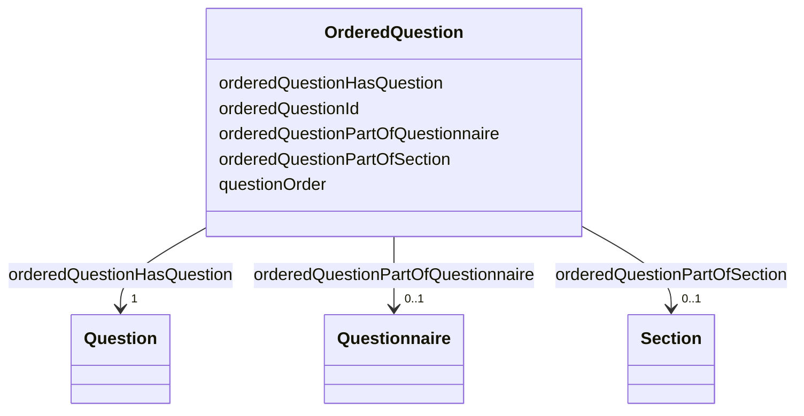

# Class: OrderedQuestion 


_Question's position within a specific questionnaire or section._


URI: [faqir:OrderedQuestion](https://faqir.org/datamodel/OrderedQuestion)





<!-- no inheritance hierarchy -->


## Slots

| Name | Cardinality and Range | Description | Inheritance |
| ---  | --- | --- | --- |
| [orderedQuestionHasQuestion](orderedQuestionHasQuestion.md) | 1 <br/> [Question](Question.md) | Question indexed in this OrderedQuestion | direct |
| [orderedQuestionPartOfQuestionnaire](orderedQuestionPartOfQuestionnaire.md) | 0..1 <br/> [Questionnaire](Questionnaire.md) | The Questionnaire that this Question is part of in the specified order | direct |
| [orderedQuestionPartOfSection](orderedQuestionPartOfSection.md) | 0..1 <br/> [Section](Section.md) | The Section that this Question is part of in the specified order | direct |
| [orderedQuestionId](orderedQuestionId.md) | 1 <br/> [Uriorcurie](Uriorcurie.md) | The unique identifier for the ordered question | direct |
| [questionOrder](questionOrder.md) | 1 <br/> [Integer](Integer.md) | Question position in the questionnaire or section (1-based index) | direct |


## Usages

| used by | used in | type | used |
| ---  | --- | --- | --- |
| [OrderedQuestion](OrderedQuestion.md) | [orderedQuestionHasQuestion](orderedQuestionHasQuestion.md) | domain | [OrderedQuestion](OrderedQuestion.md) |
| [OrderedQuestion](OrderedQuestion.md) | [orderedQuestionPartOfQuestionnaire](orderedQuestionPartOfQuestionnaire.md) | domain | [OrderedQuestion](OrderedQuestion.md) |
| [OrderedQuestion](OrderedQuestion.md) | [orderedQuestionPartOfSection](orderedQuestionPartOfSection.md) | domain | [OrderedQuestion](OrderedQuestion.md) |
| [Question](Question.md) | [questionInOrderedQuestion](questionInOrderedQuestion.md) | range | [OrderedQuestion](OrderedQuestion.md) |
| [Questionnaire](Questionnaire.md) | [questionnaireHasOrderedQuestion](questionnaireHasOrderedQuestion.md) | range | [OrderedQuestion](OrderedQuestion.md) |
| [Section](Section.md) | [sectionHasOrderedQuestion](sectionHasOrderedQuestion.md) | range | [OrderedQuestion](OrderedQuestion.md) |


## Identifier and Mapping Information


### Schema Source


* from schema: https://w3id.org/faqir/datamodel


## Mappings

| Mapping Type | Mapped Value |
| ---  | ---  |
| self | faqir:OrderedQuestion |
| native | https://w3id.org/faqir/datamodel/OrderedQuestion |


## LinkML Source

<!-- TODO: investigate https://stackoverflow.com/questions/37606292/how-to-create-tabbed-code-blocks-in-mkdocs-or-sphinx -->

### Direct

<details>
```yaml
name: OrderedQuestion
description: Question's position within a specific questionnaire or section.
from_schema: https://w3id.org/faqir/datamodel
slots:
- orderedQuestionHasQuestion
- orderedQuestionPartOfQuestionnaire
- orderedQuestionPartOfSection
attributes:
  orderedQuestionId:
    name: orderedQuestionId
    description: The unique identifier for the ordered question.
    from_schema: https://w3id.org/faqir/datamodel/questionnaire/classes
    rank: 1000
    identifier: true
    domain_of:
    - OrderedQuestion
    range: uriorcurie
    required: true
  questionOrder:
    name: questionOrder
    description: Question position in the questionnaire or section (1-based index).
    from_schema: https://w3id.org/faqir/datamodel/questionnaire/classes
    rank: 1000
    domain_of:
    - OrderedQuestion
    range: integer
    required: true
    minimum_value: 1
class_uri: faqir:OrderedQuestion
unique_keys:
  unique_question_order_per_questionnaire:
    unique_key_name: unique_question_order_per_questionnaire
    unique_key_slots:
    - questionOrder
    - orderedQuestionPartOfQuestionnaire
    description: Question order values must be unique per questionnaire
  unique_question_order_per_section:
    unique_key_name: unique_question_order_per_section
    unique_key_slots:
    - questionOrder
    - orderedQuestionPartOfSection
    description: Question order values must be unique per section

```
</details>

### Induced

<details>
```yaml
name: OrderedQuestion
description: Question's position within a specific questionnaire or section.
from_schema: https://w3id.org/faqir/datamodel
attributes:
  orderedQuestionId:
    name: orderedQuestionId
    description: The unique identifier for the ordered question.
    from_schema: https://w3id.org/faqir/datamodel/questionnaire/classes
    rank: 1000
    identifier: true
    alias: orderedQuestionId
    owner: OrderedQuestion
    domain_of:
    - OrderedQuestion
    range: uriorcurie
    required: true
  questionOrder:
    name: questionOrder
    description: Question position in the questionnaire or section (1-based index).
    from_schema: https://w3id.org/faqir/datamodel/questionnaire/classes
    rank: 1000
    alias: questionOrder
    owner: OrderedQuestion
    domain_of:
    - OrderedQuestion
    range: integer
    required: true
    minimum_value: 1
  orderedQuestionHasQuestion:
    name: orderedQuestionHasQuestion
    description: Question indexed in this OrderedQuestion.
    from_schema: https://w3id.org/faqir/datamodel
    rank: 1000
    domain: OrderedQuestion
    slot_uri: faqir:orderedQuestionHasQuestion
    alias: orderedQuestionHasQuestion
    owner: OrderedQuestion
    domain_of:
    - OrderedQuestion
    inverse: questionInOrderedQuestion
    range: Question
    required: true
    multivalued: false
  orderedQuestionPartOfQuestionnaire:
    name: orderedQuestionPartOfQuestionnaire
    description: The Questionnaire that this Question is part of in the specified
      order.
    from_schema: https://w3id.org/faqir/datamodel
    mappings:
    - fhir:Questionnaire.item
    rank: 1000
    domain: OrderedQuestion
    slot_uri: faqir:orderedQuestionPartOfQuestionnaire
    alias: orderedQuestionPartOfQuestionnaire
    owner: OrderedQuestion
    domain_of:
    - OrderedQuestion
    inverse: questionnaireHasOrderedQuestion
    range: Questionnaire
    required: false
    multivalued: false
  orderedQuestionPartOfSection:
    name: orderedQuestionPartOfSection
    description: The Section that this Question is part of in the specified order.
    from_schema: https://w3id.org/faqir/datamodel
    mappings:
    - fhir:Questionnaire.item
    rank: 1000
    domain: OrderedQuestion
    slot_uri: faqir:orderedQuestionPartOfSection
    alias: orderedQuestionPartOfSection
    owner: OrderedQuestion
    domain_of:
    - OrderedQuestion
    inverse: sectionHasOrderedQuestion
    range: Section
    required: false
    multivalued: false
class_uri: faqir:OrderedQuestion
unique_keys:
  unique_question_order_per_questionnaire:
    unique_key_name: unique_question_order_per_questionnaire
    unique_key_slots:
    - questionOrder
    - orderedQuestionPartOfQuestionnaire
    description: Question order values must be unique per questionnaire
  unique_question_order_per_section:
    unique_key_name: unique_question_order_per_section
    unique_key_slots:
    - questionOrder
    - orderedQuestionPartOfSection
    description: Question order values must be unique per section

```
</details>