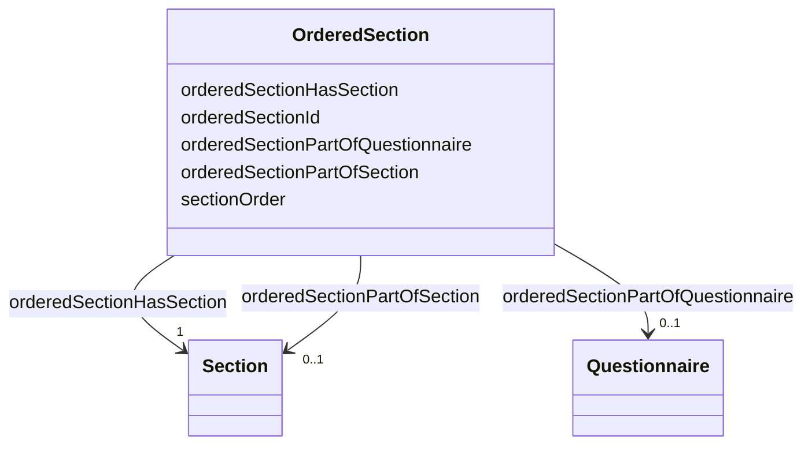

# Class: OrderedSection 


_Section's position within a specific questionnaire or section._


URI: [faqir:OrderedSection](https://faqir.org/datamodel/OrderedSection)





<!-- no inheritance hierarchy -->


## Slots

| Name | Cardinality and Range | Description | Inheritance |
| ---  | --- | --- | --- |
| [orderedSectionHasSection](orderedSectionHasSection.md) | 1 <br/> [Section](Section.md) | Section indexed in this OrderedSection | direct |
| [orderedSectionPartOfQuestionnaire](orderedSectionPartOfQuestionnaire.md) | 0..1 <br/> [Questionnaire](Questionnaire.md) | The Questionnaire that this Section is part of in the specified order | direct |
| [orderedSectionPartOfSection](orderedSectionPartOfSection.md) | 0..1 <br/> [Section](Section.md) | The Section that this Section is part of in the specified order | direct |
| [orderedSectionId](orderedSectionId.md) | 1 <br/> [Uriorcurie](Uriorcurie.md) | The unique identifier for the ordered Section | direct |
| [sectionOrder](sectionOrder.md) | 1 <br/> [Integer](Integer.md) | Section position in the questionnaire or section (1-based index) | direct |


## Usages

| used by | used in | type | used |
| ---  | --- | --- | --- |
| [Questionnaire](Questionnaire.md) | [questionnaireHasOrderedSection](questionnaireHasOrderedSection.md) | range | [OrderedSection](OrderedSection.md) |
| [OrderedSection](OrderedSection.md) | [orderedSectionHasSection](orderedSectionHasSection.md) | domain | [OrderedSection](OrderedSection.md) |
| [OrderedSection](OrderedSection.md) | [orderedSectionPartOfQuestionnaire](orderedSectionPartOfQuestionnaire.md) | domain | [OrderedSection](OrderedSection.md) |
| [OrderedSection](OrderedSection.md) | [orderedSectionPartOfSection](orderedSectionPartOfSection.md) | domain | [OrderedSection](OrderedSection.md) |
| [Section](Section.md) | [sectionHasOrderedSection](sectionHasOrderedSection.md) | range | [OrderedSection](OrderedSection.md) |
| [Section](Section.md) | [sectionInOrderedSection](sectionInOrderedSection.md) | range | [OrderedSection](OrderedSection.md) |


## Identifier and Mapping Information


### Schema Source


* from schema: https://w3id.org/faqir/datamodel


## Mappings

| Mapping Type | Mapped Value |
| ---  | ---  |
| self | faqir:OrderedSection |
| native | https://w3id.org/faqir/datamodel/OrderedSection |


## LinkML Source

<!-- TODO: investigate https://stackoverflow.com/questions/37606292/how-to-create-tabbed-code-blocks-in-mkdocs-or-sphinx -->

### Direct

<details>
```yaml
name: OrderedSection
description: Section's position within a specific questionnaire or section.
from_schema: https://w3id.org/faqir/datamodel
slots:
- orderedSectionHasSection
- orderedSectionPartOfQuestionnaire
- orderedSectionPartOfSection
attributes:
  orderedSectionId:
    name: orderedSectionId
    description: The unique identifier for the ordered Section.
    from_schema: https://w3id.org/faqir/datamodel/questionnaire/classes
    rank: 1000
    identifier: true
    domain_of:
    - OrderedSection
    range: uriorcurie
    required: true
  sectionOrder:
    name: sectionOrder
    description: Section position in the questionnaire or section (1-based index).
    from_schema: https://w3id.org/faqir/datamodel/questionnaire/classes
    rank: 1000
    domain_of:
    - OrderedSection
    range: integer
    required: true
    minimum_value: 1
class_uri: faqir:OrderedSection
unique_keys:
  unique_section_order_per_questionnaire:
    unique_key_name: unique_section_order_per_questionnaire
    unique_key_slots:
    - sectionOrder
    - orderedSectionPartOfQuestionnaire
    description: Section order values must be unique per questionnaire
  unique_section_order_per_section:
    unique_key_name: unique_section_order_per_section
    unique_key_slots:
    - sectionOrder
    - orderedSectionPartOfSection
    description: Section order values must be unique per section

```
</details>

### Induced

<details>
```yaml
name: OrderedSection
description: Section's position within a specific questionnaire or section.
from_schema: https://w3id.org/faqir/datamodel
attributes:
  orderedSectionId:
    name: orderedSectionId
    description: The unique identifier for the ordered Section.
    from_schema: https://w3id.org/faqir/datamodel/questionnaire/classes
    rank: 1000
    identifier: true
    alias: orderedSectionId
    owner: OrderedSection
    domain_of:
    - OrderedSection
    range: uriorcurie
    required: true
  sectionOrder:
    name: sectionOrder
    description: Section position in the questionnaire or section (1-based index).
    from_schema: https://w3id.org/faqir/datamodel/questionnaire/classes
    rank: 1000
    alias: sectionOrder
    owner: OrderedSection
    domain_of:
    - OrderedSection
    range: integer
    required: true
    minimum_value: 1
  orderedSectionHasSection:
    name: orderedSectionHasSection
    description: Section indexed in this OrderedSection.
    from_schema: https://w3id.org/faqir/datamodel
    rank: 1000
    domain: OrderedSection
    slot_uri: faqir:orderedSectionHasSection
    alias: orderedSectionHasSection
    owner: OrderedSection
    domain_of:
    - OrderedSection
    inverse: sectionInOrderedSection
    range: Section
    required: true
    multivalued: false
  orderedSectionPartOfQuestionnaire:
    name: orderedSectionPartOfQuestionnaire
    description: The Questionnaire that this Section is part of in the specified order.
    from_schema: https://w3id.org/faqir/datamodel
    mappings:
    - fhir:Questionnaire.item
    rank: 1000
    domain: OrderedSection
    slot_uri: faqir:orderedSectionPartOfQuestionnaire
    alias: orderedSectionPartOfQuestionnaire
    owner: OrderedSection
    domain_of:
    - OrderedSection
    inverse: questionnaireHasOrderedSection
    range: Questionnaire
    required: false
    multivalued: false
  orderedSectionPartOfSection:
    name: orderedSectionPartOfSection
    description: The Section that this Section is part of in the specified order.
    from_schema: https://w3id.org/faqir/datamodel
    mappings:
    - fhir:Questionnaire.item
    rank: 1000
    domain: OrderedSection
    slot_uri: faqir:orderedSectionPartOfSection
    alias: orderedSectionPartOfSection
    owner: OrderedSection
    domain_of:
    - OrderedSection
    inverse: sectionHasOrderedSection
    range: Section
    required: false
    multivalued: false
class_uri: faqir:OrderedSection
unique_keys:
  unique_section_order_per_questionnaire:
    unique_key_name: unique_section_order_per_questionnaire
    unique_key_slots:
    - sectionOrder
    - orderedSectionPartOfQuestionnaire
    description: Section order values must be unique per questionnaire
  unique_section_order_per_section:
    unique_key_name: unique_section_order_per_section
    unique_key_slots:
    - sectionOrder
    - orderedSectionPartOfSection
    description: Section order values must be unique per section

```
</details>