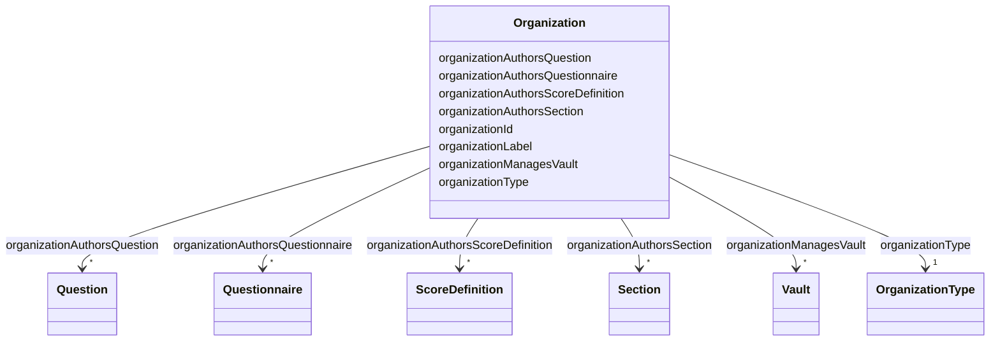

# Class: Organization 


_An entity acting in a healthcare context_


URI: [faqir:Organization](https://faqir.org/datamodel/Organization)





<!-- no inheritance hierarchy -->


## Slots

| Name | Cardinality and Range | Description | Inheritance |
| ---  | --- | --- | --- |
| [organizationAuthorsQuestionnaire](organizationAuthorsQuestionnaire.md) | * <br/> [Questionnaire](Questionnaire.md) | Questionnaire created by this organization | direct |
| [organizationAuthorsSection](organizationAuthorsSection.md) | * <br/> [Section](Section.md) | Section created by this organization | direct |
| [organizationAuthorsQuestion](organizationAuthorsQuestion.md) | * <br/> [Question](Question.md) | Question created by this organization | direct |
| [organizationAuthorsScoreDefinition](organizationAuthorsScoreDefinition.md) | * <br/> [ScoreDefinition](ScoreDefinition.md) | Score definition created by this organization | direct |
| [organizationManagesVault](organizationManagesVault.md) | * <br/> [Vault](Vault.md) | Vault managed by this organization | direct |
| [organizationId](organizationId.md) | 1 <br/> [Uriorcurie](Uriorcurie.md) | Unique identifier of the organization | direct |
| [organizationLabel](organizationLabel.md) | 1 <br/> [String](String.md) | Name of the organization | direct |
| [organizationType](organizationType.md) | 1 <br/> [OrganizationType](OrganizationType.md) | Type of organization | direct |


## Usages

| used by | used in | type | used |
| ---  | --- | --- | --- |
| [Vault](Vault.md) | [vaultManagedByOrg](vaultManagedByOrg.md) | range | [Organization](Organization.md) |
| [Organization](Organization.md) | [organizationAuthorsQuestionnaire](organizationAuthorsQuestionnaire.md) | domain | [Organization](Organization.md) |
| [Organization](Organization.md) | [organizationAuthorsSection](organizationAuthorsSection.md) | domain | [Organization](Organization.md) |
| [Organization](Organization.md) | [organizationAuthorsQuestion](organizationAuthorsQuestion.md) | domain | [Organization](Organization.md) |
| [Organization](Organization.md) | [organizationAuthorsScoreDefinition](organizationAuthorsScoreDefinition.md) | domain | [Organization](Organization.md) |
| [Organization](Organization.md) | [organizationManagesVault](organizationManagesVault.md) | domain | [Organization](Organization.md) |
| [Procedure](Procedure.md) | [procedurePerformedByOrg](procedurePerformedByOrg.md) | range | [Organization](Organization.md) |
| [Question](Question.md) | [questionAuthoredByOrg](questionAuthoredByOrg.md) | range | [Organization](Organization.md) |
| [Questionnaire](Questionnaire.md) | [questionnaireAuthoredByOrg](questionnaireAuthoredByOrg.md) | range | [Organization](Organization.md) |
| [Section](Section.md) | [sectionAuthoredByOrg](sectionAuthoredByOrg.md) | range | [Organization](Organization.md) |
| [ScoreDefinition](ScoreDefinition.md) | [scoreDefinitionAuthoredByOrg](scoreDefinitionAuthoredByOrg.md) | range | [Organization](Organization.md) |


## Identifier and Mapping Information


### Schema Source


* from schema: https://w3id.org/faqir/datamodel


## Mappings

| Mapping Type | Mapped Value |
| ---  | ---  |
| self | faqir:Organization |
| native | https://w3id.org/faqir/datamodel/Organization |
| undefined | fhir:Organization |


## LinkML Source

<!-- TODO: investigate https://stackoverflow.com/questions/37606292/how-to-create-tabbed-code-blocks-in-mkdocs-or-sphinx -->

### Direct

<details>
```yaml
name: Organization
description: An entity acting in a healthcare context
from_schema: https://w3id.org/faqir/datamodel
mappings:
- fhir:Organization
slots:
- organizationAuthorsQuestionnaire
- organizationAuthorsSection
- organizationAuthorsQuestion
- organizationAuthorsScoreDefinition
- organizationManagesVault
attributes:
  organizationId:
    name: organizationId
    description: Unique identifier of the organization.
    from_schema: https://w3id.org/faqir/datamodel/entities/organization
    rank: 1000
    identifier: true
    domain_of:
    - Organization
    range: uriorcurie
    required: true
  organizationLabel:
    name: organizationLabel
    description: Name of the organization.
    from_schema: https://w3id.org/faqir/datamodel/entities/organization
    rank: 1000
    domain_of:
    - Organization
    range: string
    required: true
  organizationType:
    name: organizationType
    description: Type of organization.
    from_schema: https://w3id.org/faqir/datamodel/entities/organization
    rank: 1000
    domain_of:
    - Organization
    range: OrganizationType
    required: true
class_uri: faqir:Organization

```
</details>

### Induced

<details>
```yaml
name: Organization
description: An entity acting in a healthcare context
from_schema: https://w3id.org/faqir/datamodel
mappings:
- fhir:Organization
attributes:
  organizationId:
    name: organizationId
    description: Unique identifier of the organization.
    from_schema: https://w3id.org/faqir/datamodel/entities/organization
    rank: 1000
    identifier: true
    alias: organizationId
    owner: Organization
    domain_of:
    - Organization
    range: uriorcurie
    required: true
  organizationLabel:
    name: organizationLabel
    description: Name of the organization.
    from_schema: https://w3id.org/faqir/datamodel/entities/organization
    rank: 1000
    alias: organizationLabel
    owner: Organization
    domain_of:
    - Organization
    range: string
    required: true
  organizationType:
    name: organizationType
    description: Type of organization.
    from_schema: https://w3id.org/faqir/datamodel/entities/organization
    rank: 1000
    alias: organizationType
    owner: Organization
    domain_of:
    - Organization
    range: OrganizationType
    required: true
  organizationAuthorsQuestionnaire:
    name: organizationAuthorsQuestionnaire
    description: Questionnaire created by this organization.
    from_schema: https://w3id.org/faqir/datamodel
    mappings:
    - prov:wasAssociatedWith
    rank: 1000
    domain: Organization
    slot_uri: faqir:organizationAuthorsQuestionnaire
    alias: organizationAuthorsQuestionnaire
    owner: Organization
    domain_of:
    - Organization
    inverse: questionnaireAuthoredByOrg
    range: Questionnaire
    required: false
    multivalued: true
  organizationAuthorsSection:
    name: organizationAuthorsSection
    description: Section created by this organization.
    from_schema: https://w3id.org/faqir/datamodel
    mappings:
    - prov:wasAssociatedWith
    rank: 1000
    domain: Organization
    slot_uri: faqir:organizationAuthorsSection
    alias: organizationAuthorsSection
    owner: Organization
    domain_of:
    - Organization
    inverse: sectionAuthoredByOrg
    range: Section
    required: false
    multivalued: true
  organizationAuthorsQuestion:
    name: organizationAuthorsQuestion
    description: Question created by this organization.
    from_schema: https://w3id.org/faqir/datamodel
    mappings:
    - prov:wasAssociatedWith
    rank: 1000
    domain: Organization
    slot_uri: faqir:organizationAuthorsQuestion
    alias: organizationAuthorsQuestion
    owner: Organization
    domain_of:
    - Organization
    inverse: questionAuthoredByOrg
    range: Question
    required: false
    multivalued: true
  organizationAuthorsScoreDefinition:
    name: organizationAuthorsScoreDefinition
    description: Score definition created by this organization.
    from_schema: https://w3id.org/faqir/datamodel
    mappings:
    - prov:wasAssociatedWith
    rank: 1000
    domain: Organization
    slot_uri: faqir:organizationAuthorsScoreDefinition
    alias: organizationAuthorsScoreDefinition
    owner: Organization
    domain_of:
    - Organization
    inverse: scoreDefinitionAuthoredByOrg
    range: ScoreDefinition
    required: false
    multivalued: true
  organizationManagesVault:
    name: organizationManagesVault
    description: Vault managed by this organization.
    from_schema: https://w3id.org/faqir/datamodel
    rank: 1000
    domain: Organization
    slot_uri: faqir:organizationManagesVault
    alias: organizationManagesVault
    owner: Organization
    domain_of:
    - Organization
    inverse: vaultManagedByOrg
    range: Vault
    required: false
    multivalued: true
class_uri: faqir:Organization

```
</details>