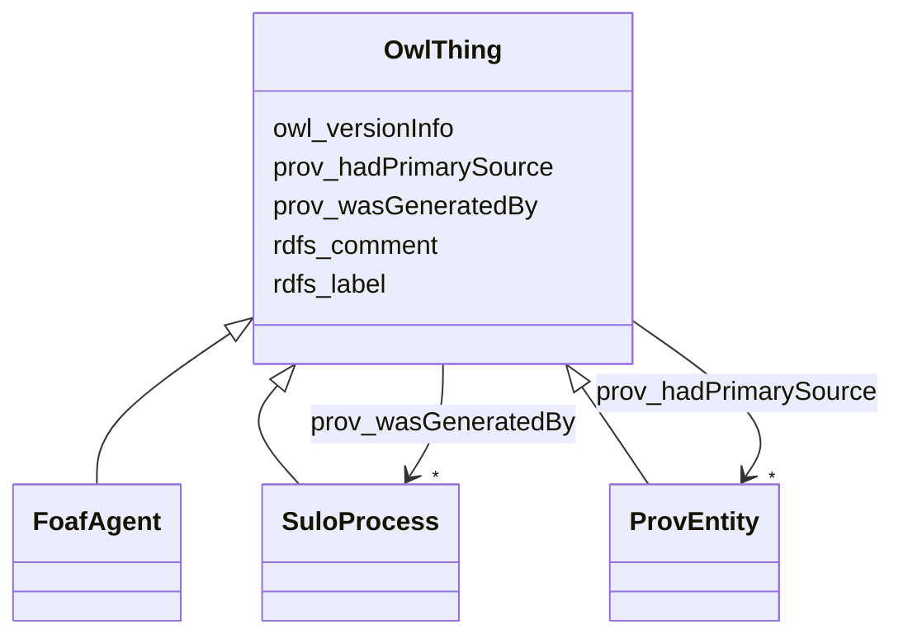

# Class: OwlThing 


_This defines IOT as the set of OWL individuals._


URI: [owl:Thing](http://www.w3.org/2002/07/owl#Thing)





## Inheritance
* **OwlThing**
    * [FoafAgent](FoafAgent.md)
    * [SuloProcess](SuloProcess.md)
    * [ProvEntity](ProvEntity.md)


## Slots

| Name | Cardinality and Range | Description | Inheritance |
| ---  | --- | --- | --- |
| [owl_versionInfo](owl_versionInfo.md) | 0..1 <br/> [String](String.md) | An owl:versionInfo statement generally has as its object a string giving info... | direct |
| [rdfs_label](rdfs_label.md) | 1..* <br/> [String](String.md) | human-readable version of a resource's name | direct |
| [rdfs_comment](rdfs_comment.md) | 1..* <br/> [String](String.md) | A textual comment helps clarify the meaning of RDF classes and properties | direct |
| [prov_hadPrimarySource](prov_hadPrimarySource.md) | * <br/> [ProvEntity](ProvEntity.md) | A primary source for a topic refers to something produced by some agent with ... | direct |
| [prov_wasGeneratedBy](prov_wasGeneratedBy.md) | * <br/> [SuloProcess](SuloProcess.md) | Generation is the completion of production of a new entity by an activity | direct |


## Usages

| used by | used in | type | used |
| ---  | --- | --- | --- |
| [OwlThing](OwlThing.md) | [owl_versionInfo](owl_versionInfo.md) | domain | [OwlThing](OwlThing.md) |
| [OwlThing](OwlThing.md) | [rdfs_label](rdfs_label.md) | domain | [OwlThing](OwlThing.md) |
| [OwlThing](OwlThing.md) | [rdfs_comment](rdfs_comment.md) | domain | [OwlThing](OwlThing.md) |
| [OwlThing](OwlThing.md) | [prov_hadPrimarySource](prov_hadPrimarySource.md) | domain | [OwlThing](OwlThing.md) |
| [OwlThing](OwlThing.md) | [prov_wasGeneratedBy](prov_wasGeneratedBy.md) | domain | [OwlThing](OwlThing.md) |
| [FoafAgent](FoafAgent.md) | [dcterms_hasPart](dcterms_hasPart.md) | range | [OwlThing](OwlThing.md) |
| [FoafAgent](FoafAgent.md) | [dcterms_isPartOf](dcterms_isPartOf.md) | range | [OwlThing](OwlThing.md) |
| [FoafAgent](FoafAgent.md) | [owl_versionInfo](owl_versionInfo.md) | domain | [OwlThing](OwlThing.md) |
| [FoafAgent](FoafAgent.md) | [rdfs_label](rdfs_label.md) | domain | [OwlThing](OwlThing.md) |
| [FoafAgent](FoafAgent.md) | [rdfs_comment](rdfs_comment.md) | domain | [OwlThing](OwlThing.md) |
| [FoafAgent](FoafAgent.md) | [prov_hadPrimarySource](prov_hadPrimarySource.md) | domain | [OwlThing](OwlThing.md) |
| [FoafAgent](FoafAgent.md) | [prov_wasGeneratedBy](prov_wasGeneratedBy.md) | domain | [OwlThing](OwlThing.md) |
| [FoafPerson](FoafPerson.md) | [dcterms_hasPart](dcterms_hasPart.md) | range | [OwlThing](OwlThing.md) |
| [FoafPerson](FoafPerson.md) | [dcterms_isPartOf](dcterms_isPartOf.md) | range | [OwlThing](OwlThing.md) |
| [FoafPerson](FoafPerson.md) | [owl_versionInfo](owl_versionInfo.md) | domain | [OwlThing](OwlThing.md) |
| [FoafPerson](FoafPerson.md) | [rdfs_label](rdfs_label.md) | domain | [OwlThing](OwlThing.md) |
| [FoafPerson](FoafPerson.md) | [rdfs_comment](rdfs_comment.md) | domain | [OwlThing](OwlThing.md) |
| [FoafPerson](FoafPerson.md) | [prov_hadPrimarySource](prov_hadPrimarySource.md) | domain | [OwlThing](OwlThing.md) |
| [FoafPerson](FoafPerson.md) | [prov_wasGeneratedBy](prov_wasGeneratedBy.md) | domain | [OwlThing](OwlThing.md) |
| [ProvOrganization](ProvOrganization.md) | [dcterms_hasPart](dcterms_hasPart.md) | range | [OwlThing](OwlThing.md) |
| [ProvOrganization](ProvOrganization.md) | [dcterms_isPartOf](dcterms_isPartOf.md) | range | [OwlThing](OwlThing.md) |
| [ProvOrganization](ProvOrganization.md) | [owl_versionInfo](owl_versionInfo.md) | domain | [OwlThing](OwlThing.md) |
| [ProvOrganization](ProvOrganization.md) | [rdfs_label](rdfs_label.md) | domain | [OwlThing](OwlThing.md) |
| [ProvOrganization](ProvOrganization.md) | [rdfs_comment](rdfs_comment.md) | domain | [OwlThing](OwlThing.md) |
| [ProvOrganization](ProvOrganization.md) | [prov_hadPrimarySource](prov_hadPrimarySource.md) | domain | [OwlThing](OwlThing.md) |
| [ProvOrganization](ProvOrganization.md) | [prov_wasGeneratedBy](prov_wasGeneratedBy.md) | domain | [OwlThing](OwlThing.md) |
| [SuloProcess](SuloProcess.md) | [dcterms_hasPart](dcterms_hasPart.md) | range | [OwlThing](OwlThing.md) |
| [SuloProcess](SuloProcess.md) | [dcterms_isPartOf](dcterms_isPartOf.md) | range | [OwlThing](OwlThing.md) |
| [SuloProcess](SuloProcess.md) | [owl_versionInfo](owl_versionInfo.md) | domain | [OwlThing](OwlThing.md) |
| [SuloProcess](SuloProcess.md) | [rdfs_label](rdfs_label.md) | domain | [OwlThing](OwlThing.md) |
| [SuloProcess](SuloProcess.md) | [rdfs_comment](rdfs_comment.md) | domain | [OwlThing](OwlThing.md) |
| [SuloProcess](SuloProcess.md) | [prov_hadPrimarySource](prov_hadPrimarySource.md) | domain | [OwlThing](OwlThing.md) |
| [SuloProcess](SuloProcess.md) | [prov_wasGeneratedBy](prov_wasGeneratedBy.md) | domain | [OwlThing](OwlThing.md) |
| [S4ehawActivity](S4ehawActivity.md) | [dcterms_hasPart](dcterms_hasPart.md) | range | [OwlThing](OwlThing.md) |
| [S4ehawActivity](S4ehawActivity.md) | [dcterms_isPartOf](dcterms_isPartOf.md) | range | [OwlThing](OwlThing.md) |
| [S4ehawActivity](S4ehawActivity.md) | [owl_versionInfo](owl_versionInfo.md) | domain | [OwlThing](OwlThing.md) |
| [S4ehawActivity](S4ehawActivity.md) | [rdfs_label](rdfs_label.md) | domain | [OwlThing](OwlThing.md) |
| [S4ehawActivity](S4ehawActivity.md) | [rdfs_comment](rdfs_comment.md) | domain | [OwlThing](OwlThing.md) |
| [S4ehawActivity](S4ehawActivity.md) | [prov_hadPrimarySource](prov_hadPrimarySource.md) | domain | [OwlThing](OwlThing.md) |
| [S4ehawActivity](S4ehawActivity.md) | [prov_wasGeneratedBy](prov_wasGeneratedBy.md) | domain | [OwlThing](OwlThing.md) |
| [FhirProcedure](FhirProcedure.md) | [dcterms_hasPart](dcterms_hasPart.md) | range | [OwlThing](OwlThing.md) |
| [FhirProcedure](FhirProcedure.md) | [dcterms_isPartOf](dcterms_isPartOf.md) | range | [OwlThing](OwlThing.md) |
| [FhirProcedure](FhirProcedure.md) | [owl_versionInfo](owl_versionInfo.md) | domain | [OwlThing](OwlThing.md) |
| [FhirProcedure](FhirProcedure.md) | [rdfs_label](rdfs_label.md) | domain | [OwlThing](OwlThing.md) |
| [FhirProcedure](FhirProcedure.md) | [rdfs_comment](rdfs_comment.md) | domain | [OwlThing](OwlThing.md) |
| [FhirProcedure](FhirProcedure.md) | [prov_hadPrimarySource](prov_hadPrimarySource.md) | domain | [OwlThing](OwlThing.md) |
| [FhirProcedure](FhirProcedure.md) | [prov_wasGeneratedBy](prov_wasGeneratedBy.md) | domain | [OwlThing](OwlThing.md) |
| [ProvEntity](ProvEntity.md) | [dcterms_hasPart](dcterms_hasPart.md) | range | [OwlThing](OwlThing.md) |
| [ProvEntity](ProvEntity.md) | [dcterms_isPartOf](dcterms_isPartOf.md) | range | [OwlThing](OwlThing.md) |
| [ProvEntity](ProvEntity.md) | [owl_versionInfo](owl_versionInfo.md) | domain | [OwlThing](OwlThing.md) |
| [ProvEntity](ProvEntity.md) | [rdfs_label](rdfs_label.md) | domain | [OwlThing](OwlThing.md) |
| [ProvEntity](ProvEntity.md) | [rdfs_comment](rdfs_comment.md) | domain | [OwlThing](OwlThing.md) |
| [ProvEntity](ProvEntity.md) | [prov_hadPrimarySource](prov_hadPrimarySource.md) | domain | [OwlThing](OwlThing.md) |
| [ProvEntity](ProvEntity.md) | [prov_wasGeneratedBy](prov_wasGeneratedBy.md) | domain | [OwlThing](OwlThing.md) |
| [SarefProperty](SarefProperty.md) | [dcterms_hasPart](dcterms_hasPart.md) | range | [OwlThing](OwlThing.md) |
| [SarefProperty](SarefProperty.md) | [dcterms_isPartOf](dcterms_isPartOf.md) | range | [OwlThing](OwlThing.md) |
| [SarefProperty](SarefProperty.md) | [owl_versionInfo](owl_versionInfo.md) | domain | [OwlThing](OwlThing.md) |
| [SarefProperty](SarefProperty.md) | [rdfs_label](rdfs_label.md) | domain | [OwlThing](OwlThing.md) |
| [SarefProperty](SarefProperty.md) | [rdfs_comment](rdfs_comment.md) | domain | [OwlThing](OwlThing.md) |
| [SarefProperty](SarefProperty.md) | [prov_hadPrimarySource](prov_hadPrimarySource.md) | domain | [OwlThing](OwlThing.md) |
| [SarefProperty](SarefProperty.md) | [prov_wasGeneratedBy](prov_wasGeneratedBy.md) | domain | [OwlThing](OwlThing.md) |
| [SarefPropertyValue](SarefPropertyValue.md) | [dcterms_hasPart](dcterms_hasPart.md) | range | [OwlThing](OwlThing.md) |
| [SarefPropertyValue](SarefPropertyValue.md) | [dcterms_isPartOf](dcterms_isPartOf.md) | range | [OwlThing](OwlThing.md) |
| [SarefPropertyValue](SarefPropertyValue.md) | [owl_versionInfo](owl_versionInfo.md) | domain | [OwlThing](OwlThing.md) |
| [SarefPropertyValue](SarefPropertyValue.md) | [rdfs_label](rdfs_label.md) | domain | [OwlThing](OwlThing.md) |
| [SarefPropertyValue](SarefPropertyValue.md) | [rdfs_comment](rdfs_comment.md) | domain | [OwlThing](OwlThing.md) |
| [SarefPropertyValue](SarefPropertyValue.md) | [prov_hadPrimarySource](prov_hadPrimarySource.md) | domain | [OwlThing](OwlThing.md) |
| [SarefPropertyValue](SarefPropertyValue.md) | [prov_wasGeneratedBy](prov_wasGeneratedBy.md) | domain | [OwlThing](OwlThing.md) |
| [QoQuestionnaire](QoQuestionnaire.md) | [dcterms_hasPart](dcterms_hasPart.md) | range | [OwlThing](OwlThing.md) |
| [QoQuestionnaire](QoQuestionnaire.md) | [owl_versionInfo](owl_versionInfo.md) | domain | [OwlThing](OwlThing.md) |
| [QoQuestionnaire](QoQuestionnaire.md) | [rdfs_label](rdfs_label.md) | domain | [OwlThing](OwlThing.md) |
| [QoQuestionnaire](QoQuestionnaire.md) | [rdfs_comment](rdfs_comment.md) | domain | [OwlThing](OwlThing.md) |
| [QoQuestionnaire](QoQuestionnaire.md) | [prov_hadPrimarySource](prov_hadPrimarySource.md) | domain | [OwlThing](OwlThing.md) |
| [QoQuestionnaire](QoQuestionnaire.md) | [prov_wasGeneratedBy](prov_wasGeneratedBy.md) | domain | [OwlThing](OwlThing.md) |
| [QoQuestionnaireStatus](QoQuestionnaireStatus.md) | [dcterms_hasPart](dcterms_hasPart.md) | range | [OwlThing](OwlThing.md) |
| [QoQuestionnaireStatus](QoQuestionnaireStatus.md) | [dcterms_isPartOf](dcterms_isPartOf.md) | range | [OwlThing](OwlThing.md) |
| [QoQuestionnaireStatus](QoQuestionnaireStatus.md) | [owl_versionInfo](owl_versionInfo.md) | domain | [OwlThing](OwlThing.md) |
| [QoQuestionnaireStatus](QoQuestionnaireStatus.md) | [rdfs_label](rdfs_label.md) | domain | [OwlThing](OwlThing.md) |
| [QoQuestionnaireStatus](QoQuestionnaireStatus.md) | [rdfs_comment](rdfs_comment.md) | domain | [OwlThing](OwlThing.md) |
| [QoQuestionnaireStatus](QoQuestionnaireStatus.md) | [prov_hadPrimarySource](prov_hadPrimarySource.md) | domain | [OwlThing](OwlThing.md) |
| [QoQuestionnaireStatus](QoQuestionnaireStatus.md) | [prov_wasGeneratedBy](prov_wasGeneratedBy.md) | domain | [OwlThing](OwlThing.md) |
| [QoOrderedSection](QoOrderedSection.md) | [dcterms_hasPart](dcterms_hasPart.md) | range | [OwlThing](OwlThing.md) |
| [QoOrderedSection](QoOrderedSection.md) | [dcterms_isPartOf](dcterms_isPartOf.md) | range | [OwlThing](OwlThing.md) |
| [QoOrderedSection](QoOrderedSection.md) | [owl_versionInfo](owl_versionInfo.md) | domain | [OwlThing](OwlThing.md) |
| [QoOrderedSection](QoOrderedSection.md) | [rdfs_label](rdfs_label.md) | domain | [OwlThing](OwlThing.md) |
| [QoOrderedSection](QoOrderedSection.md) | [rdfs_comment](rdfs_comment.md) | domain | [OwlThing](OwlThing.md) |
| [QoOrderedSection](QoOrderedSection.md) | [prov_hadPrimarySource](prov_hadPrimarySource.md) | domain | [OwlThing](OwlThing.md) |
| [QoOrderedSection](QoOrderedSection.md) | [prov_wasGeneratedBy](prov_wasGeneratedBy.md) | domain | [OwlThing](OwlThing.md) |
| [QoSection](QoSection.md) | [dcterms_hasPart](dcterms_hasPart.md) | range | [OwlThing](OwlThing.md) |
| [QoSection](QoSection.md) | [dcterms_isPartOf](dcterms_isPartOf.md) | range | [OwlThing](OwlThing.md) |
| [QoSection](QoSection.md) | [owl_versionInfo](owl_versionInfo.md) | domain | [OwlThing](OwlThing.md) |
| [QoSection](QoSection.md) | [rdfs_label](rdfs_label.md) | domain | [OwlThing](OwlThing.md) |
| [QoSection](QoSection.md) | [rdfs_comment](rdfs_comment.md) | domain | [OwlThing](OwlThing.md) |
| [QoSection](QoSection.md) | [prov_hadPrimarySource](prov_hadPrimarySource.md) | domain | [OwlThing](OwlThing.md) |
| [QoSection](QoSection.md) | [prov_wasGeneratedBy](prov_wasGeneratedBy.md) | domain | [OwlThing](OwlThing.md) |
| [QoOrderedQuestion](QoOrderedQuestion.md) | [dcterms_hasPart](dcterms_hasPart.md) | range | [OwlThing](OwlThing.md) |
| [QoOrderedQuestion](QoOrderedQuestion.md) | [dcterms_isPartOf](dcterms_isPartOf.md) | range | [OwlThing](OwlThing.md) |
| [QoOrderedQuestion](QoOrderedQuestion.md) | [owl_versionInfo](owl_versionInfo.md) | domain | [OwlThing](OwlThing.md) |
| [QoOrderedQuestion](QoOrderedQuestion.md) | [rdfs_label](rdfs_label.md) | domain | [OwlThing](OwlThing.md) |
| [QoOrderedQuestion](QoOrderedQuestion.md) | [rdfs_comment](rdfs_comment.md) | domain | [OwlThing](OwlThing.md) |
| [QoOrderedQuestion](QoOrderedQuestion.md) | [prov_hadPrimarySource](prov_hadPrimarySource.md) | domain | [OwlThing](OwlThing.md) |
| [QoOrderedQuestion](QoOrderedQuestion.md) | [prov_wasGeneratedBy](prov_wasGeneratedBy.md) | domain | [OwlThing](OwlThing.md) |
| [QoQuestion](QoQuestion.md) | [dcterms_hasPart](dcterms_hasPart.md) | range | [OwlThing](OwlThing.md) |
| [QoQuestion](QoQuestion.md) | [dcterms_isPartOf](dcterms_isPartOf.md) | range | [OwlThing](OwlThing.md) |
| [QoQuestion](QoQuestion.md) | [owl_versionInfo](owl_versionInfo.md) | domain | [OwlThing](OwlThing.md) |
| [QoQuestion](QoQuestion.md) | [rdfs_label](rdfs_label.md) | domain | [OwlThing](OwlThing.md) |
| [QoQuestion](QoQuestion.md) | [rdfs_comment](rdfs_comment.md) | domain | [OwlThing](OwlThing.md) |
| [QoQuestion](QoQuestion.md) | [prov_hadPrimarySource](prov_hadPrimarySource.md) | domain | [OwlThing](OwlThing.md) |
| [QoQuestion](QoQuestion.md) | [prov_wasGeneratedBy](prov_wasGeneratedBy.md) | domain | [OwlThing](OwlThing.md) |
| [QoQuestionnaireResponse](QoQuestionnaireResponse.md) | [dcterms_hasPart](dcterms_hasPart.md) | range | [OwlThing](OwlThing.md) |
| [QoQuestionnaireResponse](QoQuestionnaireResponse.md) | [owl_versionInfo](owl_versionInfo.md) | domain | [OwlThing](OwlThing.md) |
| [QoQuestionnaireResponse](QoQuestionnaireResponse.md) | [rdfs_label](rdfs_label.md) | domain | [OwlThing](OwlThing.md) |
| [QoQuestionnaireResponse](QoQuestionnaireResponse.md) | [rdfs_comment](rdfs_comment.md) | domain | [OwlThing](OwlThing.md) |
| [QoQuestionnaireResponse](QoQuestionnaireResponse.md) | [prov_hadPrimarySource](prov_hadPrimarySource.md) | domain | [OwlThing](OwlThing.md) |
| [QoQuestionnaireResponse](QoQuestionnaireResponse.md) | [prov_wasGeneratedBy](prov_wasGeneratedBy.md) | domain | [OwlThing](OwlThing.md) |
| [QoQuestionnaireResponseStatus](QoQuestionnaireResponseStatus.md) | [dcterms_hasPart](dcterms_hasPart.md) | range | [OwlThing](OwlThing.md) |
| [QoQuestionnaireResponseStatus](QoQuestionnaireResponseStatus.md) | [dcterms_isPartOf](dcterms_isPartOf.md) | range | [OwlThing](OwlThing.md) |
| [QoQuestionnaireResponseStatus](QoQuestionnaireResponseStatus.md) | [owl_versionInfo](owl_versionInfo.md) | domain | [OwlThing](OwlThing.md) |
| [QoQuestionnaireResponseStatus](QoQuestionnaireResponseStatus.md) | [rdfs_label](rdfs_label.md) | domain | [OwlThing](OwlThing.md) |
| [QoQuestionnaireResponseStatus](QoQuestionnaireResponseStatus.md) | [rdfs_comment](rdfs_comment.md) | domain | [OwlThing](OwlThing.md) |
| [QoQuestionnaireResponseStatus](QoQuestionnaireResponseStatus.md) | [prov_hadPrimarySource](prov_hadPrimarySource.md) | domain | [OwlThing](OwlThing.md) |
| [QoQuestionnaireResponseStatus](QoQuestionnaireResponseStatus.md) | [prov_wasGeneratedBy](prov_wasGeneratedBy.md) | domain | [OwlThing](OwlThing.md) |
| [QoAnswer](QoAnswer.md) | [dcterms_hasPart](dcterms_hasPart.md) | range | [OwlThing](OwlThing.md) |
| [QoAnswer](QoAnswer.md) | [dcterms_isPartOf](dcterms_isPartOf.md) | range | [OwlThing](OwlThing.md) |
| [QoAnswer](QoAnswer.md) | [owl_versionInfo](owl_versionInfo.md) | domain | [OwlThing](OwlThing.md) |
| [QoAnswer](QoAnswer.md) | [rdfs_label](rdfs_label.md) | domain | [OwlThing](OwlThing.md) |
| [QoAnswer](QoAnswer.md) | [rdfs_comment](rdfs_comment.md) | domain | [OwlThing](OwlThing.md) |
| [QoAnswer](QoAnswer.md) | [prov_hadPrimarySource](prov_hadPrimarySource.md) | domain | [OwlThing](OwlThing.md) |
| [QoAnswer](QoAnswer.md) | [prov_wasGeneratedBy](prov_wasGeneratedBy.md) | domain | [OwlThing](OwlThing.md) |


## Identifier and Mapping Information


### Schema Source


* from schema: https://ns.faqir.org/q-o


* imported from: owl


## Mappings

| Mapping Type | Mapped Value |
| ---  | ---  |
| self | owl:Thing |
| native | qo:OwlThing |


## LinkML Source

<!-- TODO: investigate https://stackoverflow.com/questions/37606292/how-to-create-tabbed-code-blocks-in-mkdocs-or-sphinx -->

### Direct

<details>
```yaml
name: owl_Thing
description: This defines IOT as the set of OWL individuals.
from_schema: https://ns.faqir.org/q-o
imported_from: owl
slots:
- owl_versionInfo
- rdfs_label
- rdfs_comment
- prov_hadPrimarySource
- prov_wasGeneratedBy
class_uri: owl:Thing

```
</details>

### Induced

<details>
```yaml
name: owl_Thing
description: This defines IOT as the set of OWL individuals.
from_schema: https://ns.faqir.org/q-o
imported_from: owl
attributes:
  owl_versionInfo:
    name: owl_versionInfo
    description: An owl:versionInfo statement generally has as its object a string
      giving information about this version, for example RCS/CVS keywords. This statement
      does not contribute to the logical meaning of the ontology other than that given
      by the RDF(S) model theory.
    from_schema: https://ns.faqir.org/q-o
    close_mappings:
    - saref:hasVersion
    rank: 1000
    domain: owl_Thing
    slot_uri: owl:versionInfo
    alias: owl_versionInfo
    owner: owl_Thing
    domain_of:
    - owl_Thing
    range: string
    required: false
    multivalued: false
  rdfs_label:
    name: rdfs_label
    description: human-readable version of a resource's name. Multilingual labels
      are supported using the language tagging facility of RDF literals.
    from_schema: https://ns.faqir.org/q-o
    rank: 1000
    domain: owl_Thing
    slot_uri: rdfs:label
    alias: rdfs_label
    owner: owl_Thing
    domain_of:
    - owl_Thing
    range: string
    required: true
    multivalued: true
  rdfs_comment:
    name: rdfs_comment
    description: A textual comment helps clarify the meaning of RDF classes and properties.
      Such in-line documentation complements the use of both formal techniques (Ontology
      and rule languages) and informal (prose documentation, examples, test cases).
      A variety of documentation forms can be combined to indicate the intended meaning
      of the classes and properties described in an RDF vocabulary. Since RDF vocabularies
      are expressed as RDF graphs, vocabularies defined in other namespaces may be
      used to provide richer documentation.
    from_schema: https://ns.faqir.org/q-o
    rank: 1000
    domain: owl_Thing
    slot_uri: rdfs:comment
    alias: rdfs_comment
    owner: owl_Thing
    domain_of:
    - owl_Thing
    range: string
    required: true
    multivalued: true
  prov_hadPrimarySource:
    name: prov_hadPrimarySource
    description: A primary source for a topic refers to something produced by some
      agent with direct experience and knowledge about the topic, at the time of the
      topic's study, without benefit from hindsight. Because of the directness of
      primary sources, they 'speak for themselves' in ways that cannot be captured
      through the filter of secondary sources. As such, it is important for secondary
      sources to reference those primary sources from which they were derived, so
      that their reliability can be investigated. A primary source relation is a particular
      case of derivation of secondary materials from their primary sources. It is
      recognized that the determination of primary sources can be up to interpretation,
      and should be done according to conventions accepted within the application's
      domain.
    from_schema: https://ns.faqir.org/q-o
    rank: 1000
    domain: owl_Thing
    slot_uri: prov:hadPrimarySource
    alias: prov_hadPrimarySource
    owner: owl_Thing
    domain_of:
    - owl_Thing
    range: prov_Entity
    required: false
    multivalued: true
  prov_wasGeneratedBy:
    name: prov_wasGeneratedBy
    description: Generation is the completion of production of a new entity by an
      activity. This entity did not exist before generation and becomes available
      for usage after this generation.
    from_schema: https://ns.faqir.org/q-o
    rank: 1000
    domain: owl_Thing
    slot_uri: prov:wasGeneratedBy
    alias: prov_wasGeneratedBy
    owner: owl_Thing
    domain_of:
    - owl_Thing
    range: sulo_Process
    required: false
    multivalued: true
class_uri: owl:Thing

```
</details>