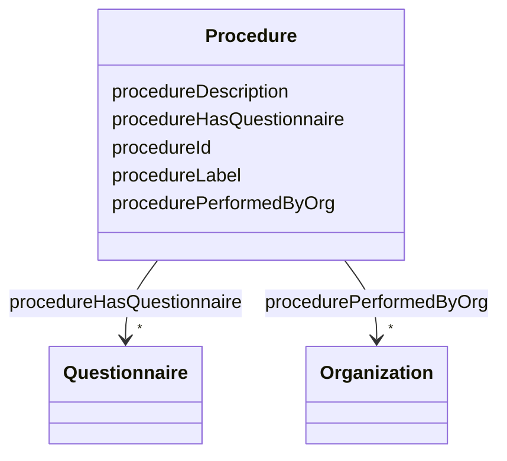

# Class: Procedure 


_A clinical or administrative process that uses resources like questionnaires_


URI: [faqir:Procedure](https://faqir.org/datamodel/Procedure)





<!-- no inheritance hierarchy -->


## Slots

| Name | Cardinality and Range | Description | Inheritance |
| ---  | --- | --- | --- |
| [procedurePerformedByOrg](procedurePerformedByOrg.md) | * <br/> [Organization](Organization.md) | Organization that manages and perfomes this procedure | direct |
| [procedureHasQuestionnaire](procedureHasQuestionnaire.md) | * <br/> [Questionnaire](Questionnaire.md) | Questionnaires part of this procedure | direct |
| [procedureId](procedureId.md) | 1 <br/> [Uriorcurie](Uriorcurie.md) | unique identifier of the procedure | direct |
| [procedureLabel](procedureLabel.md) | 1 <br/> [String](String.md) | Name of the procedure | direct |
| [procedureDescription](procedureDescription.md) | 0..1 <br/> [String](String.md) | Description of the procedure | direct |


## Usages

| used by | used in | type | used |
| ---  | --- | --- | --- |
| [Procedure](Procedure.md) | [procedurePerformedByOrg](procedurePerformedByOrg.md) | domain | [Procedure](Procedure.md) |
| [Procedure](Procedure.md) | [procedureHasQuestionnaire](procedureHasQuestionnaire.md) | domain | [Procedure](Procedure.md) |
| [Questionnaire](Questionnaire.md) | [questionnairePartOfProcedure](questionnairePartOfProcedure.md) | range | [Procedure](Procedure.md) |


## Identifier and Mapping Information


### Schema Source


* from schema: https://w3id.org/faqir/datamodel


## Mappings

| Mapping Type | Mapped Value |
| ---  | ---  |
| self | faqir:Procedure |
| native | https://w3id.org/faqir/datamodel/Procedure |
| undefined | fhir:Procedure |


## LinkML Source

<!-- TODO: investigate https://stackoverflow.com/questions/37606292/how-to-create-tabbed-code-blocks-in-mkdocs-or-sphinx -->

### Direct

<details>
```yaml
name: Procedure
description: A clinical or administrative process that uses resources like questionnaires
from_schema: https://w3id.org/faqir/datamodel
mappings:
- fhir:Procedure
slots:
- procedurePerformedByOrg
- procedureHasQuestionnaire
attributes:
  procedureId:
    name: procedureId
    description: unique identifier of the procedure.
    from_schema: https://w3id.org/faqir/datamodel/entities/procedure
    rank: 1000
    identifier: true
    domain_of:
    - Procedure
    range: uriorcurie
    required: true
  procedureLabel:
    name: procedureLabel
    description: Name of the procedure.
    from_schema: https://w3id.org/faqir/datamodel/entities/procedure
    rank: 1000
    domain_of:
    - Procedure
    range: string
    required: true
  procedureDescription:
    name: procedureDescription
    description: Description of the procedure
    from_schema: https://w3id.org/faqir/datamodel/entities/procedure
    rank: 1000
    domain_of:
    - Procedure
    range: string
    required: false
class_uri: faqir:Procedure

```
</details>

### Induced

<details>
```yaml
name: Procedure
description: A clinical or administrative process that uses resources like questionnaires
from_schema: https://w3id.org/faqir/datamodel
mappings:
- fhir:Procedure
attributes:
  procedureId:
    name: procedureId
    description: unique identifier of the procedure.
    from_schema: https://w3id.org/faqir/datamodel/entities/procedure
    rank: 1000
    identifier: true
    alias: procedureId
    owner: Procedure
    domain_of:
    - Procedure
    range: uriorcurie
    required: true
  procedureLabel:
    name: procedureLabel
    description: Name of the procedure.
    from_schema: https://w3id.org/faqir/datamodel/entities/procedure
    rank: 1000
    alias: procedureLabel
    owner: Procedure
    domain_of:
    - Procedure
    range: string
    required: true
  procedureDescription:
    name: procedureDescription
    description: Description of the procedure
    from_schema: https://w3id.org/faqir/datamodel/entities/procedure
    rank: 1000
    alias: procedureDescription
    owner: Procedure
    domain_of:
    - Procedure
    range: string
    required: false
  procedurePerformedByOrg:
    name: procedurePerformedByOrg
    description: Organization that manages and perfomes this procedure.
    from_schema: https://w3id.org/faqir/datamodel
    rank: 1000
    domain: Procedure
    slot_uri: faqir:procedurePerformedByOrg
    alias: procedurePerformedByOrg
    owner: Procedure
    domain_of:
    - Procedure
    inverse: organizationPerformsProcedure
    range: Organization
    required: false
    multivalued: true
  procedureHasQuestionnaire:
    name: procedureHasQuestionnaire
    description: Questionnaires part of this procedure.
    from_schema: https://w3id.org/faqir/datamodel
    rank: 1000
    domain: Procedure
    slot_uri: faqir:procedureHasQuestionnaire
    alias: procedureHasQuestionnaire
    owner: Procedure
    domain_of:
    - Procedure
    inverse: questionnairePartOfProcedure
    range: Questionnaire
    required: false
    multivalued: true
class_uri: faqir:Procedure

```
</details>