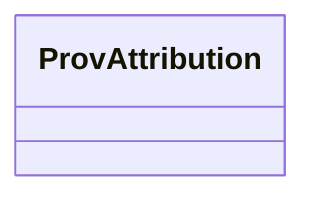

# Class: ProvAttribution 


_An instance of prov:Attribution provides additional descriptions about the binary prov:wasAttributedTo relation from an prov:Entity to some prov:Agent that had some responsible for it. For example, :cake prov:wasAttributedTo :baker; prov:qualifiedAttribution [ a prov:Attribution; prov:entity :baker; :foo :bar ]._


URI: [prov:Attribution](http://www.w3.org/ns/prov#Attribution)





<!-- no inheritance hierarchy -->


## Slots

| Name | Cardinality and Range | Description | Inheritance |
| ---  | --- | --- | --- |


## Identifier and Mapping Information


### Schema Source


* from schema: https://ns.faqir.org/q-o


## Mappings

| Mapping Type | Mapped Value |
| ---  | ---  |
| self | prov:Attribution |
| native | qo:ProvAttribution |


## LinkML Source

<!-- TODO: investigate https://stackoverflow.com/questions/37606292/how-to-create-tabbed-code-blocks-in-mkdocs-or-sphinx -->

### Direct

<details>
```yaml
name: prov_Attribution
description: An instance of prov:Attribution provides additional descriptions about
  the binary prov:wasAttributedTo relation from an prov:Entity to some prov:Agent
  that had some responsible for it. For example, :cake prov:wasAttributedTo :baker;
  prov:qualifiedAttribution [ a prov:Attribution; prov:entity :baker; :foo :bar ].
from_schema: https://ns.faqir.org/q-o
class_uri: prov:Attribution

```
</details>

### Induced

<details>
```yaml
name: prov_Attribution
description: An instance of prov:Attribution provides additional descriptions about
  the binary prov:wasAttributedTo relation from an prov:Entity to some prov:Agent
  that had some responsible for it. For example, :cake prov:wasAttributedTo :baker;
  prov:qualifiedAttribution [ a prov:Attribution; prov:entity :baker; :foo :bar ].
from_schema: https://ns.faqir.org/q-o
class_uri: prov:Attribution

```
</details>