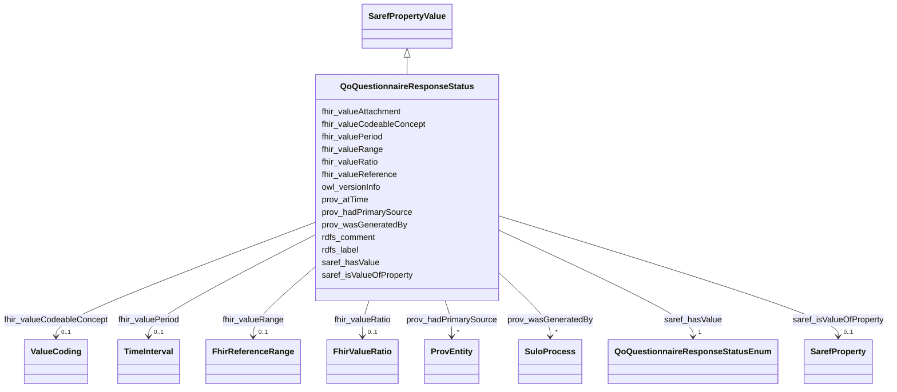

# Class: QoQuestionnaireResponseStatus 


_Defines the lifecycle state governing the operational readiness and availability of a completed or partially completed instance containing recorded values collected from a specific execution of a survey instrument._


URI: [qo:QuestionnaireResponseStatus](https://ns.faqir.org/q-o#QuestionnaireResponseStatus)





## Inheritance
* [OwlThing](OwlThing.md)
    * [SarefPropertyValue](SarefPropertyValue.md)
        * **QoQuestionnaireResponseStatus**


## Slots

| Name | Cardinality and Range | Description | Inheritance |
| ---  | --- | --- | --- |
| [prov_atTime](prov_atTime.md) | 0..1 <br/> [Datetime](Datetime.md) | The time at which an InstantaneousEvent occurred | [SarefPropertyValue](SarefPropertyValue.md) |
| [saref_hasValue](saref_hasValue.md) | 1 <br/> [QoQuestionnaireResponseStatusEnum](QoQuestionnaireResponseStatusEnum.md)&nbsp;or&nbsp;<br />[Integer](Integer.md)&nbsp;or&nbsp;<br />[Float](Float.md)&nbsp;or&nbsp;<br />[Double](Double.md)&nbsp;or&nbsp;<br />[Decimal](Decimal.md)&nbsp;or&nbsp;<br />[Date](Date.md)&nbsp;or&nbsp;<br />[Datetime](Datetime.md)&nbsp;or&nbsp;<br />[Uriorcurie](Uriorcurie.md)&nbsp;or&nbsp;<br />[String](String.md) | The status of the questionnaire response, indicating whether it is 'in-progre... | [SarefPropertyValue](SarefPropertyValue.md) |
| [saref_isValueOfProperty](saref_isValueOfProperty.md) | 0..1 <br/> [SarefProperty](SarefProperty.md) | Links a property value to the property or property of interest it is a value ... | [SarefPropertyValue](SarefPropertyValue.md) |
| [fhir_valueReference](fhir_valueReference.md) | 0..1 <br/> [Uriorcurie](Uriorcurie.md) | The Reference type contains at least one of a reference (literal reference), ... | [SarefPropertyValue](SarefPropertyValue.md) |
| [fhir_valueCodeableConcept](fhir_valueCodeableConcept.md) | 0..1 <br/> [ValueCoding](ValueCoding.md) | A CodeableConcept represents a value that is usually supplied by providing a ... | [SarefPropertyValue](SarefPropertyValue.md) |
| [fhir_valueRange](fhir_valueRange.md) | 0..1 <br/> [FhirReferenceRange](FhirReferenceRange.md) | A set of ordered Quantity values defined by a low and high limit | [SarefPropertyValue](SarefPropertyValue.md) |
| [fhir_valueRatio](fhir_valueRatio.md) | 0..1 <br/> [FhirValueRatio](FhirValueRatio.md) | A relationship between two Quantity values expressed as a numerator and a den... | [SarefPropertyValue](SarefPropertyValue.md) |
| [fhir_valuePeriod](fhir_valuePeriod.md) | 0..1 <br/> [TimeInterval](TimeInterval.md) | A time period defined by a start and end date/time | [SarefPropertyValue](SarefPropertyValue.md) |
| [fhir_valueAttachment](fhir_valueAttachment.md) | 0..1 <br/> [Uriorcurie](Uriorcurie.md) | This type is for containing or referencing attachments - additional data cont... | [SarefPropertyValue](SarefPropertyValue.md) |
| [owl_versionInfo](owl_versionInfo.md) | 0..1 <br/> [String](String.md) | An owl:versionInfo statement generally has as its object a string giving info... | [OwlThing](OwlThing.md) |
| [rdfs_label](rdfs_label.md) | 1..* <br/> [String](String.md) | human-readable version of a resource's name | [OwlThing](OwlThing.md) |
| [rdfs_comment](rdfs_comment.md) | 1..* <br/> [String](String.md) | A textual comment helps clarify the meaning of RDF classes and properties | [OwlThing](OwlThing.md) |
| [prov_hadPrimarySource](prov_hadPrimarySource.md) | * <br/> [ProvEntity](ProvEntity.md) | A primary source for a topic refers to something produced by some agent with ... | [OwlThing](OwlThing.md) |
| [prov_wasGeneratedBy](prov_wasGeneratedBy.md) | * <br/> [SuloProcess](SuloProcess.md) | Generation is the completion of production of a new entity by an activity | [OwlThing](OwlThing.md) |


## Usages

| used by | used in | type | used |
| ---  | --- | --- | --- |
| [QoQuestionnaireResponse](QoQuestionnaireResponse.md) | [fhir_status](fhir_status.md) | range | [QoQuestionnaireResponseStatus](QoQuestionnaireResponseStatus.md) |


## Identifier and Mapping Information


### Schema Source


* from schema: https://ns.faqir.org/q-o


## Mappings

| Mapping Type | Mapped Value |
| ---  | ---  |
| self | qo:QuestionnaireResponseStatus |
| native | qo:QoQuestionnaireResponseStatus |


## LinkML Source

<!-- TODO: investigate https://stackoverflow.com/questions/37606292/how-to-create-tabbed-code-blocks-in-mkdocs-or-sphinx -->

### Direct

<details>
```yaml
name: qo_QuestionnaireResponseStatus
description: Defines the lifecycle state governing the operational readiness and availability
  of a completed or partially completed instance containing recorded values collected
  from a specific execution of a survey instrument.
from_schema: https://ns.faqir.org/q-o
is_a: saref_PropertyValue
slot_usage:
  saref_hasValue:
    name: saref_hasValue
    description: The status of the questionnaire response, indicating whether it is
      'in-progress', 'completed', 'amended', 'entered-in-error' or 'stopped'.
    narrow_mappings:
    - fhir:QuestionnaireResponse.status
    range: qo_QuestionnaireResponseStatusEnum
    required: true
    multivalued: false
    inlined: false
class_uri: qo:QuestionnaireResponseStatus

```
</details>

### Induced

<details>
```yaml
name: qo_QuestionnaireResponseStatus
description: Defines the lifecycle state governing the operational readiness and availability
  of a completed or partially completed instance containing recorded values collected
  from a specific execution of a survey instrument.
from_schema: https://ns.faqir.org/q-o
is_a: saref_PropertyValue
slot_usage:
  saref_hasValue:
    name: saref_hasValue
    description: The status of the questionnaire response, indicating whether it is
      'in-progress', 'completed', 'amended', 'entered-in-error' or 'stopped'.
    narrow_mappings:
    - fhir:QuestionnaireResponse.status
    range: qo_QuestionnaireResponseStatusEnum
    required: true
    multivalued: false
    inlined: false
attributes:
  prov_atTime:
    name: prov_atTime
    description: The time at which an InstantaneousEvent occurred.
    from_schema: https://ns.faqir.org/q-o
    mappings:
    - saref:hasTimestamp
    - fhir:DeviceMetric.calibration.time
    - sosa:phenomenonTime
    rank: 1000
    domain: sulo_Process
    slot_uri: prov:atTime
    alias: prov_atTime
    owner: qo_QuestionnaireResponseStatus
    domain_of:
    - saref_PropertyValue
    range: datetime
    required: false
    multivalued: false
  saref_hasValue:
    name: saref_hasValue
    description: The status of the questionnaire response, indicating whether it is
      'in-progress', 'completed', 'amended', 'entered-in-error' or 'stopped'.
    from_schema: https://ns.faqir.org/q-o
    narrow_mappings:
    - fhir:QuestionnaireResponse.status
    rank: 1000
    slot_uri: saref:hasValue
    alias: saref_hasValue
    owner: qo_QuestionnaireResponseStatus
    domain_of:
    - saref_PropertyValue
    - QuantityValue
    - time_Duration
    range: qo_QuestionnaireResponseStatusEnum
    required: true
    multivalued: false
    inlined: false
    any_of:
    - range: integer
    - range: float
    - range: double
    - range: decimal
    - range: date
    - range: datetime
    - range: uriorcurie
    - range: string
  saref_isValueOfProperty:
    name: saref_isValueOfProperty
    description: Links a property value to the property or property of interest it
      is a value of.
    from_schema: https://ns.faqir.org/q-o
    rank: 1000
    domain: saref_PropertyValue
    slot_uri: saref:isValueOfProperty
    alias: saref_isValueOfProperty
    owner: qo_QuestionnaireResponseStatus
    domain_of:
    - saref_PropertyValue
    range: saref_Property
    required: false
    multivalued: false
  fhir_valueReference:
    name: fhir_valueReference
    description: The Reference type contains at least one of a reference (literal
      reference), an identifier (logical reference), and a display (text description
      of target). In addition, it may contain a target type.
    from_schema: https://ns.faqir.org/q-o
    rank: 1000
    slot_uri: fhir:valueReference
    alias: fhir_valueReference
    owner: qo_QuestionnaireResponseStatus
    domain_of:
    - saref_PropertyValue
    range: uriorcurie
    required: false
    multivalued: false
  fhir_valueCodeableConcept:
    name: fhir_valueCodeableConcept
    description: A CodeableConcept represents a value that is usually supplied by
      providing a reference to one or more terminologies or ontologies but may also
      be defined by the provision of text. This is a common pattern in healthcare
      data.
    from_schema: https://ns.faqir.org/q-o
    rank: 1000
    slot_uri: fhir:valueCodeableConcept
    alias: fhir_valueCodeableConcept
    owner: qo_QuestionnaireResponseStatus
    domain_of:
    - saref_PropertyValue
    range: ValueCoding
    required: false
    multivalued: false
  fhir_valueRange:
    name: fhir_valueRange
    description: A set of ordered Quantity values defined by a low and high limit.
    from_schema: https://ns.faqir.org/q-o
    rank: 1000
    slot_uri: fhir:valueRange
    alias: fhir_valueRange
    owner: qo_QuestionnaireResponseStatus
    domain_of:
    - saref_PropertyValue
    range: fhir_ReferenceRange
    required: false
    multivalued: false
  fhir_valueRatio:
    name: fhir_valueRatio
    description: A relationship between two Quantity values expressed as a numerator
      and a denominator. The Ratio datatype should only be used to express a relationship
      of two numbers if the relationship cannot be suitably expressed using a Quantity
      and a common unit. Where the denominator value is known to be fixed to '1',
      Quantity should be used instead of Ratio.
    from_schema: https://ns.faqir.org/q-o
    rank: 1000
    slot_uri: fhir:valueRatio
    alias: fhir_valueRatio
    owner: qo_QuestionnaireResponseStatus
    domain_of:
    - saref_PropertyValue
    range: fhir_ValueRatio
    required: false
    multivalued: false
  fhir_valuePeriod:
    name: fhir_valuePeriod
    description: A time period defined by a start and end date/time. A period specifies
      a range of times. The context of use will specify whether the entire range applies
      (e.g. 'the patient was an inpatient of the hospital for this time range') or
      one value from the period applies (e.g. 'give to the patient between 2 and 4
      pm on 24-Jun 2013').
    from_schema: https://ns.faqir.org/q-o
    rank: 1000
    slot_uri: fhir:valuePeriod
    alias: fhir_valuePeriod
    owner: qo_QuestionnaireResponseStatus
    domain_of:
    - saref_PropertyValue
    range: time_Interval
    required: false
    multivalued: false
  fhir_valueAttachment:
    name: fhir_valueAttachment
    description: This type is for containing or referencing attachments - additional
      data content defined in other formats. The most common use of this type is to
      include images or reports in some report format such as PDF. However, it can
      be used for any data that has a MIME type.
    from_schema: https://ns.faqir.org/q-o
    rank: 1000
    slot_uri: fhir:valueAttachment
    alias: fhir_valueAttachment
    owner: qo_QuestionnaireResponseStatus
    domain_of:
    - saref_PropertyValue
    range: uriorcurie
    required: false
    multivalued: false
  owl_versionInfo:
    name: owl_versionInfo
    description: An owl:versionInfo statement generally has as its object a string
      giving information about this version, for example RCS/CVS keywords. This statement
      does not contribute to the logical meaning of the ontology other than that given
      by the RDF(S) model theory.
    from_schema: https://ns.faqir.org/q-o
    close_mappings:
    - saref:hasVersion
    rank: 1000
    domain: owl_Thing
    slot_uri: owl:versionInfo
    alias: owl_versionInfo
    owner: qo_QuestionnaireResponseStatus
    domain_of:
    - owl_Thing
    range: string
    required: false
    multivalued: false
  rdfs_label:
    name: rdfs_label
    description: human-readable version of a resource's name. Multilingual labels
      are supported using the language tagging facility of RDF literals.
    from_schema: https://ns.faqir.org/q-o
    rank: 1000
    domain: owl_Thing
    slot_uri: rdfs:label
    alias: rdfs_label
    owner: qo_QuestionnaireResponseStatus
    domain_of:
    - owl_Thing
    range: string
    required: true
    multivalued: true
  rdfs_comment:
    name: rdfs_comment
    description: A textual comment helps clarify the meaning of RDF classes and properties.
      Such in-line documentation complements the use of both formal techniques (Ontology
      and rule languages) and informal (prose documentation, examples, test cases).
      A variety of documentation forms can be combined to indicate the intended meaning
      of the classes and properties described in an RDF vocabulary. Since RDF vocabularies
      are expressed as RDF graphs, vocabularies defined in other namespaces may be
      used to provide richer documentation.
    from_schema: https://ns.faqir.org/q-o
    rank: 1000
    domain: owl_Thing
    slot_uri: rdfs:comment
    alias: rdfs_comment
    owner: qo_QuestionnaireResponseStatus
    domain_of:
    - owl_Thing
    range: string
    required: true
    multivalued: true
  prov_hadPrimarySource:
    name: prov_hadPrimarySource
    description: A primary source for a topic refers to something produced by some
      agent with direct experience and knowledge about the topic, at the time of the
      topic's study, without benefit from hindsight. Because of the directness of
      primary sources, they 'speak for themselves' in ways that cannot be captured
      through the filter of secondary sources. As such, it is important for secondary
      sources to reference those primary sources from which they were derived, so
      that their reliability can be investigated. A primary source relation is a particular
      case of derivation of secondary materials from their primary sources. It is
      recognized that the determination of primary sources can be up to interpretation,
      and should be done according to conventions accepted within the application's
      domain.
    from_schema: https://ns.faqir.org/q-o
    rank: 1000
    domain: owl_Thing
    slot_uri: prov:hadPrimarySource
    alias: prov_hadPrimarySource
    owner: qo_QuestionnaireResponseStatus
    domain_of:
    - owl_Thing
    range: prov_Entity
    required: false
    multivalued: true
  prov_wasGeneratedBy:
    name: prov_wasGeneratedBy
    description: Generation is the completion of production of a new entity by an
      activity. This entity did not exist before generation and becomes available
      for usage after this generation.
    from_schema: https://ns.faqir.org/q-o
    rank: 1000
    domain: owl_Thing
    slot_uri: prov:wasGeneratedBy
    alias: prov_wasGeneratedBy
    owner: qo_QuestionnaireResponseStatus
    domain_of:
    - owl_Thing
    range: sulo_Process
    required: false
    multivalued: true
class_uri: qo:QuestionnaireResponseStatus

```
</details>