# Class: QoScoreDefinition 


_A score calculated from questions._


URI: [qo:ScoreDefinition](https://ns.faqir.org/q-o#ScoreDefinition)

```mermaid
 classDiagram
    class QoScoreDefinition
    click QoScoreDefinition href "../QoScoreDefinition"
      ProvEntity <|-- QoScoreDefinition
        click ProvEntity href "../ProvEntity"
      
      QoScoreDefinition : dcterms_created
        
      QoScoreDefinition : dcterms_creator
        
          
    
        
        
        QoScoreDefinition --> "1..*" ProvOrganization : dcterms_creator
        click ProvOrganization href "../ProvOrganization"
    

        
      QoScoreDefinition : dcterms_hasPart
        
          
    
        
        
        QoScoreDefinition --> "*" OwlThing : dcterms_hasPart
        click OwlThing href "../OwlThing"
    

        
      QoScoreDefinition : dcterms_isPartOf
        
          
    
        
        
        QoScoreDefinition --> "*" OwlThing : dcterms_isPartOf
        click OwlThing href "../OwlThing"
    

        
      QoScoreDefinition : dcterms_modified
        
      QoScoreDefinition : fhir_status
        
          
    
        
        
        QoScoreDefinition --> "*" SarefPropertyValue : fhir_status
        click SarefPropertyValue href "../SarefPropertyValue"
    

        
      QoScoreDefinition : owl_versionInfo
        
      QoScoreDefinition : prov_generatedAtTime
        
          
    
        
        
        QoScoreDefinition --> "*" FlexibleDateTime : prov_generatedAtTime
        click FlexibleDateTime href "../FlexibleDateTime"
    

        
      QoScoreDefinition : prov_hadPrimarySource
        
          
    
        
        
        QoScoreDefinition --> "*" ProvEntity : prov_hadPrimarySource
        click ProvEntity href "../ProvEntity"
    

        
      QoScoreDefinition : prov_type
        
          
    
        
        
        QoScoreDefinition --> "1..*" QoScoreType : prov_type
        click QoScoreType href "../QoScoreType"
    

        
      QoScoreDefinition : prov_wasAttributedTo
        
          
    
        
        
        QoScoreDefinition --> "*" FoafAgent : prov_wasAttributedTo
        click FoafAgent href "../FoafAgent"
    

        
      QoScoreDefinition : prov_wasGeneratedBy
        
          
    
        
        
        QoScoreDefinition --> "*" SuloProcess : prov_wasGeneratedBy
        click SuloProcess href "../SuloProcess"
    

        
      QoScoreDefinition : qo_categories
        
      QoScoreDefinition : qo_formula
        
      QoScoreDefinition : qo_interpretationGuide
        
      QoScoreDefinition : qo_intervalParams
        
          
    
        
        
        QoScoreDefinition --> "0..1" IntervalParams : qo_intervalParams
        click IntervalParams href "../IntervalParams"
    

        
      QoScoreDefinition : qo_parameter
        
          
    
        
        
        QoScoreDefinition --> "*" QoScoreParameter : qo_parameter
        click QoScoreParameter href "../QoScoreParameter"
    

        
      QoScoreDefinition : qo_usesQuestion
        
          
    
        
        
        QoScoreDefinition --> "1..*" QoQuestion : qo_usesQuestion
        click QoQuestion href "../QoQuestion"
    

        
      QoScoreDefinition : rdfs_comment
        
      QoScoreDefinition : rdfs_label
        
      QoScoreDefinition : saref_hasProperty
        
          
    
        
        
        QoScoreDefinition --> "*" SarefProperty : saref_hasProperty
        click SarefProperty href "../SarefProperty"
    

        
      QoScoreDefinition : saref_hasPropertyValue
        
          
    
        
        
        QoScoreDefinition --> "*" SarefPropertyValue : saref_hasPropertyValue
        click SarefPropertyValue href "../SarefPropertyValue"
    

        
      
```





## Inheritance
* [OwlThing](OwlThing.md)
    * [ProvEntity](ProvEntity.md)
        * **QoScoreDefinition**


## Slots

| Name | Cardinality and Range | Description | Inheritance |
| ---  | --- | --- | --- |
| [qo_parameter](qo_parameter.md) | * <br/> [QoScoreParameter](QoScoreParameter.md) | The ScoreParameter that is required for this ScoreDefinition | direct |
| [qo_usesQuestion](qo_usesQuestion.md) | 1..* <br/> [QoQuestion](QoQuestion.md) | The Question(s) that this ScoreDefinition is based on | direct |
| [qo_formula](qo_formula.md) | 1 <br/> [String](String.md) | The formula used to calculate the score | direct |
| [qo_categories](qo_categories.md) | * <br/> [String](String.md) | Categories for categorical scores | direct |
| [qo_interpretationGuide](qo_interpretationGuide.md) | 0..1 <br/> [String](String.md) | How to interpret the score values | direct |
| [qo_intervalParams](qo_intervalParams.md) | 0..1 <br/> [IntervalParams](IntervalParams.md) | Minimum and maximum values for numerical_percentage and numerical_z_score sco... | direct |
| [prov_wasAttributedTo](prov_wasAttributedTo.md) | * <br/> [FoafAgent](FoafAgent.md) | Attribution is the ascribing of an entity to an agent | [ProvEntity](ProvEntity.md) |
| [dcterms_created](dcterms_created.md) | 1 <br/> [datetime](datetime.md) | The date and time when the score was defined | [ProvEntity](ProvEntity.md) |
| [dcterms_modified](dcterms_modified.md) | 1 <br/> [datetime](datetime.md) | The date and time when the score definition was last updated | [ProvEntity](ProvEntity.md) |
| [owl_versionInfo](owl_versionInfo.md) | 0..1 <br/> [String](String.md) | An owl:versionInfo statement generally has as its object a string giving info... | [OwlThing](OwlThing.md) |
| [rdfs_label](rdfs_label.md) | 1..* <br/> [String](String.md) | human-readable version of a resource's name | [OwlThing](OwlThing.md) |
| [rdfs_comment](rdfs_comment.md) | 1..* <br/> [String](String.md) | A textual comment helps clarify the meaning of RDF classes and properties | [OwlThing](OwlThing.md) |
| [prov_type](prov_type.md) | 1..* <br/> [QoScoreType](QoScoreType.md) | Type of score: numerical_continuous, numerical_integer, numerical_percentage,... | [OwlThing](OwlThing.md) |
| [dcterms_hasPart](dcterms_hasPart.md) | * <br/> [OwlThing](OwlThing.md) | A related resource that is included either physically or logically in the des... | [OwlThing](OwlThing.md) |
| [dcterms_isPartOf](dcterms_isPartOf.md) | * <br/> [OwlThing](OwlThing.md) | A related resource in which the described resource is physically or logically... | [OwlThing](OwlThing.md) |
| [prov_generatedAtTime](prov_generatedAtTime.md) | * <br/> [FlexibleDateTime](FlexibleDateTime.md) | The time at which an entity was completely created and is available for use | [OwlThing](OwlThing.md) |
| [fhir_status](fhir_status.md) | * <br/> [SarefPropertyValue](SarefPropertyValue.md) | A code specifying the state of the observation/procedure/questionnaire | [OwlThing](OwlThing.md) |
| [dcterms_creator](dcterms_creator.md) | 1..* <br/> [ProvOrganization](ProvOrganization.md) | The Organization that has created this Score Definition | [OwlThing](OwlThing.md) |
| [prov_hadPrimarySource](prov_hadPrimarySource.md) | * <br/> [ProvEntity](ProvEntity.md) | A primary source for a topic refers to something produced by some agent with ... | [OwlThing](OwlThing.md) |
| [prov_wasGeneratedBy](prov_wasGeneratedBy.md) | * <br/> [SuloProcess](SuloProcess.md) | Generation is the completion of production of a new entity by an activity | [OwlThing](OwlThing.md) |
| [saref_hasProperty](saref_hasProperty.md) | * <br/> [SarefProperty](SarefProperty.md) | Links a feature kind or a feature of interest to one of its properties | [OwlThing](OwlThing.md) |
| [saref_hasPropertyValue](saref_hasPropertyValue.md) | * <br/> [SarefPropertyValue](SarefPropertyValue.md) | Links a feature kind, a feature of interest, or a property of interest, to a ... | [OwlThing](OwlThing.md) |


## Usages

| used by | used in | type | used |
| ---  | --- | --- | --- |
| [QoQuestionnaire](QoQuestionnaire.md) | [qo_usesScoreDefinition](qo_usesScoreDefinition.md) | range | [QoScoreDefinition](QoScoreDefinition.md) |
| [QoSection](QoSection.md) | [qo_usesScoreDefinition](qo_usesScoreDefinition.md) | range | [QoScoreDefinition](QoScoreDefinition.md) |
| [QoScoreDefinition](QoScoreDefinition.md) | [qo_parameter](qo_parameter.md) | domain | [QoScoreDefinition](QoScoreDefinition.md) |
| [QoScoreDefinition](QoScoreDefinition.md) | [qo_usesQuestion](qo_usesQuestion.md) | domain | [QoScoreDefinition](QoScoreDefinition.md) |
| [QoScoreValue](QoScoreValue.md) | [qo_basedOn](qo_basedOn.md) | range | [QoScoreDefinition](QoScoreDefinition.md) |


## Identifier and Mapping Information


### Schema Source


* from schema: https://ns.faqir.org/q-o


## Mappings

| Mapping Type | Mapped Value |
| ---  | ---  |
| self | qo:ScoreDefinition |
| native | qo:QoScoreDefinition |


## LinkML Source

<!-- TODO: investigate https://stackoverflow.com/questions/37606292/how-to-create-tabbed-code-blocks-in-mkdocs-or-sphinx -->

### Direct

<details>
```yaml
name: qo_ScoreDefinition
description: A score calculated from questions.
from_schema: https://ns.faqir.org/q-o
is_a: prov_Entity
slots:
- qo_parameter
- qo_usesQuestion
slot_usage:
  prov_type:
    name: prov_type
    description: 'Type of score: numerical_continuous, numerical_integer, numerical_percentage,
      numerical_z_score, numerical_t_score or categorical. Determines valid score
      values.'
    range: qo_ScoreType
    required: true
  dcterms_created:
    name: dcterms_created
    description: The date and time when the score was defined.
    required: true
  dcterms_modified:
    name: dcterms_modified
    description: The date and time when the score definition was last updated.
    required: true
  dcterms_creator:
    name: dcterms_creator
    description: The Organization that has created this Score Definition.
    range: prov_Organization
    required: true
    multivalued: true
attributes:
  qo_formula:
    name: qo_formula
    description: The formula used to calculate the score.
    from_schema: https://ns.faqir.org/q-o/classes
    rank: 1000
    slot_uri: qo:formula
    domain_of:
    - qo_ScoreDefinition
    range: string
    required: true
  qo_categories:
    name: qo_categories
    description: Categories for categorical scores.
    from_schema: https://ns.faqir.org/q-o/classes
    rank: 1000
    slot_uri: qo:categories
    domain_of:
    - qo_ScoreDefinition
    range: string
    required: false
    multivalued: true
  qo_interpretationGuide:
    name: qo_interpretationGuide
    description: How to interpret the score values. English explanation.
    from_schema: https://ns.faqir.org/q-o/classes
    rank: 1000
    slot_uri: qo:interpretationGuide
    domain_of:
    - qo_ScoreDefinition
    range: string
    required: false
  qo_intervalParams:
    name: qo_intervalParams
    description: Minimum and maximum values for numerical_percentage and numerical_z_score
      scores.
    from_schema: https://ns.faqir.org/q-o/classes
    slot_uri: qo:intervalParams
    domain_of:
    - qo_Question
    - qo_ScoreDefinition
    range: IntervalParams
    required: false
class_uri: qo:ScoreDefinition
rules:
- preconditions:
    slot_conditions:
      prov_type:
        name: prov_type
        equals_string_in:
        - categorical
  postconditions:
    slot_conditions:
      qo_scoreDefinitionCategories:
        name: qo_scoreDefinitionCategories
        required: true
  description: If scoreDefinitionType is 'categorical', scoreDefinitionCategories
    is required.
- preconditions:
    slot_conditions:
      prov_type:
        name: prov_type
        equals_string_in:
        - numerical_percentage
        - numerical_z_score
  postconditions:
    slot_conditions:
      qo_scoreDefinitionIntervalParams:
        name: qo_scoreDefinitionIntervalParams
        required: true
  description: If scoreDefinitionType is 'numerical_percentage' or 'numerical_z_score',
    scoreDefinitionIntervalParams is required.

```
</details>

### Induced

<details>
```yaml
name: qo_ScoreDefinition
description: A score calculated from questions.
from_schema: https://ns.faqir.org/q-o
is_a: prov_Entity
slot_usage:
  prov_type:
    name: prov_type
    description: 'Type of score: numerical_continuous, numerical_integer, numerical_percentage,
      numerical_z_score, numerical_t_score or categorical. Determines valid score
      values.'
    range: qo_ScoreType
    required: true
  dcterms_created:
    name: dcterms_created
    description: The date and time when the score was defined.
    required: true
  dcterms_modified:
    name: dcterms_modified
    description: The date and time when the score definition was last updated.
    required: true
  dcterms_creator:
    name: dcterms_creator
    description: The Organization that has created this Score Definition.
    range: prov_Organization
    required: true
    multivalued: true
attributes:
  qo_formula:
    name: qo_formula
    description: The formula used to calculate the score.
    from_schema: https://ns.faqir.org/q-o/classes
    rank: 1000
    slot_uri: qo:formula
    alias: qo_formula
    owner: qo_ScoreDefinition
    domain_of:
    - qo_ScoreDefinition
    range: string
    required: true
  qo_categories:
    name: qo_categories
    description: Categories for categorical scores.
    from_schema: https://ns.faqir.org/q-o/classes
    rank: 1000
    slot_uri: qo:categories
    alias: qo_categories
    owner: qo_ScoreDefinition
    domain_of:
    - qo_ScoreDefinition
    range: string
    required: false
    multivalued: true
  qo_interpretationGuide:
    name: qo_interpretationGuide
    description: How to interpret the score values. English explanation.
    from_schema: https://ns.faqir.org/q-o/classes
    rank: 1000
    slot_uri: qo:interpretationGuide
    alias: qo_interpretationGuide
    owner: qo_ScoreDefinition
    domain_of:
    - qo_ScoreDefinition
    range: string
    required: false
  qo_intervalParams:
    name: qo_intervalParams
    description: Minimum and maximum values for numerical_percentage and numerical_z_score
      scores.
    from_schema: https://ns.faqir.org/q-o/classes
    slot_uri: qo:intervalParams
    alias: qo_intervalParams
    owner: qo_ScoreDefinition
    domain_of:
    - qo_Question
    - qo_ScoreDefinition
    range: IntervalParams
    required: false
  qo_parameter:
    name: qo_parameter
    description: The ScoreParameter that is required for this ScoreDefinition.
    from_schema: https://ns.faqir.org/q-o
    rank: 1000
    domain: qo_ScoreDefinition
    slot_uri: qo:parameter
    alias: qo_parameter
    owner: qo_ScoreDefinition
    domain_of:
    - qo_ScoreDefinition
    range: qo_ScoreParameter
    required: false
    multivalued: true
  qo_usesQuestion:
    name: qo_usesQuestion
    description: The Question(s) that this ScoreDefinition is based on.
    from_schema: https://ns.faqir.org/q-o
    rank: 1000
    domain: qo_ScoreDefinition
    slot_uri: qo:usesQuestion
    alias: qo_usesQuestion
    owner: qo_ScoreDefinition
    domain_of:
    - qo_ScoreDefinition
    range: qo_Question
    required: true
    multivalued: true
  prov_wasAttributedTo:
    name: prov_wasAttributedTo
    description: Attribution is the ascribing of an entity to an agent.
    from_schema: https://ns.faqir.org/q-o
    rank: 1000
    domain: prov_Entity
    slot_uri: prov:wasAttributedTo
    alias: prov_wasAttributedTo
    owner: qo_ScoreDefinition
    domain_of:
    - prov_Entity
    range: foaf_Agent
    required: false
    multivalued: true
  dcterms_created:
    name: dcterms_created
    description: The date and time when the score was defined.
    from_schema: https://ns.faqir.org/q-o
    rank: 1000
    slot_uri: dcterms:created
    alias: dcterms_created
    owner: qo_ScoreDefinition
    domain_of:
    - prov_Entity
    range: datetime
    required: true
  dcterms_modified:
    name: dcterms_modified
    description: The date and time when the score definition was last updated.
    from_schema: https://ns.faqir.org/q-o
    rank: 1000
    slot_uri: dcterms:modified
    alias: dcterms_modified
    owner: qo_ScoreDefinition
    domain_of:
    - prov_Entity
    range: datetime
    required: true
  owl_versionInfo:
    name: owl_versionInfo
    description: An owl:versionInfo statement generally has as its object a string
      giving information about this version, for example RCS/CVS keywords. This statement
      does not contribute to the logical meaning of the ontology other than that given
      by the RDF(S) model theory.
    from_schema: https://ns.faqir.org/q-o
    close_mappings:
    - saref:hasVersion
    rank: 1000
    domain: owl_Thing
    slot_uri: owl:versionInfo
    alias: owl_versionInfo
    owner: qo_ScoreDefinition
    domain_of:
    - owl_Thing
    range: string
    required: false
    multivalued: false
  rdfs_label:
    name: rdfs_label
    description: human-readable version of a resource's name. Multilingual labels
      are supported using the language tagging facility of RDF literals.
    from_schema: https://ns.faqir.org/q-o
    rank: 1000
    domain: owl_Thing
    slot_uri: rdfs:label
    alias: rdfs_label
    owner: qo_ScoreDefinition
    domain_of:
    - owl_Thing
    range: string
    required: true
    multivalued: true
  rdfs_comment:
    name: rdfs_comment
    description: A textual comment helps clarify the meaning of RDF classes and properties.
      Such in-line documentation complements the use of both formal techniques (Ontology
      and rule languages) and informal (prose documentation, examples, test cases).
      A variety of documentation forms can be combined to indicate the intended meaning
      of the classes and properties described in an RDF vocabulary. Since RDF vocabularies
      are expressed as RDF graphs, vocabularies defined in other namespaces may be
      used to provide richer documentation.
    from_schema: https://ns.faqir.org/q-o
    rank: 1000
    domain: owl_Thing
    slot_uri: rdfs:comment
    alias: rdfs_comment
    owner: qo_ScoreDefinition
    domain_of:
    - owl_Thing
    range: string
    required: true
    multivalued: true
  prov_type:
    name: prov_type
    description: 'Type of score: numerical_continuous, numerical_integer, numerical_percentage,
      numerical_z_score, numerical_t_score or categorical. Determines valid score
      values.'
    from_schema: https://ns.faqir.org/q-o
    exact_mappings:
    - rdf:type
    - sphn:hasTypeCode
    narrow_mappings:
    - schema:procedureType
    rank: 1000
    domain: owl_Thing
    slot_uri: prov:type
    alias: prov_type
    owner: qo_ScoreDefinition
    domain_of:
    - owl_Thing
    - sphn_TimePattern
    range: qo_ScoreType
    required: true
    multivalued: true
  dcterms_hasPart:
    name: dcterms_hasPart
    description: A related resource that is included either physically or logically
      in the described resource.
    from_schema: https://ns.faqir.org/q-o
    rank: 1000
    domain: owl_Thing
    slot_uri: dcterms:hasPart
    alias: dcterms_hasPart
    owner: qo_ScoreDefinition
    domain_of:
    - owl_Thing
    inverse: dcterms_isPartOf
    range: owl_Thing
    required: false
    multivalued: true
  dcterms_isPartOf:
    name: dcterms_isPartOf
    description: A related resource in which the described resource is physically
      or logically included.
    from_schema: https://ns.faqir.org/q-o
    rank: 1000
    domain: owl_Thing
    slot_uri: dcterms:isPartOf
    alias: dcterms_isPartOf
    owner: qo_ScoreDefinition
    domain_of:
    - owl_Thing
    inverse: dcterms_hasPart
    range: owl_Thing
    required: false
    multivalued: true
  prov_generatedAtTime:
    name: prov_generatedAtTime
    description: The time at which an entity was completely created and is available
      for use.
    from_schema: https://ns.faqir.org/q-o
    rank: 1000
    domain: owl_Thing
    slot_uri: prov:generatedAtTime
    alias: prov_generatedAtTime
    owner: qo_ScoreDefinition
    domain_of:
    - owl_Thing
    range: FlexibleDateTime
    required: false
    multivalued: true
  fhir_status:
    name: fhir_status
    description: A code specifying the state of the observation/procedure/questionnaire...
      Generally, this will be the in-progress or completed state.
    from_schema: https://ns.faqir.org/q-o
    rank: 1000
    is_a: saref_hasPropertyValue
    domain: owl_Thing
    slot_uri: fhir:resource-status
    alias: fhir_status
    owner: qo_ScoreDefinition
    domain_of:
    - owl_Thing
    range: saref_PropertyValue
    required: false
    multivalued: true
    inlined: true
    inlined_as_list: true
  dcterms_creator:
    name: dcterms_creator
    description: The Organization that has created this Score Definition.
    from_schema: https://ns.faqir.org/q-o
    rank: 1000
    domain: owl_Thing
    slot_uri: dcterms:creator
    alias: dcterms_creator
    owner: qo_ScoreDefinition
    domain_of:
    - owl_Thing
    range: prov_Organization
    required: true
    multivalued: true
  prov_hadPrimarySource:
    name: prov_hadPrimarySource
    description: A primary source for a topic refers to something produced by some
      agent with direct experience and knowledge about the topic, at the time of the
      topic's study, without benefit from hindsight. Because of the directness of
      primary sources, they 'speak for themselves' in ways that cannot be captured
      through the filter of secondary sources. As such, it is important for secondary
      sources to reference those primary sources from which they were derived, so
      that their reliability can be investigated. A primary source relation is a particular
      case of derivation of secondary materials from their primary sources. It is
      recognized that the determination of primary sources can be up to interpretation,
      and should be done according to conventions accepted within the application's
      domain.
    from_schema: https://ns.faqir.org/q-o
    rank: 1000
    domain: owl_Thing
    slot_uri: prov:hadPrimarySource
    alias: prov_hadPrimarySource
    owner: qo_ScoreDefinition
    domain_of:
    - owl_Thing
    range: prov_Entity
    required: false
    multivalued: true
  prov_wasGeneratedBy:
    name: prov_wasGeneratedBy
    description: Generation is the completion of production of a new entity by an
      activity. This entity did not exist before generation and becomes available
      for usage after this generation.
    from_schema: https://ns.faqir.org/q-o
    rank: 1000
    domain: owl_Thing
    slot_uri: prov:wasGeneratedBy
    alias: prov_wasGeneratedBy
    owner: qo_ScoreDefinition
    domain_of:
    - owl_Thing
    range: sulo_Process
    required: false
    multivalued: true
  saref_hasProperty:
    name: saref_hasProperty
    description: Links a feature kind or a feature of interest to one of its properties.
    from_schema: https://ns.faqir.org/q-o
    mappings:
    - ssn:hasProperty
    rank: 1000
    domain: owl_Thing
    slot_uri: saref:hasProperty
    alias: saref_hasProperty
    owner: qo_ScoreDefinition
    domain_of:
    - owl_Thing
    range: saref_Property
    required: false
    multivalued: true
    inlined: true
    inlined_as_list: true
  saref_hasPropertyValue:
    name: saref_hasPropertyValue
    description: Links a feature kind, a feature of interest, or a property of interest,
      to a property value.
    from_schema: https://ns.faqir.org/q-o
    rank: 1000
    domain: owl_Thing
    slot_uri: saref:hasPropertyValue
    alias: saref_hasPropertyValue
    owner: qo_ScoreDefinition
    domain_of:
    - owl_Thing
    range: saref_PropertyValue
    required: false
    multivalued: true
    inlined: true
    inlined_as_list: true
class_uri: qo:ScoreDefinition
rules:
- preconditions:
    slot_conditions:
      prov_type:
        name: prov_type
        equals_string_in:
        - categorical
  postconditions:
    slot_conditions:
      qo_scoreDefinitionCategories:
        name: qo_scoreDefinitionCategories
        required: true
  description: If scoreDefinitionType is 'categorical', scoreDefinitionCategories
    is required.
- preconditions:
    slot_conditions:
      prov_type:
        name: prov_type
        equals_string_in:
        - numerical_percentage
        - numerical_z_score
  postconditions:
    slot_conditions:
      qo_scoreDefinitionIntervalParams:
        name: qo_scoreDefinitionIntervalParams
        required: true
  description: If scoreDefinitionType is 'numerical_percentage' or 'numerical_z_score',
    scoreDefinitionIntervalParams is required.

```
</details>