# Class: QoScoreParameter 


_Parameters for score definitions, such as min/max values, categories or constants needed._


URI: [qo:ScoreParameter](https://ns.faqir.org/q-o#ScoreParameter)

```mermaid
 classDiagram
    class QoScoreParameter
    click QoScoreParameter href "../QoScoreParameter"
      ProvEntity <|-- QoScoreParameter
        click ProvEntity href "../ProvEntity"
      
      QoScoreParameter : dcterms_created
        
      QoScoreParameter : dcterms_creator
        
          
    
        
        
        QoScoreParameter --> "*" FoafAgent : dcterms_creator
        click FoafAgent href "../FoafAgent"
    

        
      QoScoreParameter : dcterms_hasPart
        
          
    
        
        
        QoScoreParameter --> "*" OwlThing : dcterms_hasPart
        click OwlThing href "../OwlThing"
    

        
      QoScoreParameter : dcterms_isPartOf
        
          
    
        
        
        QoScoreParameter --> "*" OwlThing : dcterms_isPartOf
        click OwlThing href "../OwlThing"
    

        
      QoScoreParameter : dcterms_modified
        
      QoScoreParameter : fhir_status
        
          
    
        
        
        QoScoreParameter --> "*" SarefPropertyValue : fhir_status
        click SarefPropertyValue href "../SarefPropertyValue"
    

        
      QoScoreParameter : owl_versionInfo
        
      QoScoreParameter : prov_generatedAtTime
        
          
    
        
        
        QoScoreParameter --> "*" FlexibleDateTime : prov_generatedAtTime
        click FlexibleDateTime href "../FlexibleDateTime"
    

        
      QoScoreParameter : prov_hadPrimarySource
        
          
    
        
        
        QoScoreParameter --> "*" ProvEntity : prov_hadPrimarySource
        click ProvEntity href "../ProvEntity"
    

        
      QoScoreParameter : prov_type
        
          
    
        
        
        QoScoreParameter --> "1..*" QoScoreParameterType : prov_type
        click QoScoreParameterType href "../QoScoreParameterType"
    

        
      QoScoreParameter : prov_wasAttributedTo
        
          
    
        
        
        QoScoreParameter --> "*" FoafAgent : prov_wasAttributedTo
        click FoafAgent href "../FoafAgent"
    

        
      QoScoreParameter : prov_wasGeneratedBy
        
          
    
        
        
        QoScoreParameter --> "*" SuloProcess : prov_wasGeneratedBy
        click SuloProcess href "../SuloProcess"
    

        
      QoScoreParameter : qo_valueDateTime
        
          
    
        
        
        QoScoreParameter --> "0..1" ValueDateTime : qo_valueDateTime
        click ValueDateTime href "../ValueDateTime"
    

        
      QoScoreParameter : qo_valueNumerical
        
          
    
        
        
        QoScoreParameter --> "0..1" ValueNumerical : qo_valueNumerical
        click ValueNumerical href "../ValueNumerical"
    

        
      QoScoreParameter : rdfs_comment
        
      QoScoreParameter : rdfs_label
        
      QoScoreParameter : saref_hasProperty
        
          
    
        
        
        QoScoreParameter --> "*" SarefProperty : saref_hasProperty
        click SarefProperty href "../SarefProperty"
    

        
      QoScoreParameter : saref_hasPropertyValue
        
          
    
        
        
        QoScoreParameter --> "*" SarefPropertyValue : saref_hasPropertyValue
        click SarefPropertyValue href "../SarefPropertyValue"
    

        
      
```





## Inheritance
* [OwlThing](OwlThing.md)
    * [ProvEntity](ProvEntity.md)
        * **QoScoreParameter**


## Slots

| Name | Cardinality and Range | Description | Inheritance |
| ---  | --- | --- | --- |
| [qo_valueNumerical](qo_valueNumerical.md) | 0..1 <br/> [ValueNumerical](ValueNumerical.md) | Numerical value parameter (e | direct |
| [qo_valueDateTime](qo_valueDateTime.md) | 0..1 <br/> [ValueDateTime](ValueDateTime.md) | DateTime value parameter formatted as YYYY-MM-DDThh:mm:ss+zz:zz | direct |
| [prov_wasAttributedTo](prov_wasAttributedTo.md) | * <br/> [FoafAgent](FoafAgent.md) | Attribution is the ascribing of an entity to an agent | [ProvEntity](ProvEntity.md) |
| [dcterms_created](dcterms_created.md) | 0..1 <br/> [datetime](datetime.md) | The date and time when the entity was created | [ProvEntity](ProvEntity.md) |
| [dcterms_modified](dcterms_modified.md) | 0..1 <br/> [datetime](datetime.md) | The date and time when the entity was last updated | [ProvEntity](ProvEntity.md) |
| [owl_versionInfo](owl_versionInfo.md) | 0..1 <br/> [String](String.md) | An owl:versionInfo statement generally has as its object a string giving info... | [OwlThing](OwlThing.md) |
| [rdfs_label](rdfs_label.md) | 1..* <br/> [String](String.md) | human-readable version of a resource's name | [OwlThing](OwlThing.md) |
| [rdfs_comment](rdfs_comment.md) | 1..* <br/> [String](String.md) | A textual comment helps clarify the meaning of RDF classes and properties | [OwlThing](OwlThing.md) |
| [prov_type](prov_type.md) | 1..* <br/> [QoScoreParameterType](QoScoreParameterType.md) | Type of parameter: numerical or dateTime | [OwlThing](OwlThing.md) |
| [dcterms_hasPart](dcterms_hasPart.md) | * <br/> [OwlThing](OwlThing.md) | A related resource that is included either physically or logically in the des... | [OwlThing](OwlThing.md) |
| [dcterms_isPartOf](dcterms_isPartOf.md) | * <br/> [OwlThing](OwlThing.md) | A related resource in which the described resource is physically or logically... | [OwlThing](OwlThing.md) |
| [prov_generatedAtTime](prov_generatedAtTime.md) | * <br/> [FlexibleDateTime](FlexibleDateTime.md) | The time at which an entity was completely created and is available for use | [OwlThing](OwlThing.md) |
| [fhir_status](fhir_status.md) | * <br/> [SarefPropertyValue](SarefPropertyValue.md) | A code specifying the state of the observation/procedure/questionnaire | [OwlThing](OwlThing.md) |
| [dcterms_creator](dcterms_creator.md) | * <br/> [FoafAgent](FoafAgent.md) | An entity responsible for making the resource | [OwlThing](OwlThing.md) |
| [prov_hadPrimarySource](prov_hadPrimarySource.md) | * <br/> [ProvEntity](ProvEntity.md) | A primary source for a topic refers to something produced by some agent with ... | [OwlThing](OwlThing.md) |
| [prov_wasGeneratedBy](prov_wasGeneratedBy.md) | * <br/> [SuloProcess](SuloProcess.md) | Generation is the completion of production of a new entity by an activity | [OwlThing](OwlThing.md) |
| [saref_hasProperty](saref_hasProperty.md) | * <br/> [SarefProperty](SarefProperty.md) | Links a feature kind or a feature of interest to one of its properties | [OwlThing](OwlThing.md) |
| [saref_hasPropertyValue](saref_hasPropertyValue.md) | * <br/> [SarefPropertyValue](SarefPropertyValue.md) | Links a feature kind, a feature of interest, or a property of interest, to a ... | [OwlThing](OwlThing.md) |


## Usages

| used by | used in | type | used |
| ---  | --- | --- | --- |
| [QoScoreDefinition](QoScoreDefinition.md) | [qo_parameter](qo_parameter.md) | range | [QoScoreParameter](QoScoreParameter.md) |


## Identifier and Mapping Information


### Schema Source


* from schema: https://ns.faqir.org/q-o


## Mappings

| Mapping Type | Mapped Value |
| ---  | ---  |
| self | qo:ScoreParameter |
| native | qo:QoScoreParameter |


## LinkML Source

<!-- TODO: investigate https://stackoverflow.com/questions/37606292/how-to-create-tabbed-code-blocks-in-mkdocs-or-sphinx -->

### Direct

<details>
```yaml
name: qo_ScoreParameter
description: Parameters for score definitions, such as min/max values, categories
  or constants needed.
from_schema: https://ns.faqir.org/q-o
is_a: prov_Entity
slot_usage:
  prov_type:
    name: prov_type
    description: 'Type of parameter: numerical or dateTime.'
    range: qo_ScoreParameterType
    required: true
attributes:
  qo_valueNumerical:
    name: qo_valueNumerical
    description: Numerical value parameter (e.g., 0.785, 82).
    from_schema: https://ns.faqir.org/q-o/classes
    rank: 1000
    slot_uri: qo:valueNumerical
    domain_of:
    - qo_ScoreParameter
    range: ValueNumerical
    required: false
  qo_valueDateTime:
    name: qo_valueDateTime
    description: DateTime value parameter formatted as YYYY-MM-DDThh:mm:ss+zz:zz.
    from_schema: https://ns.faqir.org/q-o/classes
    rank: 1000
    slot_uri: qo:valueDateTime
    domain_of:
    - qo_ScoreParameter
    range: ValueDateTime
    required: false
class_uri: qo:ScoreParameter
rules:
- preconditions:
    slot_conditions:
      qo_scoreParameterType:
        name: qo_scoreParameterType
        equals_string_in:
        - numerical
  postconditions:
    slot_conditions:
      qo_scoreParameterValueNumerical:
        name: qo_scoreParameterValueNumerical
        required: true
  description: If scoreParameterType is 'numerical', scoreParameterValueNumerical
    is required.
- preconditions:
    slot_conditions:
      qo_scoreParameterType:
        name: qo_scoreParameterType
        equals_string_in:
        - dateTime
  postconditions:
    slot_conditions:
      qo_scoreParameterValueDateTime:
        name: qo_scoreParameterValueDateTime
        required: true
  description: If scoreParameterType is 'dateTime', scoreParameterValueDateTime is
    required.

```
</details>

### Induced

<details>
```yaml
name: qo_ScoreParameter
description: Parameters for score definitions, such as min/max values, categories
  or constants needed.
from_schema: https://ns.faqir.org/q-o
is_a: prov_Entity
slot_usage:
  prov_type:
    name: prov_type
    description: 'Type of parameter: numerical or dateTime.'
    range: qo_ScoreParameterType
    required: true
attributes:
  qo_valueNumerical:
    name: qo_valueNumerical
    description: Numerical value parameter (e.g., 0.785, 82).
    from_schema: https://ns.faqir.org/q-o/classes
    rank: 1000
    slot_uri: qo:valueNumerical
    alias: qo_valueNumerical
    owner: qo_ScoreParameter
    domain_of:
    - qo_ScoreParameter
    range: ValueNumerical
    required: false
  qo_valueDateTime:
    name: qo_valueDateTime
    description: DateTime value parameter formatted as YYYY-MM-DDThh:mm:ss+zz:zz.
    from_schema: https://ns.faqir.org/q-o/classes
    rank: 1000
    slot_uri: qo:valueDateTime
    alias: qo_valueDateTime
    owner: qo_ScoreParameter
    domain_of:
    - qo_ScoreParameter
    range: ValueDateTime
    required: false
  prov_wasAttributedTo:
    name: prov_wasAttributedTo
    description: Attribution is the ascribing of an entity to an agent.
    from_schema: https://ns.faqir.org/q-o
    rank: 1000
    domain: prov_Entity
    slot_uri: prov:wasAttributedTo
    alias: prov_wasAttributedTo
    owner: qo_ScoreParameter
    domain_of:
    - prov_Entity
    range: foaf_Agent
    required: false
    multivalued: true
  dcterms_created:
    name: dcterms_created
    description: The date and time when the entity was created.
    from_schema: https://ns.faqir.org/q-o
    rank: 1000
    slot_uri: dcterms:created
    alias: dcterms_created
    owner: qo_ScoreParameter
    domain_of:
    - prov_Entity
    range: datetime
    required: false
  dcterms_modified:
    name: dcterms_modified
    description: The date and time when the entity was last updated.
    from_schema: https://ns.faqir.org/q-o
    rank: 1000
    slot_uri: dcterms:modified
    alias: dcterms_modified
    owner: qo_ScoreParameter
    domain_of:
    - prov_Entity
    range: datetime
    required: false
  owl_versionInfo:
    name: owl_versionInfo
    description: An owl:versionInfo statement generally has as its object a string
      giving information about this version, for example RCS/CVS keywords. This statement
      does not contribute to the logical meaning of the ontology other than that given
      by the RDF(S) model theory.
    from_schema: https://ns.faqir.org/q-o
    close_mappings:
    - saref:hasVersion
    rank: 1000
    domain: owl_Thing
    slot_uri: owl:versionInfo
    alias: owl_versionInfo
    owner: qo_ScoreParameter
    domain_of:
    - owl_Thing
    range: string
    required: false
    multivalued: false
  rdfs_label:
    name: rdfs_label
    description: human-readable version of a resource's name. Multilingual labels
      are supported using the language tagging facility of RDF literals.
    from_schema: https://ns.faqir.org/q-o
    rank: 1000
    domain: owl_Thing
    slot_uri: rdfs:label
    alias: rdfs_label
    owner: qo_ScoreParameter
    domain_of:
    - owl_Thing
    range: string
    required: true
    multivalued: true
  rdfs_comment:
    name: rdfs_comment
    description: A textual comment helps clarify the meaning of RDF classes and properties.
      Such in-line documentation complements the use of both formal techniques (Ontology
      and rule languages) and informal (prose documentation, examples, test cases).
      A variety of documentation forms can be combined to indicate the intended meaning
      of the classes and properties described in an RDF vocabulary. Since RDF vocabularies
      are expressed as RDF graphs, vocabularies defined in other namespaces may be
      used to provide richer documentation.
    from_schema: https://ns.faqir.org/q-o
    rank: 1000
    domain: owl_Thing
    slot_uri: rdfs:comment
    alias: rdfs_comment
    owner: qo_ScoreParameter
    domain_of:
    - owl_Thing
    range: string
    required: true
    multivalued: true
  prov_type:
    name: prov_type
    description: 'Type of parameter: numerical or dateTime.'
    from_schema: https://ns.faqir.org/q-o
    exact_mappings:
    - rdf:type
    - sphn:hasTypeCode
    narrow_mappings:
    - schema:procedureType
    rank: 1000
    domain: owl_Thing
    slot_uri: prov:type
    alias: prov_type
    owner: qo_ScoreParameter
    domain_of:
    - owl_Thing
    - sphn_TimePattern
    range: qo_ScoreParameterType
    required: true
    multivalued: true
  dcterms_hasPart:
    name: dcterms_hasPart
    description: A related resource that is included either physically or logically
      in the described resource.
    from_schema: https://ns.faqir.org/q-o
    rank: 1000
    domain: owl_Thing
    slot_uri: dcterms:hasPart
    alias: dcterms_hasPart
    owner: qo_ScoreParameter
    domain_of:
    - owl_Thing
    inverse: dcterms_isPartOf
    range: owl_Thing
    required: false
    multivalued: true
  dcterms_isPartOf:
    name: dcterms_isPartOf
    description: A related resource in which the described resource is physically
      or logically included.
    from_schema: https://ns.faqir.org/q-o
    rank: 1000
    domain: owl_Thing
    slot_uri: dcterms:isPartOf
    alias: dcterms_isPartOf
    owner: qo_ScoreParameter
    domain_of:
    - owl_Thing
    inverse: dcterms_hasPart
    range: owl_Thing
    required: false
    multivalued: true
  prov_generatedAtTime:
    name: prov_generatedAtTime
    description: The time at which an entity was completely created and is available
      for use.
    from_schema: https://ns.faqir.org/q-o
    rank: 1000
    domain: owl_Thing
    slot_uri: prov:generatedAtTime
    alias: prov_generatedAtTime
    owner: qo_ScoreParameter
    domain_of:
    - owl_Thing
    range: FlexibleDateTime
    required: false
    multivalued: true
  fhir_status:
    name: fhir_status
    description: A code specifying the state of the observation/procedure/questionnaire...
      Generally, this will be the in-progress or completed state.
    from_schema: https://ns.faqir.org/q-o
    rank: 1000
    is_a: saref_hasPropertyValue
    domain: owl_Thing
    slot_uri: fhir:resource-status
    alias: fhir_status
    owner: qo_ScoreParameter
    domain_of:
    - owl_Thing
    range: saref_PropertyValue
    required: false
    multivalued: true
    inlined: true
    inlined_as_list: true
  dcterms_creator:
    name: dcterms_creator
    description: An entity responsible for making the resource.
    from_schema: https://ns.faqir.org/q-o
    rank: 1000
    domain: owl_Thing
    slot_uri: dcterms:creator
    alias: dcterms_creator
    owner: qo_ScoreParameter
    domain_of:
    - owl_Thing
    range: foaf_Agent
    required: false
    multivalued: true
  prov_hadPrimarySource:
    name: prov_hadPrimarySource
    description: A primary source for a topic refers to something produced by some
      agent with direct experience and knowledge about the topic, at the time of the
      topic's study, without benefit from hindsight. Because of the directness of
      primary sources, they 'speak for themselves' in ways that cannot be captured
      through the filter of secondary sources. As such, it is important for secondary
      sources to reference those primary sources from which they were derived, so
      that their reliability can be investigated. A primary source relation is a particular
      case of derivation of secondary materials from their primary sources. It is
      recognized that the determination of primary sources can be up to interpretation,
      and should be done according to conventions accepted within the application's
      domain.
    from_schema: https://ns.faqir.org/q-o
    rank: 1000
    domain: owl_Thing
    slot_uri: prov:hadPrimarySource
    alias: prov_hadPrimarySource
    owner: qo_ScoreParameter
    domain_of:
    - owl_Thing
    range: prov_Entity
    required: false
    multivalued: true
  prov_wasGeneratedBy:
    name: prov_wasGeneratedBy
    description: Generation is the completion of production of a new entity by an
      activity. This entity did not exist before generation and becomes available
      for usage after this generation.
    from_schema: https://ns.faqir.org/q-o
    rank: 1000
    domain: owl_Thing
    slot_uri: prov:wasGeneratedBy
    alias: prov_wasGeneratedBy
    owner: qo_ScoreParameter
    domain_of:
    - owl_Thing
    range: sulo_Process
    required: false
    multivalued: true
  saref_hasProperty:
    name: saref_hasProperty
    description: Links a feature kind or a feature of interest to one of its properties.
    from_schema: https://ns.faqir.org/q-o
    mappings:
    - ssn:hasProperty
    rank: 1000
    domain: owl_Thing
    slot_uri: saref:hasProperty
    alias: saref_hasProperty
    owner: qo_ScoreParameter
    domain_of:
    - owl_Thing
    range: saref_Property
    required: false
    multivalued: true
    inlined: true
    inlined_as_list: true
  saref_hasPropertyValue:
    name: saref_hasPropertyValue
    description: Links a feature kind, a feature of interest, or a property of interest,
      to a property value.
    from_schema: https://ns.faqir.org/q-o
    rank: 1000
    domain: owl_Thing
    slot_uri: saref:hasPropertyValue
    alias: saref_hasPropertyValue
    owner: qo_ScoreParameter
    domain_of:
    - owl_Thing
    range: saref_PropertyValue
    required: false
    multivalued: true
    inlined: true
    inlined_as_list: true
class_uri: qo:ScoreParameter
rules:
- preconditions:
    slot_conditions:
      qo_scoreParameterType:
        name: qo_scoreParameterType
        equals_string_in:
        - numerical
  postconditions:
    slot_conditions:
      qo_scoreParameterValueNumerical:
        name: qo_scoreParameterValueNumerical
        required: true
  description: If scoreParameterType is 'numerical', scoreParameterValueNumerical
    is required.
- preconditions:
    slot_conditions:
      qo_scoreParameterType:
        name: qo_scoreParameterType
        equals_string_in:
        - dateTime
  postconditions:
    slot_conditions:
      qo_scoreParameterValueDateTime:
        name: qo_scoreParameterValueDateTime
        required: true
  description: If scoreParameterType is 'dateTime', scoreParameterValueDateTime is
    required.

```
</details>