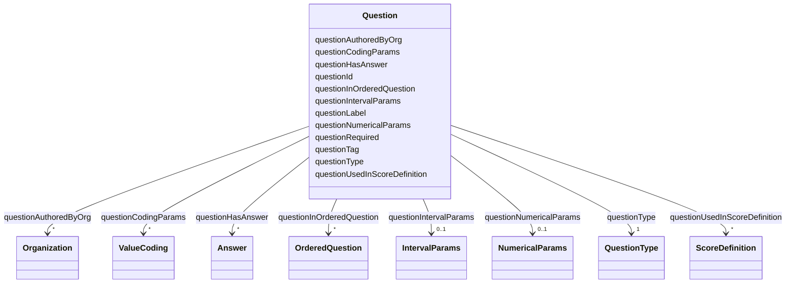

# Class: Question 


_A question in the questionnaire._


URI: [faqir:Question](https://faqir.org/datamodel/Question)





<!-- no inheritance hierarchy -->


## Slots

| Name | Cardinality and Range | Description | Inheritance |
| ---  | --- | --- | --- |
| [questionType](questionType.md) | 1 <br/> [QuestionType](QuestionType.md) | Type of the question (e | direct |
| [questionAuthoredByOrg](questionAuthoredByOrg.md) | * <br/> [Organization](Organization.md) | The organization that has designed this Question | direct |
| [questionInOrderedQuestion](questionInOrderedQuestion.md) | * <br/> [OrderedQuestion](OrderedQuestion.md) | OrderedQuestions that this Question is indexed in | direct |
| [questionHasAnswer](questionHasAnswer.md) | * <br/> [Answer](Answer.md) | The Answer to this Question | direct |
| [questionUsedInScoreDefinition](questionUsedInScoreDefinition.md) | * <br/> [ScoreDefinition](ScoreDefinition.md) | The ScoreDefinition that this Question is used in | direct |
| [questionId](questionId.md) | 1 <br/> [Uriorcurie](Uriorcurie.md) | The unique identifier for a question in the questionnaire | direct |
| [questionTag](questionTag.md) | 1 <br/> [String](String.md) | Internal English identifier, e | direct |
| [questionLabel](questionLabel.md) | 1 <br/> [String](String.md) | The text of the question itself, which is displayed to the user | direct |
| [questionNumericalParams](questionNumericalParams.md) | 0..1 <br/> [NumericalParams](NumericalParams.md) | Unit and Precision limiting the quantitative answer for the question | direct |
| [questionCodingParams](questionCodingParams.md) | * <br/> [ValueCoding](ValueCoding.md) | Code and Display of each option offered as answer to the choice or open-choic... | direct |
| [questionIntervalParams](questionIntervalParams.md) | 0..1 <br/> [IntervalParams](IntervalParams.md) | Minimum and Maximum limiting the range the answer must be in for the question | direct |
| [questionRequired](questionRequired.md) | 0..1 <br/> [Boolean](Boolean.md) | Indicates whether answering this question is mandatory (true) or it's optiona... | direct |


## Usages

| used by | used in | type | used |
| ---  | --- | --- | --- |
| [Organization](Organization.md) | [organizationAuthorsQuestion](organizationAuthorsQuestion.md) | range | [Question](Question.md) |
| [Answer](Answer.md) | [answerToQuestion](answerToQuestion.md) | range | [Question](Question.md) |
| [OrderedQuestion](OrderedQuestion.md) | [orderedQuestionHasQuestion](orderedQuestionHasQuestion.md) | range | [Question](Question.md) |
| [Question](Question.md) | [questionAuthoredByOrg](questionAuthoredByOrg.md) | domain | [Question](Question.md) |
| [Question](Question.md) | [questionInOrderedQuestion](questionInOrderedQuestion.md) | domain | [Question](Question.md) |
| [Question](Question.md) | [questionHasAnswer](questionHasAnswer.md) | domain | [Question](Question.md) |
| [Question](Question.md) | [questionUsedInScoreDefinition](questionUsedInScoreDefinition.md) | domain | [Question](Question.md) |
| [ScoreDefinition](ScoreDefinition.md) | [scoreDefinitionUsesQuestion](scoreDefinitionUsesQuestion.md) | range | [Question](Question.md) |


## Identifier and Mapping Information


### Schema Source


* from schema: https://w3id.org/faqir/datamodel


## Mappings

| Mapping Type | Mapped Value |
| ---  | ---  |
| self | faqir:Question |
| native | https://w3id.org/faqir/datamodel/Question |
| undefined | fhir:Questionnaire.item.where(type='question'), skos:Concept |


## LinkML Source

<!-- TODO: investigate https://stackoverflow.com/questions/37606292/how-to-create-tabbed-code-blocks-in-mkdocs-or-sphinx -->

### Direct

<details>
```yaml
name: Question
description: A question in the questionnaire.
from_schema: https://w3id.org/faqir/datamodel
mappings:
- fhir:Questionnaire.item.where(type='question')
- skos:Concept
slots:
- questionType
- questionAuthoredByOrg
- questionInOrderedQuestion
- questionHasAnswer
- questionUsedInScoreDefinition
attributes:
  questionId:
    name: questionId
    description: The unique identifier for a question in the questionnaire.
    from_schema: https://w3id.org/faqir/datamodel/questionnaire/classes
    rank: 1000
    identifier: true
    domain_of:
    - Question
    range: uriorcurie
    required: true
  questionTag:
    name: questionTag
    description: Internal English identifier, e.g., 'q_pain_level'.
    from_schema: https://w3id.org/faqir/datamodel/questionnaire/classes
    rank: 1000
    domain_of:
    - Question
    range: string
    required: true
  questionLabel:
    name: questionLabel
    description: The text of the question itself, which is displayed to the user.
    from_schema: https://w3id.org/faqir/datamodel/questionnaire/classes
    rank: 1000
    domain_of:
    - Question
    range: string
    required: true
  questionNumericalParams:
    name: questionNumericalParams
    description: Unit and Precision limiting the quantitative answer for the question.
    from_schema: https://w3id.org/faqir/datamodel/questionnaire/classes
    rank: 1000
    domain_of:
    - Question
    range: NumericalParams
    required: false
    multivalued: false
  questionCodingParams:
    name: questionCodingParams
    description: Code and Display of each option offered as answer to the choice or
      open-choice question.
    from_schema: https://w3id.org/faqir/datamodel/questionnaire/classes
    rank: 1000
    domain_of:
    - Question
    range: ValueCoding
    required: false
    multivalued: true
  questionIntervalParams:
    name: questionIntervalParams
    description: Minimum and Maximum limiting the range the answer must be in for
      the question.
    from_schema: https://w3id.org/faqir/datamodel/questionnaire/classes
    rank: 1000
    domain_of:
    - Question
    range: IntervalParams
    required: false
    multivalued: false
  questionRequired:
    name: questionRequired
    description: Indicates whether answering this question is mandatory (true) or
      it's optional (false).
    from_schema: https://w3id.org/faqir/datamodel/questionnaire/classes
    mappings:
    - fhir:Questionnaire.item.required
    rank: 1000
    ifabsent: 'False'
    domain_of:
    - Question
    range: boolean
class_uri: faqir:Question
rules:
- preconditions:
    slot_conditions:
      questionType:
        name: questionType
        equals_string_in:
        - choice
        - openChoice
  postconditions:
    slot_conditions:
      questionCodingParams:
        name: questionCodingParams
        required: true
  description: If questionType is 'choice' or 'openChoice', questionCodingParams is
    required.
- preconditions:
    slot_conditions:
      questionType:
        name: questionType
        equals_string_in:
        - numberInterval
  postconditions:
    slot_conditions:
      questionNumericalParams:
        name: questionNumericalParams
        required: true
      questionIntervalParams:
        name: questionIntervalParams
        required: true
  description: If questionType is 'numberInterval', questionNumericalParams and questionIntervalParams
    are required.
- preconditions:
    slot_conditions:
      questionType:
        name: questionType
        equals_string_in:
        - decimal
  postconditions:
    slot_conditions:
      questionNumericalParams:
        name: questionNumericalParams
        required: true
  description: If questionType is 'decimal', questionNumericalParams is required.

```
</details>

### Induced

<details>
```yaml
name: Question
description: A question in the questionnaire.
from_schema: https://w3id.org/faqir/datamodel
mappings:
- fhir:Questionnaire.item.where(type='question')
- skos:Concept
attributes:
  questionId:
    name: questionId
    description: The unique identifier for a question in the questionnaire.
    from_schema: https://w3id.org/faqir/datamodel/questionnaire/classes
    rank: 1000
    identifier: true
    alias: questionId
    owner: Question
    domain_of:
    - Question
    range: uriorcurie
    required: true
  questionTag:
    name: questionTag
    description: Internal English identifier, e.g., 'q_pain_level'.
    from_schema: https://w3id.org/faqir/datamodel/questionnaire/classes
    rank: 1000
    alias: questionTag
    owner: Question
    domain_of:
    - Question
    range: string
    required: true
  questionLabel:
    name: questionLabel
    description: The text of the question itself, which is displayed to the user.
    from_schema: https://w3id.org/faqir/datamodel/questionnaire/classes
    rank: 1000
    alias: questionLabel
    owner: Question
    domain_of:
    - Question
    range: string
    required: true
  questionNumericalParams:
    name: questionNumericalParams
    description: Unit and Precision limiting the quantitative answer for the question.
    from_schema: https://w3id.org/faqir/datamodel/questionnaire/classes
    rank: 1000
    alias: questionNumericalParams
    owner: Question
    domain_of:
    - Question
    range: NumericalParams
    required: false
    multivalued: false
  questionCodingParams:
    name: questionCodingParams
    description: Code and Display of each option offered as answer to the choice or
      open-choice question.
    from_schema: https://w3id.org/faqir/datamodel/questionnaire/classes
    rank: 1000
    alias: questionCodingParams
    owner: Question
    domain_of:
    - Question
    range: ValueCoding
    required: false
    multivalued: true
  questionIntervalParams:
    name: questionIntervalParams
    description: Minimum and Maximum limiting the range the answer must be in for
      the question.
    from_schema: https://w3id.org/faqir/datamodel/questionnaire/classes
    rank: 1000
    alias: questionIntervalParams
    owner: Question
    domain_of:
    - Question
    range: IntervalParams
    required: false
    multivalued: false
  questionRequired:
    name: questionRequired
    description: Indicates whether answering this question is mandatory (true) or
      it's optional (false).
    from_schema: https://w3id.org/faqir/datamodel/questionnaire/classes
    mappings:
    - fhir:Questionnaire.item.required
    rank: 1000
    ifabsent: 'False'
    alias: questionRequired
    owner: Question
    domain_of:
    - Question
    range: boolean
  questionType:
    name: questionType
    description: Type of the question (e.g., choice, openChoice, numberInterval, decimal,
      dateTime, text). Determines valid answers.
    from_schema: https://w3id.org/faqir/datamodel
    rank: 1000
    slot_uri: faqir:questionType
    alias: questionType
    owner: Question
    domain_of:
    - Answer
    - Question
    range: QuestionType
    required: true
  questionAuthoredByOrg:
    name: questionAuthoredByOrg
    description: The organization that has designed this Question.
    from_schema: https://w3id.org/faqir/datamodel
    rank: 1000
    domain: Question
    slot_uri: faqir:questionAuthoredByOrg
    alias: questionAuthoredByOrg
    owner: Question
    domain_of:
    - Question
    inverse: organizationAuthorsQuestion
    range: Organization
    required: false
    multivalued: true
  questionInOrderedQuestion:
    name: questionInOrderedQuestion
    description: OrderedQuestions that this Question is indexed in.
    from_schema: https://w3id.org/faqir/datamodel
    rank: 1000
    domain: Question
    slot_uri: faqir:questionInOrderedQuestion
    alias: questionInOrderedQuestion
    owner: Question
    domain_of:
    - Question
    inverse: orderedQuestionHasQuestion
    range: OrderedQuestion
    required: false
    multivalued: true
  questionHasAnswer:
    name: questionHasAnswer
    description: The Answer to this Question.
    from_schema: https://w3id.org/faqir/datamodel
    mappings:
    - fhir:Questionnaire.item.answer
    rank: 1000
    domain: Question
    slot_uri: faqir:questionHasAnswer
    alias: questionHasAnswer
    owner: Question
    domain_of:
    - Question
    inverse: answerToQuestion
    range: Answer
    required: false
    multivalued: true
  questionUsedInScoreDefinition:
    name: questionUsedInScoreDefinition
    description: The ScoreDefinition that this Question is used in.
    from_schema: https://w3id.org/faqir/datamodel
    rank: 1000
    domain: Question
    slot_uri: faqir:questionUsedInScoreDefinition
    alias: questionUsedInScoreDefinition
    owner: Question
    domain_of:
    - Question
    inverse: scoreDefinitionUsesQuestion
    range: ScoreDefinition
    required: false
    multivalued: true
class_uri: faqir:Question
rules:
- preconditions:
    slot_conditions:
      questionType:
        name: questionType
        equals_string_in:
        - choice
        - openChoice
  postconditions:
    slot_conditions:
      questionCodingParams:
        name: questionCodingParams
        required: true
  description: If questionType is 'choice' or 'openChoice', questionCodingParams is
    required.
- preconditions:
    slot_conditions:
      questionType:
        name: questionType
        equals_string_in:
        - numberInterval
  postconditions:
    slot_conditions:
      questionNumericalParams:
        name: questionNumericalParams
        required: true
      questionIntervalParams:
        name: questionIntervalParams
        required: true
  description: If questionType is 'numberInterval', questionNumericalParams and questionIntervalParams
    are required.
- preconditions:
    slot_conditions:
      questionType:
        name: questionType
        equals_string_in:
        - decimal
  postconditions:
    slot_conditions:
      questionNumericalParams:
        name: questionNumericalParams
        required: true
  description: If questionType is 'decimal', questionNumericalParams is required.

```
</details>