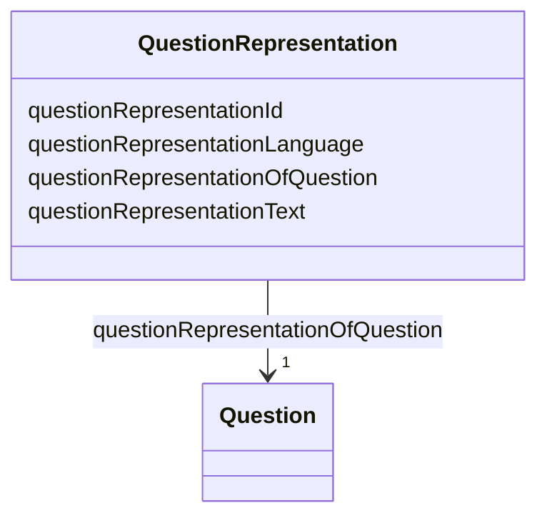

# Class: QuestionRepresentation 


_The text representation of the question, in a specific language._


URI: [faqir:QuestionRepresentation](https://faqir.org/datamodel/QuestionRepresentation)





<!-- no inheritance hierarchy -->


## Slots

| Name | Cardinality and Range | Description | Inheritance |
| ---  | --- | --- | --- |
| [questionRepresentationOfQuestion](questionRepresentationOfQuestion.md) | 1 <br/> [Question](Question.md) | The Question that this QuestionRepresentation describes | direct |
| [questionRepresentationId](questionRepresentationId.md) | 1 <br/> [Uriorcurie](Uriorcurie.md) | The unique identifier for the question representation | direct |
| [questionRepresentationText](questionRepresentationText.md) | 1 <br/> [String](String.md) | The text of the question as presented to the user | direct |
| [questionRepresentationLanguage](questionRepresentationLanguage.md) | 1 <br/> [String](String.md) | The language of the question text, represented as a BCP 47 language tag (e | direct |


## Usages

| used by | used in | type | used |
| ---  | --- | --- | --- |
| [Question](Question.md) | [questionHasQuestionRepresentation](questionHasQuestionRepresentation.md) | range | [QuestionRepresentation](QuestionRepresentation.md) |
| [QuestionRepresentation](QuestionRepresentation.md) | [questionRepresentationOfQuestion](questionRepresentationOfQuestion.md) | domain | [QuestionRepresentation](QuestionRepresentation.md) |


## Identifier and Mapping Information


### Schema Source


* from schema: https://w3id.org/faqir/datamodel


## Mappings

| Mapping Type | Mapped Value |
| ---  | ---  |
| self | faqir:QuestionRepresentation |
| native | https://w3id.org/faqir/datamodel/QuestionRepresentation |


## LinkML Source

<!-- TODO: investigate https://stackoverflow.com/questions/37606292/how-to-create-tabbed-code-blocks-in-mkdocs-or-sphinx -->

### Direct

<details>
```yaml
name: QuestionRepresentation
description: The text representation of the question, in a specific language.
from_schema: https://w3id.org/faqir/datamodel
slots:
- questionRepresentationOfQuestion
attributes:
  questionRepresentationId:
    name: questionRepresentationId
    description: The unique identifier for the question representation.
    from_schema: https://w3id.org/faqir/datamodel/questionnaire/classes
    rank: 1000
    identifier: true
    domain_of:
    - QuestionRepresentation
    range: uriorcurie
    required: true
  questionRepresentationText:
    name: questionRepresentationText
    description: The text of the question as presented to the user.
    from_schema: https://w3id.org/faqir/datamodel/questionnaire/classes
    rank: 1000
    domain_of:
    - QuestionRepresentation
    range: string
    required: true
  questionRepresentationLanguage:
    name: questionRepresentationLanguage
    description: The language of the question text, represented as a BCP 47 language
      tag (e.g., 'en', 'fr', 'es').
    from_schema: https://w3id.org/faqir/datamodel/questionnaire/classes
    rank: 1000
    domain_of:
    - QuestionRepresentation
    range: string
    required: true
    pattern: ^[a-z]{2}(-[A-Z]{2})?$
class_uri: faqir:QuestionRepresentation

```
</details>

### Induced

<details>
```yaml
name: QuestionRepresentation
description: The text representation of the question, in a specific language.
from_schema: https://w3id.org/faqir/datamodel
attributes:
  questionRepresentationId:
    name: questionRepresentationId
    description: The unique identifier for the question representation.
    from_schema: https://w3id.org/faqir/datamodel/questionnaire/classes
    rank: 1000
    identifier: true
    alias: questionRepresentationId
    owner: QuestionRepresentation
    domain_of:
    - QuestionRepresentation
    range: uriorcurie
    required: true
  questionRepresentationText:
    name: questionRepresentationText
    description: The text of the question as presented to the user.
    from_schema: https://w3id.org/faqir/datamodel/questionnaire/classes
    rank: 1000
    alias: questionRepresentationText
    owner: QuestionRepresentation
    domain_of:
    - QuestionRepresentation
    range: string
    required: true
  questionRepresentationLanguage:
    name: questionRepresentationLanguage
    description: The language of the question text, represented as a BCP 47 language
      tag (e.g., 'en', 'fr', 'es').
    from_schema: https://w3id.org/faqir/datamodel/questionnaire/classes
    rank: 1000
    alias: questionRepresentationLanguage
    owner: QuestionRepresentation
    domain_of:
    - QuestionRepresentation
    range: string
    required: true
    pattern: ^[a-z]{2}(-[A-Z]{2})?$
  questionRepresentationOfQuestion:
    name: questionRepresentationOfQuestion
    description: The Question that this QuestionRepresentation describes.
    from_schema: https://w3id.org/faqir/datamodel
    rank: 1000
    domain: QuestionRepresentation
    slot_uri: faqir:questionRepresentationOfQuestion
    alias: questionRepresentationOfQuestion
    owner: QuestionRepresentation
    domain_of:
    - QuestionRepresentation
    inverse: questionHasQuestionRepresentation
    range: Question
    required: true
    multivalued: false
class_uri: faqir:QuestionRepresentation

```
</details>