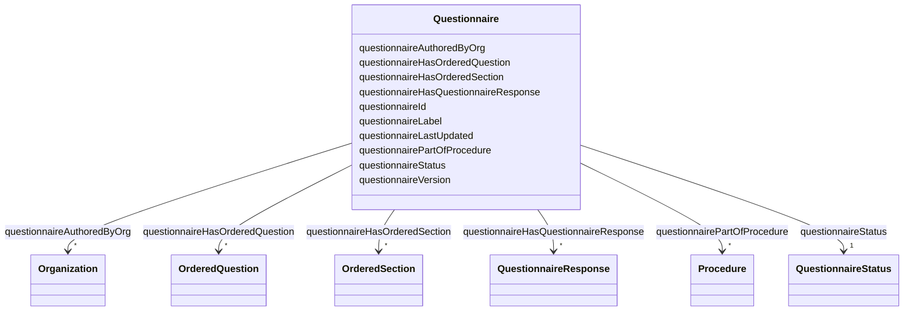

# Class: Questionnaire 


_A questionnaire that can be answered (collection of questions)._


URI: [faqir:Questionnaire](https://faqir.org/datamodel/Questionnaire)





<!-- no inheritance hierarchy -->


## Slots

| Name | Cardinality and Range | Description | Inheritance |
| ---  | --- | --- | --- |
| [questionnaireHasQuestionnaireResponse](questionnaireHasQuestionnaireResponse.md) | * <br/> [QuestionnaireResponse](QuestionnaireResponse.md) | The QuestionnaireResponse that is associated with this Questionnaire | direct |
| [questionnaireHasOrderedQuestion](questionnaireHasOrderedQuestion.md) | * <br/> [OrderedQuestion](OrderedQuestion.md) | The Question that is part of this Questionnaire, with their display order | direct |
| [questionnaireHasOrderedSection](questionnaireHasOrderedSection.md) | * <br/> [OrderedSection](OrderedSection.md) | The Section that is part of this Questionnaire, with their display order | direct |
| [questionnaireAuthoredByOrg](questionnaireAuthoredByOrg.md) | * <br/> [Organization](Organization.md) | The Organization that has created this Questionnaire | direct |
| [questionnairePartOfProcedure](questionnairePartOfProcedure.md) | * <br/> [Procedure](Procedure.md) | Procedure this questionnaire is part of | direct |
| [questionnaireId](questionnaireId.md) | 1 <br/> [Uriorcurie](Uriorcurie.md) | The unique identifier for the questionnaire | direct |
| [questionnaireLabel](questionnaireLabel.md) | 1 <br/> [String](String.md) | The label or title of the questionnaire, which is displayed to the user | direct |
| [questionnaireStatus](questionnaireStatus.md) | 1 <br/> [QuestionnaireStatus](QuestionnaireStatus.md) | The status of the questionnaire, indicating whether it is draft, active, reti... | direct |
| [questionnaireVersion](questionnaireVersion.md) | 1 <br/> [String](String.md) | Version of the questionnaire | direct |
| [questionnaireLastUpdated](questionnaireLastUpdated.md) | 1 <br/> [Datetime](Datetime.md) | The date and time when the questionnaire was last updated | direct |


## Usages

| used by | used in | type | used |
| ---  | --- | --- | --- |
| [Organization](Organization.md) | [organizationAuthorsQuestionnaire](organizationAuthorsQuestionnaire.md) | range | [Questionnaire](Questionnaire.md) |
| [Procedure](Procedure.md) | [procedureHasQuestionnaire](procedureHasQuestionnaire.md) | range | [Questionnaire](Questionnaire.md) |
| [QuestionnaireResponse](QuestionnaireResponse.md) | [questionnaireResponseToQuestionnaire](questionnaireResponseToQuestionnaire.md) | range | [Questionnaire](Questionnaire.md) |
| [OrderedQuestion](OrderedQuestion.md) | [orderedQuestionPartOfQuestionnaire](orderedQuestionPartOfQuestionnaire.md) | range | [Questionnaire](Questionnaire.md) |
| [Questionnaire](Questionnaire.md) | [questionnaireHasQuestionnaireResponse](questionnaireHasQuestionnaireResponse.md) | domain | [Questionnaire](Questionnaire.md) |
| [Questionnaire](Questionnaire.md) | [questionnaireHasOrderedQuestion](questionnaireHasOrderedQuestion.md) | domain | [Questionnaire](Questionnaire.md) |
| [Questionnaire](Questionnaire.md) | [questionnaireHasOrderedSection](questionnaireHasOrderedSection.md) | domain | [Questionnaire](Questionnaire.md) |
| [Questionnaire](Questionnaire.md) | [questionnaireAuthoredByOrg](questionnaireAuthoredByOrg.md) | domain | [Questionnaire](Questionnaire.md) |
| [Questionnaire](Questionnaire.md) | [questionnairePartOfProcedure](questionnairePartOfProcedure.md) | domain | [Questionnaire](Questionnaire.md) |
| [OrderedSection](OrderedSection.md) | [orderedSectionPartOfQuestionnaire](orderedSectionPartOfQuestionnaire.md) | range | [Questionnaire](Questionnaire.md) |


## Identifier and Mapping Information


### Schema Source


* from schema: https://w3id.org/faqir/datamodel


## Mappings

| Mapping Type | Mapped Value |
| ---  | ---  |
| self | faqir:Questionnaire |
| native | https://w3id.org/faqir/datamodel/Questionnaire |
| undefined | fhir:Questionnaire, euVoc:QUESTIONNAIRE |


## LinkML Source

<!-- TODO: investigate https://stackoverflow.com/questions/37606292/how-to-create-tabbed-code-blocks-in-mkdocs-or-sphinx -->

### Direct

<details>
```yaml
name: Questionnaire
description: A questionnaire that can be answered (collection of questions).
from_schema: https://w3id.org/faqir/datamodel
mappings:
- fhir:Questionnaire
- euVoc:QUESTIONNAIRE
slots:
- questionnaireHasQuestionnaireResponse
- questionnaireHasOrderedQuestion
- questionnaireHasOrderedSection
- questionnaireAuthoredByOrg
- questionnairePartOfProcedure
attributes:
  questionnaireId:
    name: questionnaireId
    description: The unique identifier for the questionnaire.
    from_schema: https://w3id.org/faqir/datamodel/questionnaire/classes
    rank: 1000
    identifier: true
    domain_of:
    - Questionnaire
    range: uriorcurie
    required: true
  questionnaireLabel:
    name: questionnaireLabel
    description: The label or title of the questionnaire, which is displayed to the
      user.
    from_schema: https://w3id.org/faqir/datamodel/questionnaire/classes
    rank: 1000
    domain_of:
    - Questionnaire
    range: string
    required: true
  questionnaireStatus:
    name: questionnaireStatus
    description: The status of the questionnaire, indicating whether it is draft,
      active, retired or unknown.
    from_schema: https://w3id.org/faqir/datamodel/questionnaire/classes
    mappings:
    - fhir:Questionnaire.status
    rank: 1000
    domain_of:
    - Questionnaire
    range: QuestionnaireStatus
    required: true
  questionnaireVersion:
    name: questionnaireVersion
    description: Version of the questionnaire.
    from_schema: https://w3id.org/faqir/datamodel/questionnaire/classes
    rank: 1000
    domain_of:
    - Questionnaire
    range: string
    required: true
    pattern: ^\d+\.\d+\.\d+$
  questionnaireLastUpdated:
    name: questionnaireLastUpdated
    description: The date and time when the questionnaire was last updated.
    from_schema: https://w3id.org/faqir/datamodel/questionnaire/classes
    mappings:
    - fhir:Questionnaire.date
    rank: 1000
    domain_of:
    - Questionnaire
    range: datetime
    required: true
class_uri: faqir:Questionnaire

```
</details>

### Induced

<details>
```yaml
name: Questionnaire
description: A questionnaire that can be answered (collection of questions).
from_schema: https://w3id.org/faqir/datamodel
mappings:
- fhir:Questionnaire
- euVoc:QUESTIONNAIRE
attributes:
  questionnaireId:
    name: questionnaireId
    description: The unique identifier for the questionnaire.
    from_schema: https://w3id.org/faqir/datamodel/questionnaire/classes
    rank: 1000
    identifier: true
    alias: questionnaireId
    owner: Questionnaire
    domain_of:
    - Questionnaire
    range: uriorcurie
    required: true
  questionnaireLabel:
    name: questionnaireLabel
    description: The label or title of the questionnaire, which is displayed to the
      user.
    from_schema: https://w3id.org/faqir/datamodel/questionnaire/classes
    rank: 1000
    alias: questionnaireLabel
    owner: Questionnaire
    domain_of:
    - Questionnaire
    range: string
    required: true
  questionnaireStatus:
    name: questionnaireStatus
    description: The status of the questionnaire, indicating whether it is draft,
      active, retired or unknown.
    from_schema: https://w3id.org/faqir/datamodel/questionnaire/classes
    mappings:
    - fhir:Questionnaire.status
    rank: 1000
    alias: questionnaireStatus
    owner: Questionnaire
    domain_of:
    - Questionnaire
    range: QuestionnaireStatus
    required: true
  questionnaireVersion:
    name: questionnaireVersion
    description: Version of the questionnaire.
    from_schema: https://w3id.org/faqir/datamodel/questionnaire/classes
    rank: 1000
    alias: questionnaireVersion
    owner: Questionnaire
    domain_of:
    - Questionnaire
    range: string
    required: true
    pattern: ^\d+\.\d+\.\d+$
  questionnaireLastUpdated:
    name: questionnaireLastUpdated
    description: The date and time when the questionnaire was last updated.
    from_schema: https://w3id.org/faqir/datamodel/questionnaire/classes
    mappings:
    - fhir:Questionnaire.date
    rank: 1000
    alias: questionnaireLastUpdated
    owner: Questionnaire
    domain_of:
    - Questionnaire
    range: datetime
    required: true
  questionnaireHasQuestionnaireResponse:
    name: questionnaireHasQuestionnaireResponse
    description: The QuestionnaireResponse that is associated with this Questionnaire.
    from_schema: https://w3id.org/faqir/datamodel
    mappings:
    - fhir:QuestionnaireResponse
    rank: 1000
    domain: Questionnaire
    slot_uri: faqir:questionnaireHasQuestionnaireResponse
    alias: questionnaireHasQuestionnaireResponse
    owner: Questionnaire
    domain_of:
    - Questionnaire
    inverse: questionnaireResponseToQuestionnaire
    range: QuestionnaireResponse
    multivalued: true
  questionnaireHasOrderedQuestion:
    name: questionnaireHasOrderedQuestion
    description: The Question that is part of this Questionnaire, with their display
      order.
    from_schema: https://w3id.org/faqir/datamodel
    mappings:
    - fhir:Questionnaire.item.where(type='question')
    rank: 1000
    domain: Questionnaire
    slot_uri: faqir:questionnaireHasOrderedQuestion
    alias: questionnaireHasOrderedQuestion
    owner: Questionnaire
    domain_of:
    - Questionnaire
    inverse: orderedQuestionPartOfQuestionnaire
    range: OrderedQuestion
    required: false
    multivalued: true
    inlined: true
    inlined_as_list: true
  questionnaireHasOrderedSection:
    name: questionnaireHasOrderedSection
    description: The Section that is part of this Questionnaire, with their display
      order.
    from_schema: https://w3id.org/faqir/datamodel
    mappings:
    - fhir:Questionnaire.item.where(type='group')
    rank: 1000
    domain: Questionnaire
    slot_uri: faqir:questionnaireHasOrderedSection
    alias: questionnaireHasOrderedSection
    owner: Questionnaire
    domain_of:
    - Questionnaire
    inverse: orderedSectionPartOfQuestionnaire
    range: OrderedSection
    required: false
    multivalued: true
    inlined: true
    inlined_as_list: true
  questionnaireAuthoredByOrg:
    name: questionnaireAuthoredByOrg
    description: The Organization that has created this Questionnaire.
    from_schema: https://w3id.org/faqir/datamodel
    mappings:
    - fhir:Questionnaire.author
    rank: 1000
    domain: Questionnaire
    slot_uri: faqir:questionnaireAuthoredByOrg
    alias: questionnaireAuthoredByOrg
    owner: Questionnaire
    domain_of:
    - Questionnaire
    inverse: organizationAuthorsQuestionnaire
    range: Organization
    required: false
    multivalued: true
  questionnairePartOfProcedure:
    name: questionnairePartOfProcedure
    description: Procedure this questionnaire is part of.
    from_schema: https://w3id.org/faqir/datamodel
    rank: 1000
    domain: Questionnaire
    slot_uri: faqir:questionnairePartOfProcedure
    alias: questionnairePartOfProcedure
    owner: Questionnaire
    domain_of:
    - Questionnaire
    inverse: procedureHasQuestionnaire
    range: Procedure
    required: false
    multivalued: true
class_uri: faqir:Questionnaire

```
</details>