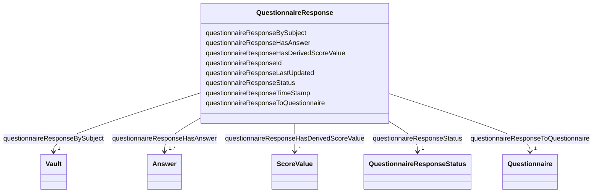

# Class: QuestionnaireResponse 


_A response to a questionnaire (collection of answers)._


URI: [faqir:QuestionnaireResponse](https://faqir.org/datamodel/QuestionnaireResponse)





<!-- no inheritance hierarchy -->


## Slots

| Name | Cardinality and Range | Description | Inheritance |
| ---  | --- | --- | --- |
| [questionnaireResponseBySubject](questionnaireResponseBySubject.md) | 1 <br/> [Vault](Vault.md) | The subject that has authored this QuestionnaireResponse | direct |
| [questionnaireResponseToQuestionnaire](questionnaireResponseToQuestionnaire.md) | 1 <br/> [Questionnaire](Questionnaire.md) | The Questionnaire that this QuestionnaireResponse is for | direct |
| [questionnaireResponseHasAnswer](questionnaireResponseHasAnswer.md) | 1..* <br/> [Answer](Answer.md) | The Answer that is part of this QuestionnaireResponse | direct |
| [questionnaireResponseHasDerivedScoreValue](questionnaireResponseHasDerivedScoreValue.md) | * <br/> [ScoreValue](ScoreValue.md) | The ScoreValue that is calculated from this QuestionnaireResponse's answers | direct |
| [questionnaireResponseId](questionnaireResponseId.md) | 1 <br/> [Uriorcurie](Uriorcurie.md) | The unique identifier for a specific questionnaire response | direct |
| [questionnaireResponseStatus](questionnaireResponseStatus.md) | 1 <br/> [QuestionnaireResponseStatus](QuestionnaireResponseStatus.md) | The status of the questionnaire response, indicating whether it is 	'in-progr... | direct |
| [questionnaireResponseTimeStamp](questionnaireResponseTimeStamp.md) | 1 <br/> [Datetime](Datetime.md) | The date and time when the questionnaire response was created (when the quest... | direct |
| [questionnaireResponseLastUpdated](questionnaireResponseLastUpdated.md) | 1 <br/> [Datetime](Datetime.md) | The date and time when the questionnaire response was last updated | direct |


## Usages

| used by | used in | type | used |
| ---  | --- | --- | --- |
| [Vault](Vault.md) | [hasQuestionnaireResponse](hasQuestionnaireResponse.md) | range | [QuestionnaireResponse](QuestionnaireResponse.md) |
| [QuestionnaireResponse](QuestionnaireResponse.md) | [questionnaireResponseBySubject](questionnaireResponseBySubject.md) | domain | [QuestionnaireResponse](QuestionnaireResponse.md) |
| [QuestionnaireResponse](QuestionnaireResponse.md) | [questionnaireResponseToQuestionnaire](questionnaireResponseToQuestionnaire.md) | domain | [QuestionnaireResponse](QuestionnaireResponse.md) |
| [QuestionnaireResponse](QuestionnaireResponse.md) | [questionnaireResponseHasAnswer](questionnaireResponseHasAnswer.md) | domain | [QuestionnaireResponse](QuestionnaireResponse.md) |
| [QuestionnaireResponse](QuestionnaireResponse.md) | [questionnaireResponseHasDerivedScoreValue](questionnaireResponseHasDerivedScoreValue.md) | domain | [QuestionnaireResponse](QuestionnaireResponse.md) |
| [Answer](Answer.md) | [answerInQuestionnaireResponse](answerInQuestionnaireResponse.md) | range | [QuestionnaireResponse](QuestionnaireResponse.md) |
| [Questionnaire](Questionnaire.md) | [questionnaireHasQuestionnaireResponse](questionnaireHasQuestionnaireResponse.md) | range | [QuestionnaireResponse](QuestionnaireResponse.md) |
| [ScoreValue](ScoreValue.md) | [scoreValueDerivedFromQuestionnaireResponse](scoreValueDerivedFromQuestionnaireResponse.md) | range | [QuestionnaireResponse](QuestionnaireResponse.md) |


## Identifier and Mapping Information


### Schema Source


* from schema: https://w3id.org/faqir/datamodel


## Mappings

| Mapping Type | Mapped Value |
| ---  | ---  |
| self | faqir:QuestionnaireResponse |
| native | https://w3id.org/faqir/datamodel/QuestionnaireResponse |


## LinkML Source

<!-- TODO: investigate https://stackoverflow.com/questions/37606292/how-to-create-tabbed-code-blocks-in-mkdocs-or-sphinx -->

### Direct

<details>
```yaml
name: QuestionnaireResponse
description: A response to a questionnaire (collection of answers).
from_schema: https://w3id.org/faqir/datamodel
slots:
- questionnaireResponseBySubject
- questionnaireResponseToQuestionnaire
- questionnaireResponseHasAnswer
- questionnaireResponseHasDerivedScoreValue
attributes:
  questionnaireResponseId:
    name: questionnaireResponseId
    description: The unique identifier for a specific questionnaire response.
    from_schema: https://w3id.org/faqir/datamodel/questionnaire/classes
    rank: 1000
    identifier: true
    domain_of:
    - QuestionnaireResponse
    range: uriorcurie
    required: true
  questionnaireResponseStatus:
    name: questionnaireResponseStatus
    description: "The status of the questionnaire response, indicating whether it\
      \ is \t'in-progress', 'completed', 'amended', 'entered-in-error' or 'stopped'."
    from_schema: https://w3id.org/faqir/datamodel/questionnaire/classes
    mappings:
    - fhir:QuestionnaireResponse.status
    rank: 1000
    domain_of:
    - QuestionnaireResponse
    range: QuestionnaireResponseStatus
    required: true
  questionnaireResponseTimeStamp:
    name: questionnaireResponseTimeStamp
    description: The date and time when the questionnaire response was created (when
      the questionnaire starts to be answered, not when it's finished).
    from_schema: https://w3id.org/faqir/datamodel/questionnaire/classes
    mappings:
    - fhir:QuestionnaireResponse.authored
    rank: 1000
    domain_of:
    - QuestionnaireResponse
    range: datetime
    required: true
  questionnaireResponseLastUpdated:
    name: questionnaireResponseLastUpdated
    description: The date and time when the questionnaire response was last updated.
    from_schema: https://w3id.org/faqir/datamodel/questionnaire/classes
    rank: 1000
    domain_of:
    - QuestionnaireResponse
    range: datetime
    required: true
class_uri: faqir:QuestionnaireResponse

```
</details>

### Induced

<details>
```yaml
name: QuestionnaireResponse
description: A response to a questionnaire (collection of answers).
from_schema: https://w3id.org/faqir/datamodel
attributes:
  questionnaireResponseId:
    name: questionnaireResponseId
    description: The unique identifier for a specific questionnaire response.
    from_schema: https://w3id.org/faqir/datamodel/questionnaire/classes
    rank: 1000
    identifier: true
    alias: questionnaireResponseId
    owner: QuestionnaireResponse
    domain_of:
    - QuestionnaireResponse
    range: uriorcurie
    required: true
  questionnaireResponseStatus:
    name: questionnaireResponseStatus
    description: "The status of the questionnaire response, indicating whether it\
      \ is \t'in-progress', 'completed', 'amended', 'entered-in-error' or 'stopped'."
    from_schema: https://w3id.org/faqir/datamodel/questionnaire/classes
    mappings:
    - fhir:QuestionnaireResponse.status
    rank: 1000
    alias: questionnaireResponseStatus
    owner: QuestionnaireResponse
    domain_of:
    - QuestionnaireResponse
    range: QuestionnaireResponseStatus
    required: true
  questionnaireResponseTimeStamp:
    name: questionnaireResponseTimeStamp
    description: The date and time when the questionnaire response was created (when
      the questionnaire starts to be answered, not when it's finished).
    from_schema: https://w3id.org/faqir/datamodel/questionnaire/classes
    mappings:
    - fhir:QuestionnaireResponse.authored
    rank: 1000
    alias: questionnaireResponseTimeStamp
    owner: QuestionnaireResponse
    domain_of:
    - QuestionnaireResponse
    range: datetime
    required: true
  questionnaireResponseLastUpdated:
    name: questionnaireResponseLastUpdated
    description: The date and time when the questionnaire response was last updated.
    from_schema: https://w3id.org/faqir/datamodel/questionnaire/classes
    rank: 1000
    alias: questionnaireResponseLastUpdated
    owner: QuestionnaireResponse
    domain_of:
    - QuestionnaireResponse
    range: datetime
    required: true
  questionnaireResponseBySubject:
    name: questionnaireResponseBySubject
    description: The subject that has authored this QuestionnaireResponse.
    from_schema: https://w3id.org/faqir/datamodel
    mappings:
    - fhir:questionnaireResponse.subject
    rank: 1000
    domain: QuestionnaireResponse
    slot_uri: faqir:questionnaireResponseBySubject
    alias: questionnaireResponseBySubject
    owner: QuestionnaireResponse
    domain_of:
    - QuestionnaireResponse
    inverse: hasQuestionnaireResponse
    range: Vault
    required: true
    multivalued: false
  questionnaireResponseToQuestionnaire:
    name: questionnaireResponseToQuestionnaire
    description: The Questionnaire that this QuestionnaireResponse is for.
    from_schema: https://w3id.org/faqir/datamodel
    mappings:
    - fhir:questionnaireResponse.questionnaire
    rank: 1000
    domain: QuestionnaireResponse
    slot_uri: faqir:questionnaireResponseToQuestionnaire
    alias: questionnaireResponseToQuestionnaire
    owner: QuestionnaireResponse
    domain_of:
    - QuestionnaireResponse
    inverse: questionnaireHasQuestionnaireResponse
    range: Questionnaire
    required: true
    multivalued: false
  questionnaireResponseHasAnswer:
    name: questionnaireResponseHasAnswer
    description: The Answer that is part of this QuestionnaireResponse.
    from_schema: https://w3id.org/faqir/datamodel
    mappings:
    - fhir:questionnaireResponse.item.answer
    rank: 1000
    domain: QuestionnaireResponse
    slot_uri: faqir:questionnaireResponseHasAnswer
    alias: questionnaireResponseHasAnswer
    owner: QuestionnaireResponse
    domain_of:
    - QuestionnaireResponse
    inverse: answerInQuestionnaireResponse
    range: Answer
    required: true
    multivalued: true
  questionnaireResponseHasDerivedScoreValue:
    name: questionnaireResponseHasDerivedScoreValue
    description: The ScoreValue that is calculated from this QuestionnaireResponse's
      answers.
    from_schema: https://w3id.org/faqir/datamodel
    rank: 1000
    domain: QuestionnaireResponse
    slot_uri: faqir:questionnaireResponseHasDerivedScoreValue
    alias: questionnaireResponseHasDerivedScoreValue
    owner: QuestionnaireResponse
    domain_of:
    - QuestionnaireResponse
    inverse: scoreValueDerivedFromQuestionnaireResponse
    range: ScoreValue
    required: false
    multivalued: true
class_uri: faqir:QuestionnaireResponse

```
</details>