# Class: SarefPropertyValue 


_Describes the value for a property. The property value is optionally linked to its value expressed as an RDF literal (DP saref:hasValue), optionally to the unit of measurement (OP saref:isMeasuredIn), and optionally to the properties or properties of interest it is a value of (OP saref:isValueOfProperty)._


URI: [saref:PropertyValue](https://saref.etsi.org/core/PropertyValue)

```mermaid
 classDiagram
    class SarefPropertyValue
    click SarefPropertyValue href "../SarefPropertyValue"
      ProvEntity <|-- SarefPropertyValue
        click ProvEntity href "../ProvEntity"
      

      SarefPropertyValue <|-- QoQuestionnaireStatus
        click QoQuestionnaireStatus href "../QoQuestionnaireStatus"
      SarefPropertyValue <|-- QoQuestionnaireResponseStatus
        click QoQuestionnaireResponseStatus href "../QoQuestionnaireResponseStatus"
      
      
      SarefPropertyValue : dcterms_created
        
      SarefPropertyValue : dcterms_creator
        
          
    
        
        
        SarefPropertyValue --> "*" FoafAgent : dcterms_creator
        click FoafAgent href "../FoafAgent"
    

        
      SarefPropertyValue : dcterms_hasPart
        
          
    
        
        
        SarefPropertyValue --> "*" OwlThing : dcterms_hasPart
        click OwlThing href "../OwlThing"
    

        
      SarefPropertyValue : dcterms_isPartOf
        
          
    
        
        
        SarefPropertyValue --> "*" OwlThing : dcterms_isPartOf
        click OwlThing href "../OwlThing"
    

        
      SarefPropertyValue : dcterms_modified
        
      SarefPropertyValue : fhir_status
        
          
    
        
        
        SarefPropertyValue --> "*" SarefPropertyValue : fhir_status
        click SarefPropertyValue href "../SarefPropertyValue"
    

        
      SarefPropertyValue : fhir_valueAttachment
        
      SarefPropertyValue : fhir_valueCodeableConcept
        
          
    
        
        
        SarefPropertyValue --> "0..1" ValueCoding : fhir_valueCodeableConcept
        click ValueCoding href "../ValueCoding"
    

        
      SarefPropertyValue : fhir_valuePeriod
        
          
    
        
        
        SarefPropertyValue --> "0..1" TimeInterval : fhir_valuePeriod
        click TimeInterval href "../TimeInterval"
    

        
      SarefPropertyValue : fhir_valueRange
        
          
    
        
        
        SarefPropertyValue --> "0..1" FhirReferenceRange : fhir_valueRange
        click FhirReferenceRange href "../FhirReferenceRange"
    

        
      SarefPropertyValue : fhir_valueRatio
        
          
    
        
        
        SarefPropertyValue --> "0..1" FhirValueRatio : fhir_valueRatio
        click FhirValueRatio href "../FhirValueRatio"
    

        
      SarefPropertyValue : fhir_valueReference
        
      SarefPropertyValue : owl_versionInfo
        
      SarefPropertyValue : prov_atTime
        
      SarefPropertyValue : prov_generatedAtTime
        
      SarefPropertyValue : prov_hadPrimarySource
        
          
    
        
        
        SarefPropertyValue --> "*" ProvEntity : prov_hadPrimarySource
        click ProvEntity href "../ProvEntity"
    

        
      SarefPropertyValue : prov_type
        
      SarefPropertyValue : prov_wasAttributedTo
        
          
    
        
        
        SarefPropertyValue --> "*" FoafAgent : prov_wasAttributedTo
        click FoafAgent href "../FoafAgent"
    

        
      SarefPropertyValue : prov_wasGeneratedBy
        
          
    
        
        
        SarefPropertyValue --> "*" SuloProcess : prov_wasGeneratedBy
        click SuloProcess href "../SuloProcess"
    

        
      SarefPropertyValue : rdfs_comment
        
      SarefPropertyValue : rdfs_label
        
      SarefPropertyValue : saref_hasProperty
        
          
    
        
        
        SarefPropertyValue --> "*" SarefProperty : saref_hasProperty
        click SarefProperty href "../SarefProperty"
    

        
      SarefPropertyValue : saref_hasPropertyValue
        
          
    
        
        
        SarefPropertyValue --> "*" SarefPropertyValue : saref_hasPropertyValue
        click SarefPropertyValue href "../SarefPropertyValue"
    

        
      SarefPropertyValue : saref_hasValue
        
      SarefPropertyValue : saref_isValueOfProperty
        
          
    
        
        
        SarefPropertyValue --> "0..1" SarefProperty : saref_isValueOfProperty
        click SarefProperty href "../SarefProperty"
    

        
      
```





## Inheritance
* [OwlThing](OwlThing.md)
    * [ProvEntity](ProvEntity.md)
        * **SarefPropertyValue**
            * [QoQuestionnaireStatus](QoQuestionnaireStatus.md)
            * [QoQuestionnaireResponseStatus](QoQuestionnaireResponseStatus.md)


## Slots

| Name | Cardinality and Range | Description | Inheritance |
| ---  | --- | --- | --- |
| [prov_atTime](prov_atTime.md) | 0..1 <br/> [Datetime](Datetime.md) | The time at which an InstantaneousEvent occurred | direct |
| [saref_hasValue](saref_hasValue.md) | 0..1 <br/> [String](String.md)&nbsp;or&nbsp;<br />[Integer](Integer.md)&nbsp;or&nbsp;<br />[Float](Float.md)&nbsp;or&nbsp;<br />[Double](Double.md)&nbsp;or&nbsp;<br />[Decimal](Decimal.md)&nbsp;or&nbsp;<br />[Date](Date.md)&nbsp;or&nbsp;<br />[Datetime](Datetime.md)&nbsp;or&nbsp;<br />[Uriorcurie](Uriorcurie.md)&nbsp;or&nbsp;<br />[String](String.md) | Value of a property value expressed as an RDF literal | direct |
| [saref_isValueOfProperty](saref_isValueOfProperty.md) | 0..1 <br/> [SarefProperty](SarefProperty.md) | Links a property value to the property or property of interest it is a value ... | direct |
| [fhir_valueReference](fhir_valueReference.md) | 0..1 <br/> [Uriorcurie](Uriorcurie.md) | The Reference type contains at least one of a reference (literal reference), ... | direct |
| [fhir_valueCodeableConcept](fhir_valueCodeableConcept.md) | 0..1 <br/> [ValueCoding](ValueCoding.md) | A CodeableConcept represents a value that is usually supplied by providing a ... | direct |
| [fhir_valueRange](fhir_valueRange.md) | 0..1 <br/> [FhirReferenceRange](FhirReferenceRange.md) | A set of ordered Quantity values defined by a low and high limit | direct |
| [fhir_valueRatio](fhir_valueRatio.md) | 0..1 <br/> [FhirValueRatio](FhirValueRatio.md) | A relationship between two Quantity values expressed as a numerator and a den... | direct |
| [fhir_valuePeriod](fhir_valuePeriod.md) | 0..1 <br/> [TimeInterval](TimeInterval.md) | A time period defined by a start and end date/time | direct |
| [fhir_valueAttachment](fhir_valueAttachment.md) | 0..1 <br/> [Uriorcurie](Uriorcurie.md) | This type is for containing or referencing attachments - additional data cont... | direct |
| [prov_wasAttributedTo](prov_wasAttributedTo.md) | * <br/> [FoafAgent](FoafAgent.md) | Attribution is the ascribing of an entity to an agent | [ProvEntity](ProvEntity.md) |
| [dcterms_created](dcterms_created.md) | 0..1 <br/> [Datetime](Datetime.md) | The date and time when the entity was created | [ProvEntity](ProvEntity.md) |
| [dcterms_modified](dcterms_modified.md) | 0..1 <br/> [Datetime](Datetime.md) | The date and time when the entity was last updated | [ProvEntity](ProvEntity.md) |
| [prov_type](prov_type.md) | * <br/> [Uriorcurie](Uriorcurie.md) | The attribute prov:type provides further typing information for any construct... | [ProvEntity](ProvEntity.md) |
| [dcterms_hasPart](dcterms_hasPart.md) | * <br/> [OwlThing](OwlThing.md) | A related resource that is included either physically or logically in the des... | [ProvEntity](ProvEntity.md) |
| [dcterms_isPartOf](dcterms_isPartOf.md) | * <br/> [OwlThing](OwlThing.md) | A related resource in which the described resource is physically or logically... | [ProvEntity](ProvEntity.md) |
| [prov_generatedAtTime](prov_generatedAtTime.md) | * <br/> [Datetime](Datetime.md) | The time at which an entity was completely created and is available for use | [ProvEntity](ProvEntity.md) |
| [fhir_status](fhir_status.md) | * <br/> [SarefPropertyValue](SarefPropertyValue.md) | A code specifying the state of the observation/procedure/questionnaire | [ProvEntity](ProvEntity.md) |
| [dcterms_creator](dcterms_creator.md) | * <br/> [FoafAgent](FoafAgent.md) | An entity responsible for making the resource | [ProvEntity](ProvEntity.md) |
| [saref_hasProperty](saref_hasProperty.md) | * <br/> [SarefProperty](SarefProperty.md) | Links a feature kind or a feature of interest to one of its properties | [ProvEntity](ProvEntity.md) |
| [saref_hasPropertyValue](saref_hasPropertyValue.md) | * <br/> [SarefPropertyValue](SarefPropertyValue.md) | Links a feature kind, a feature of interest, or a property of interest, to a ... | [ProvEntity](ProvEntity.md) |
| [owl_versionInfo](owl_versionInfo.md) | 0..1 <br/> [String](String.md) | An owl:versionInfo statement generally has as its object a string giving info... | [OwlThing](OwlThing.md) |
| [rdfs_label](rdfs_label.md) | 1..* <br/> [String](String.md) | human-readable version of a resource's name | [OwlThing](OwlThing.md) |
| [rdfs_comment](rdfs_comment.md) | 1..* <br/> [String](String.md) | A textual comment helps clarify the meaning of RDF classes and properties | [OwlThing](OwlThing.md) |
| [prov_hadPrimarySource](prov_hadPrimarySource.md) | * <br/> [ProvEntity](ProvEntity.md) | A primary source for a topic refers to something produced by some agent with ... | [OwlThing](OwlThing.md) |
| [prov_wasGeneratedBy](prov_wasGeneratedBy.md) | * <br/> [SuloProcess](SuloProcess.md) | Generation is the completion of production of a new entity by an activity | [OwlThing](OwlThing.md) |


## Usages

| used by | used in | type | used |
| ---  | --- | --- | --- |
| [FoafAgent](FoafAgent.md) | [fhir_status](fhir_status.md) | range | [SarefPropertyValue](SarefPropertyValue.md) |
| [FoafAgent](FoafAgent.md) | [saref_hasPropertyValue](saref_hasPropertyValue.md) | range | [SarefPropertyValue](SarefPropertyValue.md) |
| [FoafPerson](FoafPerson.md) | [fhir_status](fhir_status.md) | range | [SarefPropertyValue](SarefPropertyValue.md) |
| [FoafPerson](FoafPerson.md) | [saref_hasPropertyValue](saref_hasPropertyValue.md) | range | [SarefPropertyValue](SarefPropertyValue.md) |
| [ProvOrganization](ProvOrganization.md) | [fhir_status](fhir_status.md) | range | [SarefPropertyValue](SarefPropertyValue.md) |
| [ProvOrganization](ProvOrganization.md) | [saref_hasPropertyValue](saref_hasPropertyValue.md) | range | [SarefPropertyValue](SarefPropertyValue.md) |
| [SuloProcess](SuloProcess.md) | [fhir_status](fhir_status.md) | range | [SarefPropertyValue](SarefPropertyValue.md) |
| [SuloProcess](SuloProcess.md) | [saref_hasPropertyValue](saref_hasPropertyValue.md) | range | [SarefPropertyValue](SarefPropertyValue.md) |
| [S4ehawActivity](S4ehawActivity.md) | [fhir_status](fhir_status.md) | range | [SarefPropertyValue](SarefPropertyValue.md) |
| [S4ehawActivity](S4ehawActivity.md) | [saref_hasPropertyValue](saref_hasPropertyValue.md) | range | [SarefPropertyValue](SarefPropertyValue.md) |
| [FhirProcedure](FhirProcedure.md) | [fhir_status](fhir_status.md) | range | [SarefPropertyValue](SarefPropertyValue.md) |
| [FhirProcedure](FhirProcedure.md) | [saref_hasPropertyValue](saref_hasPropertyValue.md) | range | [SarefPropertyValue](SarefPropertyValue.md) |
| [ProvEntity](ProvEntity.md) | [fhir_status](fhir_status.md) | range | [SarefPropertyValue](SarefPropertyValue.md) |
| [ProvEntity](ProvEntity.md) | [saref_hasPropertyValue](saref_hasPropertyValue.md) | range | [SarefPropertyValue](SarefPropertyValue.md) |
| [SarefProperty](SarefProperty.md) | [fhir_status](fhir_status.md) | range | [SarefPropertyValue](SarefPropertyValue.md) |
| [SarefProperty](SarefProperty.md) | [saref_hasPropertyValue](saref_hasPropertyValue.md) | range | [SarefPropertyValue](SarefPropertyValue.md) |
| [SarefPropertyValue](SarefPropertyValue.md) | [saref_isValueOfProperty](saref_isValueOfProperty.md) | domain | [SarefPropertyValue](SarefPropertyValue.md) |
| [SarefPropertyValue](SarefPropertyValue.md) | [fhir_status](fhir_status.md) | range | [SarefPropertyValue](SarefPropertyValue.md) |
| [SarefPropertyValue](SarefPropertyValue.md) | [saref_hasPropertyValue](saref_hasPropertyValue.md) | range | [SarefPropertyValue](SarefPropertyValue.md) |
| [QoQuestionnaire](QoQuestionnaire.md) | [saref_hasPropertyValue](saref_hasPropertyValue.md) | range | [SarefPropertyValue](SarefPropertyValue.md) |
| [QoQuestionnaireStatus](QoQuestionnaireStatus.md) | [saref_isValueOfProperty](saref_isValueOfProperty.md) | domain | [SarefPropertyValue](SarefPropertyValue.md) |
| [QoQuestionnaireStatus](QoQuestionnaireStatus.md) | [fhir_status](fhir_status.md) | range | [SarefPropertyValue](SarefPropertyValue.md) |
| [QoQuestionnaireStatus](QoQuestionnaireStatus.md) | [saref_hasPropertyValue](saref_hasPropertyValue.md) | range | [SarefPropertyValue](SarefPropertyValue.md) |
| [QoOrderedSection](QoOrderedSection.md) | [fhir_status](fhir_status.md) | range | [SarefPropertyValue](SarefPropertyValue.md) |
| [QoOrderedSection](QoOrderedSection.md) | [saref_hasPropertyValue](saref_hasPropertyValue.md) | range | [SarefPropertyValue](SarefPropertyValue.md) |
| [QoSection](QoSection.md) | [fhir_status](fhir_status.md) | range | [SarefPropertyValue](SarefPropertyValue.md) |
| [QoSection](QoSection.md) | [saref_hasPropertyValue](saref_hasPropertyValue.md) | range | [SarefPropertyValue](SarefPropertyValue.md) |
| [QoOrderedQuestion](QoOrderedQuestion.md) | [fhir_status](fhir_status.md) | range | [SarefPropertyValue](SarefPropertyValue.md) |
| [QoOrderedQuestion](QoOrderedQuestion.md) | [saref_hasPropertyValue](saref_hasPropertyValue.md) | range | [SarefPropertyValue](SarefPropertyValue.md) |
| [QoQuestion](QoQuestion.md) | [fhir_status](fhir_status.md) | range | [SarefPropertyValue](SarefPropertyValue.md) |
| [QoQuestion](QoQuestion.md) | [saref_hasPropertyValue](saref_hasPropertyValue.md) | range | [SarefPropertyValue](SarefPropertyValue.md) |
| [QoQuestionnaireResponse](QoQuestionnaireResponse.md) | [saref_hasPropertyValue](saref_hasPropertyValue.md) | range | [SarefPropertyValue](SarefPropertyValue.md) |
| [QoQuestionnaireResponseStatus](QoQuestionnaireResponseStatus.md) | [saref_isValueOfProperty](saref_isValueOfProperty.md) | domain | [SarefPropertyValue](SarefPropertyValue.md) |
| [QoQuestionnaireResponseStatus](QoQuestionnaireResponseStatus.md) | [fhir_status](fhir_status.md) | range | [SarefPropertyValue](SarefPropertyValue.md) |
| [QoQuestionnaireResponseStatus](QoQuestionnaireResponseStatus.md) | [saref_hasPropertyValue](saref_hasPropertyValue.md) | range | [SarefPropertyValue](SarefPropertyValue.md) |
| [QoAnswer](QoAnswer.md) | [fhir_status](fhir_status.md) | range | [SarefPropertyValue](SarefPropertyValue.md) |
| [QoAnswer](QoAnswer.md) | [saref_hasPropertyValue](saref_hasPropertyValue.md) | range | [SarefPropertyValue](SarefPropertyValue.md) |


## Identifier and Mapping Information


### Schema Source


* from schema: https://ns.faqir.org/q-o


## Mappings

| Mapping Type | Mapped Value |
| ---  | ---  |
| self | saref:PropertyValue |
| native | qo:SarefPropertyValue |
| undefined | sosa:Result |


## LinkML Source

<!-- TODO: investigate https://stackoverflow.com/questions/37606292/how-to-create-tabbed-code-blocks-in-mkdocs-or-sphinx -->

### Direct

<details>
```yaml
name: saref_PropertyValue
description: Describes the value for a property. The property value is optionally
  linked to its value expressed as an RDF literal (DP saref:hasValue), optionally
  to the unit of measurement (OP saref:isMeasuredIn), and optionally to the properties
  or properties of interest it is a value of (OP saref:isValueOfProperty).
from_schema: https://ns.faqir.org/q-o
mappings:
- sosa:Result
is_a: prov_Entity
slots:
- prov_atTime
- saref_hasValue
- saref_isValueOfProperty
- fhir_valueReference
attributes:
  fhir_valueCodeableConcept:
    name: fhir_valueCodeableConcept
    description: A CodeableConcept represents a value that is usually supplied by
      providing a reference to one or more terminologies or ontologies but may also
      be defined by the provision of text. This is a common pattern in healthcare
      data.
    from_schema: https://ns.faqir.org/q-o
    rank: 1000
    slot_uri: fhir:valueCodeableConcept
    domain_of:
    - saref_PropertyValue
    range: ValueCoding
    required: false
    multivalued: false
  fhir_valueRange:
    name: fhir_valueRange
    description: A set of ordered Quantity values defined by a low and high limit.
    from_schema: https://ns.faqir.org/q-o
    rank: 1000
    slot_uri: fhir:valueRange
    domain_of:
    - saref_PropertyValue
    range: fhir_ReferenceRange
    required: false
    multivalued: false
  fhir_valueRatio:
    name: fhir_valueRatio
    description: A relationship between two Quantity values expressed as a numerator
      and a denominator. The Ratio datatype should only be used to express a relationship
      of two numbers if the relationship cannot be suitably expressed using a Quantity
      and a common unit. Where the denominator value is known to be fixed to '1',
      Quantity should be used instead of Ratio.
    from_schema: https://ns.faqir.org/q-o
    rank: 1000
    slot_uri: fhir:valueRatio
    domain_of:
    - saref_PropertyValue
    range: fhir_ValueRatio
    required: false
    multivalued: false
  fhir_valuePeriod:
    name: fhir_valuePeriod
    description: A time period defined by a start and end date/time. A period specifies
      a range of times. The context of use will specify whether the entire range applies
      (e.g. 'the patient was an inpatient of the hospital for this time range') or
      one value from the period applies (e.g. 'give to the patient between 2 and 4
      pm on 24-Jun 2013').
    from_schema: https://ns.faqir.org/q-o
    rank: 1000
    slot_uri: fhir:valuePeriod
    domain_of:
    - saref_PropertyValue
    range: time_Interval
    required: false
    multivalued: false
  fhir_valueAttachment:
    name: fhir_valueAttachment
    description: This type is for containing or referencing attachments - additional
      data content defined in other formats. The most common use of this type is to
      include images or reports in some report format such as PDF. However, it can
      be used for any data that has a MIME type.
    from_schema: https://ns.faqir.org/q-o
    rank: 1000
    slot_uri: fhir:valueAttachment
    domain_of:
    - saref_PropertyValue
    range: uriorcurie
    required: false
    multivalued: false
class_uri: saref:PropertyValue

```
</details>

### Induced

<details>
```yaml
name: saref_PropertyValue
description: Describes the value for a property. The property value is optionally
  linked to its value expressed as an RDF literal (DP saref:hasValue), optionally
  to the unit of measurement (OP saref:isMeasuredIn), and optionally to the properties
  or properties of interest it is a value of (OP saref:isValueOfProperty).
from_schema: https://ns.faqir.org/q-o
mappings:
- sosa:Result
is_a: prov_Entity
attributes:
  fhir_valueCodeableConcept:
    name: fhir_valueCodeableConcept
    description: A CodeableConcept represents a value that is usually supplied by
      providing a reference to one or more terminologies or ontologies but may also
      be defined by the provision of text. This is a common pattern in healthcare
      data.
    from_schema: https://ns.faqir.org/q-o
    rank: 1000
    slot_uri: fhir:valueCodeableConcept
    alias: fhir_valueCodeableConcept
    owner: saref_PropertyValue
    domain_of:
    - saref_PropertyValue
    range: ValueCoding
    required: false
    multivalued: false
  fhir_valueRange:
    name: fhir_valueRange
    description: A set of ordered Quantity values defined by a low and high limit.
    from_schema: https://ns.faqir.org/q-o
    rank: 1000
    slot_uri: fhir:valueRange
    alias: fhir_valueRange
    owner: saref_PropertyValue
    domain_of:
    - saref_PropertyValue
    range: fhir_ReferenceRange
    required: false
    multivalued: false
  fhir_valueRatio:
    name: fhir_valueRatio
    description: A relationship between two Quantity values expressed as a numerator
      and a denominator. The Ratio datatype should only be used to express a relationship
      of two numbers if the relationship cannot be suitably expressed using a Quantity
      and a common unit. Where the denominator value is known to be fixed to '1',
      Quantity should be used instead of Ratio.
    from_schema: https://ns.faqir.org/q-o
    rank: 1000
    slot_uri: fhir:valueRatio
    alias: fhir_valueRatio
    owner: saref_PropertyValue
    domain_of:
    - saref_PropertyValue
    range: fhir_ValueRatio
    required: false
    multivalued: false
  fhir_valuePeriod:
    name: fhir_valuePeriod
    description: A time period defined by a start and end date/time. A period specifies
      a range of times. The context of use will specify whether the entire range applies
      (e.g. 'the patient was an inpatient of the hospital for this time range') or
      one value from the period applies (e.g. 'give to the patient between 2 and 4
      pm on 24-Jun 2013').
    from_schema: https://ns.faqir.org/q-o
    rank: 1000
    slot_uri: fhir:valuePeriod
    alias: fhir_valuePeriod
    owner: saref_PropertyValue
    domain_of:
    - saref_PropertyValue
    range: time_Interval
    required: false
    multivalued: false
  fhir_valueAttachment:
    name: fhir_valueAttachment
    description: This type is for containing or referencing attachments - additional
      data content defined in other formats. The most common use of this type is to
      include images or reports in some report format such as PDF. However, it can
      be used for any data that has a MIME type.
    from_schema: https://ns.faqir.org/q-o
    rank: 1000
    slot_uri: fhir:valueAttachment
    alias: fhir_valueAttachment
    owner: saref_PropertyValue
    domain_of:
    - saref_PropertyValue
    range: uriorcurie
    required: false
    multivalued: false
  prov_atTime:
    name: prov_atTime
    description: The time at which an InstantaneousEvent occurred.
    from_schema: https://ns.faqir.org/q-o
    mappings:
    - saref:hasTimestamp
    - fhir:DeviceMetric.calibration.time
    - sosa:phenomenonTime
    rank: 1000
    domain: sulo_Process
    slot_uri: prov:atTime
    alias: prov_atTime
    owner: saref_PropertyValue
    domain_of:
    - saref_PropertyValue
    range: datetime
    required: false
    multivalued: false
  saref_hasValue:
    name: saref_hasValue
    description: Value of a property value expressed as an RDF literal. Note that,
      even if decimal values are expected, values could use other datatypes.
    from_schema: https://ns.faqir.org/q-o
    rank: 1000
    slot_uri: saref:hasValue
    alias: saref_hasValue
    owner: saref_PropertyValue
    domain_of:
    - saref_PropertyValue
    - QuantityValue
    - time_Duration
    range: string
    required: false
    multivalued: false
    any_of:
    - range: integer
    - range: float
    - range: double
    - range: decimal
    - range: date
    - range: datetime
    - range: uriorcurie
    - range: string
  saref_isValueOfProperty:
    name: saref_isValueOfProperty
    description: Links a property value to the property or property of interest it
      is a value of.
    from_schema: https://ns.faqir.org/q-o
    rank: 1000
    domain: saref_PropertyValue
    slot_uri: saref:isValueOfProperty
    alias: saref_isValueOfProperty
    owner: saref_PropertyValue
    domain_of:
    - saref_PropertyValue
    range: saref_Property
    required: false
    multivalued: false
  fhir_valueReference:
    name: fhir_valueReference
    description: The Reference type contains at least one of a reference (literal
      reference), an identifier (logical reference), and a display (text description
      of target). In addition, it may contain a target type.
    from_schema: https://ns.faqir.org/q-o
    rank: 1000
    slot_uri: fhir:valueReference
    alias: fhir_valueReference
    owner: saref_PropertyValue
    domain_of:
    - saref_PropertyValue
    range: uriorcurie
    required: false
    multivalued: false
  prov_wasAttributedTo:
    name: prov_wasAttributedTo
    description: Attribution is the ascribing of an entity to an agent.
    from_schema: https://ns.faqir.org/q-o
    rank: 1000
    domain: prov_Entity
    slot_uri: prov:wasAttributedTo
    alias: prov_wasAttributedTo
    owner: saref_PropertyValue
    domain_of:
    - prov_Entity
    range: foaf_Agent
    required: false
    multivalued: true
  dcterms_created:
    name: dcterms_created
    description: The date and time when the entity was created.
    from_schema: https://ns.faqir.org/q-o
    rank: 1000
    slot_uri: dcterms:created
    alias: dcterms_created
    owner: saref_PropertyValue
    domain_of:
    - prov_Entity
    range: datetime
    required: false
  dcterms_modified:
    name: dcterms_modified
    description: The date and time when the entity was last updated.
    from_schema: https://ns.faqir.org/q-o
    rank: 1000
    slot_uri: dcterms:modified
    alias: dcterms_modified
    owner: saref_PropertyValue
    domain_of:
    - prov_Entity
    range: datetime
    required: false
  prov_type:
    name: prov_type
    description: The attribute prov:type provides further typing information for any
      construct with an optional set of attribute-value pairs.
    from_schema: https://ns.faqir.org/q-o
    exact_mappings:
    - rdf:type
    - sphn:hasTypeCode
    narrow_mappings:
    - schema:procedureType
    rank: 1000
    slot_uri: prov:type
    alias: prov_type
    owner: saref_PropertyValue
    domain_of:
    - foaf_Agent
    - sulo_Process
    - prov_Entity
    range: uriorcurie
    required: false
    multivalued: true
  dcterms_hasPart:
    name: dcterms_hasPart
    description: A related resource that is included either physically or logically
      in the described resource.
    from_schema: https://ns.faqir.org/q-o
    rank: 1000
    slot_uri: dcterms:hasPart
    alias: dcterms_hasPart
    owner: saref_PropertyValue
    domain_of:
    - foaf_Agent
    - sulo_Process
    - prov_Entity
    inverse: dcterms_isPartOf
    range: owl_Thing
    required: false
    multivalued: true
  dcterms_isPartOf:
    name: dcterms_isPartOf
    description: A related resource in which the described resource is physically
      or logically included.
    from_schema: https://ns.faqir.org/q-o
    rank: 1000
    slot_uri: dcterms:isPartOf
    alias: dcterms_isPartOf
    owner: saref_PropertyValue
    domain_of:
    - foaf_Agent
    - sulo_Process
    - prov_Entity
    inverse: dcterms_hasPart
    range: owl_Thing
    required: false
    multivalued: true
  prov_generatedAtTime:
    name: prov_generatedAtTime
    description: The time at which an entity was completely created and is available
      for use.
    from_schema: https://ns.faqir.org/q-o
    rank: 1000
    slot_uri: prov:generatedAtTime
    alias: prov_generatedAtTime
    owner: saref_PropertyValue
    domain_of:
    - foaf_Agent
    - sulo_Process
    - prov_Entity
    range: datetime
    required: false
    multivalued: true
  fhir_status:
    name: fhir_status
    description: A code specifying the state of the observation/procedure/questionnaire...
      Generally, this will be the in-progress or completed state.
    from_schema: https://ns.faqir.org/q-o
    rank: 1000
    is_a: saref_hasPropertyValue
    slot_uri: fhir:resource-status
    alias: fhir_status
    owner: saref_PropertyValue
    domain_of:
    - foaf_Agent
    - sulo_Process
    - prov_Entity
    range: saref_PropertyValue
    required: false
    multivalued: true
    inlined: true
    inlined_as_list: true
  dcterms_creator:
    name: dcterms_creator
    description: An entity responsible for making the resource.
    from_schema: https://ns.faqir.org/q-o
    rank: 1000
    slot_uri: dcterms:creator
    alias: dcterms_creator
    owner: saref_PropertyValue
    domain_of:
    - foaf_Agent
    - sulo_Process
    - prov_Entity
    range: foaf_Agent
    required: false
    multivalued: true
  saref_hasProperty:
    name: saref_hasProperty
    description: Links a feature kind or a feature of interest to one of its properties.
    from_schema: https://ns.faqir.org/q-o
    mappings:
    - ssn:hasProperty
    rank: 1000
    slot_uri: saref:hasProperty
    alias: saref_hasProperty
    owner: saref_PropertyValue
    domain_of:
    - foaf_Agent
    - sulo_Process
    - prov_Entity
    range: saref_Property
    required: false
    multivalued: true
    inlined: true
    inlined_as_list: true
  saref_hasPropertyValue:
    name: saref_hasPropertyValue
    description: Links a feature kind, a feature of interest, or a property of interest,
      to a property value.
    from_schema: https://ns.faqir.org/q-o
    rank: 1000
    slot_uri: saref:hasPropertyValue
    alias: saref_hasPropertyValue
    owner: saref_PropertyValue
    domain_of:
    - foaf_Agent
    - sulo_Process
    - prov_Entity
    range: saref_PropertyValue
    required: false
    multivalued: true
    inlined: true
    inlined_as_list: true
  owl_versionInfo:
    name: owl_versionInfo
    description: An owl:versionInfo statement generally has as its object a string
      giving information about this version, for example RCS/CVS keywords. This statement
      does not contribute to the logical meaning of the ontology other than that given
      by the RDF(S) model theory.
    from_schema: https://ns.faqir.org/q-o
    close_mappings:
    - saref:hasVersion
    rank: 1000
    domain: owl_Thing
    slot_uri: owl:versionInfo
    alias: owl_versionInfo
    owner: saref_PropertyValue
    domain_of:
    - owl_Thing
    range: string
    required: false
    multivalued: false
  rdfs_label:
    name: rdfs_label
    description: human-readable version of a resource's name. Multilingual labels
      are supported using the language tagging facility of RDF literals.
    from_schema: https://ns.faqir.org/q-o
    rank: 1000
    domain: owl_Thing
    slot_uri: rdfs:label
    alias: rdfs_label
    owner: saref_PropertyValue
    domain_of:
    - owl_Thing
    range: string
    required: true
    multivalued: true
  rdfs_comment:
    name: rdfs_comment
    description: A textual comment helps clarify the meaning of RDF classes and properties.
      Such in-line documentation complements the use of both formal techniques (Ontology
      and rule languages) and informal (prose documentation, examples, test cases).
      A variety of documentation forms can be combined to indicate the intended meaning
      of the classes and properties described in an RDF vocabulary. Since RDF vocabularies
      are expressed as RDF graphs, vocabularies defined in other namespaces may be
      used to provide richer documentation.
    from_schema: https://ns.faqir.org/q-o
    rank: 1000
    domain: owl_Thing
    slot_uri: rdfs:comment
    alias: rdfs_comment
    owner: saref_PropertyValue
    domain_of:
    - owl_Thing
    range: string
    required: true
    multivalued: true
  prov_hadPrimarySource:
    name: prov_hadPrimarySource
    description: A primary source for a topic refers to something produced by some
      agent with direct experience and knowledge about the topic, at the time of the
      topic's study, without benefit from hindsight. Because of the directness of
      primary sources, they 'speak for themselves' in ways that cannot be captured
      through the filter of secondary sources. As such, it is important for secondary
      sources to reference those primary sources from which they were derived, so
      that their reliability can be investigated. A primary source relation is a particular
      case of derivation of secondary materials from their primary sources. It is
      recognized that the determination of primary sources can be up to interpretation,
      and should be done according to conventions accepted within the application's
      domain.
    from_schema: https://ns.faqir.org/q-o
    rank: 1000
    domain: owl_Thing
    slot_uri: prov:hadPrimarySource
    alias: prov_hadPrimarySource
    owner: saref_PropertyValue
    domain_of:
    - owl_Thing
    range: prov_Entity
    required: false
    multivalued: true
  prov_wasGeneratedBy:
    name: prov_wasGeneratedBy
    description: Generation is the completion of production of a new entity by an
      activity. This entity did not exist before generation and becomes available
      for usage after this generation.
    from_schema: https://ns.faqir.org/q-o
    rank: 1000
    domain: owl_Thing
    slot_uri: prov:wasGeneratedBy
    alias: prov_wasGeneratedBy
    owner: saref_PropertyValue
    domain_of:
    - owl_Thing
    range: sulo_Process
    required: false
    multivalued: true
class_uri: saref:PropertyValue

```
</details>