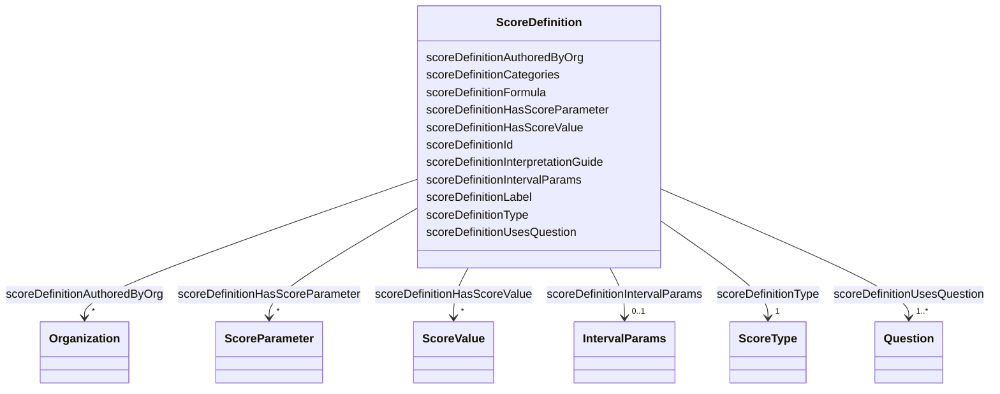

# Class: ScoreDefinition 


_A score calculated from questions._


URI: [faqir:ScoreDefinition](https://faqir.org/datamodel/ScoreDefinition)





<!-- no inheritance hierarchy -->


## Slots

| Name | Cardinality and Range | Description | Inheritance |
| ---  | --- | --- | --- |
| [scoreDefinitionType](scoreDefinitionType.md) | 1 <br/> [ScoreType](ScoreType.md) | Type of score: numerical_continuous, numerical_integer, numerical_percentage,... | direct |
| [scoreDefinitionHasScoreParameter](scoreDefinitionHasScoreParameter.md) | * <br/> [ScoreParameter](ScoreParameter.md) | The ScoreParameter that is required for this ScoreDefinition | direct |
| [scoreDefinitionUsesQuestion](scoreDefinitionUsesQuestion.md) | 1..* <br/> [Question](Question.md) | The Question(s) that this ScoreDefinition is based on | direct |
| [scoreDefinitionHasScoreValue](scoreDefinitionHasScoreValue.md) | * <br/> [ScoreValue](ScoreValue.md) | The ScoreValue that is calculated following this ScoreDefinition | direct |
| [scoreDefinitionAuthoredByOrg](scoreDefinitionAuthoredByOrg.md) | * <br/> [Organization](Organization.md) | The Organization that has created this ScoreDefinition | direct |
| [scoreDefinitionId](scoreDefinitionId.md) | 1 <br/> [Uriorcurie](Uriorcurie.md) | Unique identifier for the score definition | direct |
| [scoreDefinitionLabel](scoreDefinitionLabel.md) | 1 <br/> [String](String.md) | Label or title of the score definition | direct |
| [scoreDefinitionIntervalParams](scoreDefinitionIntervalParams.md) | 0..1 <br/> [IntervalParams](IntervalParams.md) | Minimum and maximum values for numerical_percentage and numerical_z_score sco... | direct |
| [scoreDefinitionFormula](scoreDefinitionFormula.md) | 1 <br/> [String](String.md) | The formula used to calculate the score | direct |
| [scoreDefinitionCategories](scoreDefinitionCategories.md) | * <br/> [String](String.md) | Categories for categorical scores | direct |
| [scoreDefinitionInterpretationGuide](scoreDefinitionInterpretationGuide.md) | 0..1 <br/> [String](String.md) | How to interpret the score values | direct |


## Usages

| used by | used in | type | used |
| ---  | --- | --- | --- |
| [Organization](Organization.md) | [organizationAuthorsScoreDefinition](organizationAuthorsScoreDefinition.md) | range | [ScoreDefinition](ScoreDefinition.md) |
| [Question](Question.md) | [questionUsedInScoreDefinition](questionUsedInScoreDefinition.md) | range | [ScoreDefinition](ScoreDefinition.md) |
| [ScoreDefinition](ScoreDefinition.md) | [scoreDefinitionHasScoreParameter](scoreDefinitionHasScoreParameter.md) | domain | [ScoreDefinition](ScoreDefinition.md) |
| [ScoreDefinition](ScoreDefinition.md) | [scoreDefinitionUsesQuestion](scoreDefinitionUsesQuestion.md) | domain | [ScoreDefinition](ScoreDefinition.md) |
| [ScoreDefinition](ScoreDefinition.md) | [scoreDefinitionHasScoreValue](scoreDefinitionHasScoreValue.md) | domain | [ScoreDefinition](ScoreDefinition.md) |
| [ScoreDefinition](ScoreDefinition.md) | [scoreDefinitionAuthoredByOrg](scoreDefinitionAuthoredByOrg.md) | domain | [ScoreDefinition](ScoreDefinition.md) |
| [ScoreParameter](ScoreParameter.md) | [scoreParameterPartOfScoreDefinition](scoreParameterPartOfScoreDefinition.md) | range | [ScoreDefinition](ScoreDefinition.md) |
| [ScoreValue](ScoreValue.md) | [scoreValueBasedOnScoreDefinition](scoreValueBasedOnScoreDefinition.md) | range | [ScoreDefinition](ScoreDefinition.md) |


## Identifier and Mapping Information


### Schema Source


* from schema: https://w3id.org/faqir/datamodel


## Mappings

| Mapping Type | Mapped Value |
| ---  | ---  |
| self | faqir:ScoreDefinition |
| native | https://w3id.org/faqir/datamodel/ScoreDefinition |


## LinkML Source

<!-- TODO: investigate https://stackoverflow.com/questions/37606292/how-to-create-tabbed-code-blocks-in-mkdocs-or-sphinx -->

### Direct

<details>
```yaml
name: ScoreDefinition
description: A score calculated from questions.
from_schema: https://w3id.org/faqir/datamodel
slots:
- scoreDefinitionType
- scoreDefinitionHasScoreParameter
- scoreDefinitionUsesQuestion
- scoreDefinitionHasScoreValue
- scoreDefinitionAuthoredByOrg
attributes:
  scoreDefinitionId:
    name: scoreDefinitionId
    description: Unique identifier for the score definition.
    from_schema: https://w3id.org/faqir/datamodel/questionnaire/classes
    rank: 1000
    identifier: true
    domain_of:
    - ScoreDefinition
    range: uriorcurie
    required: true
  scoreDefinitionLabel:
    name: scoreDefinitionLabel
    description: Label or title of the score definition.
    from_schema: https://w3id.org/faqir/datamodel/questionnaire/classes
    rank: 1000
    domain_of:
    - ScoreDefinition
    range: string
    required: true
  scoreDefinitionIntervalParams:
    name: scoreDefinitionIntervalParams
    description: Minimum and maximum values for numerical_percentage and numerical_z_score
      scores.
    from_schema: https://w3id.org/faqir/datamodel/questionnaire/classes
    rank: 1000
    domain_of:
    - ScoreDefinition
    range: IntervalParams
    required: false
  scoreDefinitionFormula:
    name: scoreDefinitionFormula
    description: The formula used to calculate the score.
    from_schema: https://w3id.org/faqir/datamodel/questionnaire/classes
    rank: 1000
    domain_of:
    - ScoreDefinition
    range: string
    required: true
  scoreDefinitionCategories:
    name: scoreDefinitionCategories
    description: Categories for categorical scores.
    from_schema: https://w3id.org/faqir/datamodel/questionnaire/classes
    rank: 1000
    domain_of:
    - ScoreDefinition
    range: string
    required: false
    multivalued: true
  scoreDefinitionInterpretationGuide:
    name: scoreDefinitionInterpretationGuide
    description: How to interpret the score values. English explanation.
    from_schema: https://w3id.org/faqir/datamodel/questionnaire/classes
    rank: 1000
    domain_of:
    - ScoreDefinition
    range: string
    required: false
class_uri: faqir:ScoreDefinition
rules:
- preconditions:
    slot_conditions:
      scoreDefinitionType:
        name: scoreDefinitionType
        equals_string_in:
        - categorical
  postconditions:
    slot_conditions:
      scoreDefinitionCategories:
        name: scoreDefinitionCategories
        required: true
  description: If scoreDefinitionType is 'categorical', scoreDefinitionCategories
    is required.
- preconditions:
    slot_conditions:
      scoreDefinitionType:
        name: scoreDefinitionType
        equals_string_in:
        - numerical_percentage
        - numerical_z_score
  postconditions:
    slot_conditions:
      scoreDefinitionIntervalParams:
        name: scoreDefinitionIntervalParams
        required: true
  description: If scoreDefinitionType is 'numerical_percentage' or 'numerical_z_score',
    scoreDefinitionIntervalParams is required.

```
</details>

### Induced

<details>
```yaml
name: ScoreDefinition
description: A score calculated from questions.
from_schema: https://w3id.org/faqir/datamodel
attributes:
  scoreDefinitionId:
    name: scoreDefinitionId
    description: Unique identifier for the score definition.
    from_schema: https://w3id.org/faqir/datamodel/questionnaire/classes
    rank: 1000
    identifier: true
    alias: scoreDefinitionId
    owner: ScoreDefinition
    domain_of:
    - ScoreDefinition
    range: uriorcurie
    required: true
  scoreDefinitionLabel:
    name: scoreDefinitionLabel
    description: Label or title of the score definition.
    from_schema: https://w3id.org/faqir/datamodel/questionnaire/classes
    rank: 1000
    alias: scoreDefinitionLabel
    owner: ScoreDefinition
    domain_of:
    - ScoreDefinition
    range: string
    required: true
  scoreDefinitionIntervalParams:
    name: scoreDefinitionIntervalParams
    description: Minimum and maximum values for numerical_percentage and numerical_z_score
      scores.
    from_schema: https://w3id.org/faqir/datamodel/questionnaire/classes
    rank: 1000
    alias: scoreDefinitionIntervalParams
    owner: ScoreDefinition
    domain_of:
    - ScoreDefinition
    range: IntervalParams
    required: false
  scoreDefinitionFormula:
    name: scoreDefinitionFormula
    description: The formula used to calculate the score.
    from_schema: https://w3id.org/faqir/datamodel/questionnaire/classes
    rank: 1000
    alias: scoreDefinitionFormula
    owner: ScoreDefinition
    domain_of:
    - ScoreDefinition
    range: string
    required: true
  scoreDefinitionCategories:
    name: scoreDefinitionCategories
    description: Categories for categorical scores.
    from_schema: https://w3id.org/faqir/datamodel/questionnaire/classes
    rank: 1000
    alias: scoreDefinitionCategories
    owner: ScoreDefinition
    domain_of:
    - ScoreDefinition
    range: string
    required: false
    multivalued: true
  scoreDefinitionInterpretationGuide:
    name: scoreDefinitionInterpretationGuide
    description: How to interpret the score values. English explanation.
    from_schema: https://w3id.org/faqir/datamodel/questionnaire/classes
    rank: 1000
    alias: scoreDefinitionInterpretationGuide
    owner: ScoreDefinition
    domain_of:
    - ScoreDefinition
    range: string
    required: false
  scoreDefinitionType:
    name: scoreDefinitionType
    description: 'Type of score: numerical_continuous, numerical_integer, numerical_percentage,
      numerical_z_score, numerical_t_score or categorical. Determines valid score
      values.'
    from_schema: https://w3id.org/faqir/datamodel
    rank: 1000
    slot_uri: faqir:scoreDefinitionType
    alias: scoreDefinitionType
    owner: ScoreDefinition
    domain_of:
    - ScoreDefinition
    - ScoreValue
    range: ScoreType
    required: true
  scoreDefinitionHasScoreParameter:
    name: scoreDefinitionHasScoreParameter
    description: The ScoreParameter that is required for this ScoreDefinition.
    from_schema: https://w3id.org/faqir/datamodel
    rank: 1000
    domain: ScoreDefinition
    slot_uri: faqir:scoreDefinitionHasScoreParameter
    alias: scoreDefinitionHasScoreParameter
    owner: ScoreDefinition
    domain_of:
    - ScoreDefinition
    inverse: scoreParameterPartOfScoreDefinition
    range: ScoreParameter
    required: false
    multivalued: true
  scoreDefinitionUsesQuestion:
    name: scoreDefinitionUsesQuestion
    description: The Question(s) that this ScoreDefinition is based on.
    from_schema: https://w3id.org/faqir/datamodel
    rank: 1000
    domain: ScoreDefinition
    slot_uri: faqir:scoreDefinitionUsesQuestion
    alias: scoreDefinitionUsesQuestion
    owner: ScoreDefinition
    domain_of:
    - ScoreDefinition
    inverse: questionUsedInScoreDefinition
    range: Question
    required: true
    multivalued: true
  scoreDefinitionHasScoreValue:
    name: scoreDefinitionHasScoreValue
    description: The ScoreValue that is calculated following this ScoreDefinition.
    from_schema: https://w3id.org/faqir/datamodel
    rank: 1000
    domain: ScoreDefinition
    slot_uri: faqir:scoreDefinitionHasScoreValue
    alias: scoreDefinitionHasScoreValue
    owner: ScoreDefinition
    domain_of:
    - ScoreDefinition
    inverse: scoreValueBasedOnScoreDefinition
    range: ScoreValue
    required: false
    multivalued: true
  scoreDefinitionAuthoredByOrg:
    name: scoreDefinitionAuthoredByOrg
    description: The Organization that has created this ScoreDefinition.
    from_schema: https://w3id.org/faqir/datamodel
    mappings:
    - fhir:Questionnaire.author
    rank: 1000
    domain: ScoreDefinition
    slot_uri: faqir:scoreDefinitionAuthoredByOrg
    alias: scoreDefinitionAuthoredByOrg
    owner: ScoreDefinition
    domain_of:
    - ScoreDefinition
    inverse: organizationAuthorsScoreDefinition
    range: Organization
    required: false
    multivalued: true
class_uri: faqir:ScoreDefinition
rules:
- preconditions:
    slot_conditions:
      scoreDefinitionType:
        name: scoreDefinitionType
        equals_string_in:
        - categorical
  postconditions:
    slot_conditions:
      scoreDefinitionCategories:
        name: scoreDefinitionCategories
        required: true
  description: If scoreDefinitionType is 'categorical', scoreDefinitionCategories
    is required.
- preconditions:
    slot_conditions:
      scoreDefinitionType:
        name: scoreDefinitionType
        equals_string_in:
        - numerical_percentage
        - numerical_z_score
  postconditions:
    slot_conditions:
      scoreDefinitionIntervalParams:
        name: scoreDefinitionIntervalParams
        required: true
  description: If scoreDefinitionType is 'numerical_percentage' or 'numerical_z_score',
    scoreDefinitionIntervalParams is required.

```
</details>