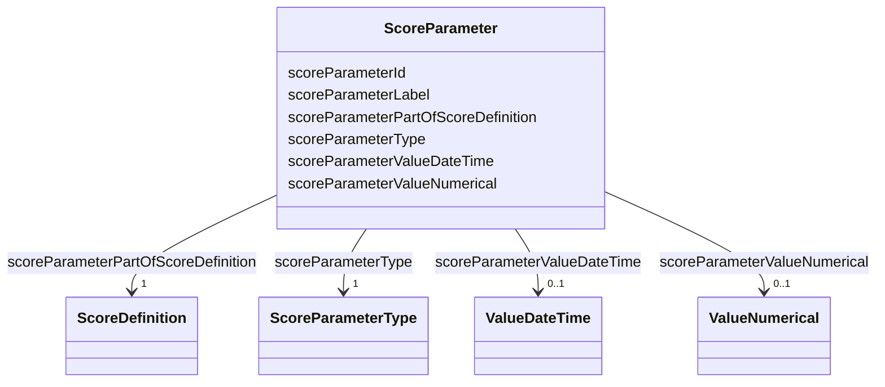

# Class: ScoreParameter 


_Parameters for score definitions, such as min/max values, categories or constants needed._


URI: [faqir:ScoreParameter](https://faqir.org/datamodel/ScoreParameter)





<!-- no inheritance hierarchy -->


## Slots

| Name | Cardinality and Range | Description | Inheritance |
| ---  | --- | --- | --- |
| [scoreParameterPartOfScoreDefinition](scoreParameterPartOfScoreDefinition.md) | 1 <br/> [ScoreDefinition](ScoreDefinition.md) | The ScoreDefinition(s) that this ScoreParameter is part of | direct |
| [scoreParameterId](scoreParameterId.md) | 1 <br/> [Uriorcurie](Uriorcurie.md) | Unique identifier for the score parameter | direct |
| [scoreParameterLabel](scoreParameterLabel.md) | 1 <br/> [String](String.md) | Label or title of the parameter | direct |
| [scoreParameterType](scoreParameterType.md) | 1 <br/> [ScoreParameterType](ScoreParameterType.md) | Type of parameter: numerical or dateTime | direct |
| [scoreParameterValueNumerical](scoreParameterValueNumerical.md) | 0..1 <br/> [ValueNumerical](ValueNumerical.md) | Numerical value parameter (e | direct |
| [scoreParameterValueDateTime](scoreParameterValueDateTime.md) | 0..1 <br/> [ValueDateTime](ValueDateTime.md) | DateTime value parameter formatted as YYYY-MM-DDThh:mm:ss+zz:zz | direct |


## Usages

| used by | used in | type | used |
| ---  | --- | --- | --- |
| [ScoreDefinition](ScoreDefinition.md) | [scoreDefinitionHasScoreParameter](scoreDefinitionHasScoreParameter.md) | range | [ScoreParameter](ScoreParameter.md) |
| [ScoreParameter](ScoreParameter.md) | [scoreParameterPartOfScoreDefinition](scoreParameterPartOfScoreDefinition.md) | domain | [ScoreParameter](ScoreParameter.md) |


## Identifier and Mapping Information


### Schema Source


* from schema: https://w3id.org/faqir/datamodel


## Mappings

| Mapping Type | Mapped Value |
| ---  | ---  |
| self | faqir:ScoreParameter |
| native | https://w3id.org/faqir/datamodel/ScoreParameter |


## LinkML Source

<!-- TODO: investigate https://stackoverflow.com/questions/37606292/how-to-create-tabbed-code-blocks-in-mkdocs-or-sphinx -->

### Direct

<details>
```yaml
name: ScoreParameter
description: Parameters for score definitions, such as min/max values, categories
  or constants needed.
from_schema: https://w3id.org/faqir/datamodel
slots:
- scoreParameterPartOfScoreDefinition
attributes:
  scoreParameterId:
    name: scoreParameterId
    description: Unique identifier for the score parameter.
    from_schema: https://w3id.org/faqir/datamodel/questionnaire/classes
    rank: 1000
    identifier: true
    domain_of:
    - ScoreParameter
    range: uriorcurie
    required: true
  scoreParameterLabel:
    name: scoreParameterLabel
    description: Label or title of the parameter. Standard English name.
    from_schema: https://w3id.org/faqir/datamodel/questionnaire/classes
    rank: 1000
    domain_of:
    - ScoreParameter
    range: string
    required: true
  scoreParameterType:
    name: scoreParameterType
    description: 'Type of parameter: numerical or dateTime.'
    from_schema: https://w3id.org/faqir/datamodel/questionnaire/classes
    rank: 1000
    domain_of:
    - ScoreParameter
    range: ScoreParameterType
    required: true
  scoreParameterValueNumerical:
    name: scoreParameterValueNumerical
    description: Numerical value parameter (e.g., 0.785, 82).
    from_schema: https://w3id.org/faqir/datamodel/questionnaire/classes
    rank: 1000
    domain_of:
    - ScoreParameter
    range: ValueNumerical
    required: false
  scoreParameterValueDateTime:
    name: scoreParameterValueDateTime
    description: DateTime value parameter formatted as YYYY-MM-DDThh:mm:ss+zz:zz.
    from_schema: https://w3id.org/faqir/datamodel/questionnaire/classes
    rank: 1000
    domain_of:
    - ScoreParameter
    range: ValueDateTime
    required: false
class_uri: faqir:ScoreParameter
rules:
- preconditions:
    slot_conditions:
      scoreParameterType:
        name: scoreParameterType
        equals_string_in:
        - numerical
  postconditions:
    slot_conditions:
      scoreParameterValueNumerical:
        name: scoreParameterValueNumerical
        required: true
  description: If scoreParameterType is 'numerical', scoreParameterValueNumerical
    is required.
- preconditions:
    slot_conditions:
      scoreParameterType:
        name: scoreParameterType
        equals_string_in:
        - dateTime
  postconditions:
    slot_conditions:
      scoreParameterValueDateTime:
        name: scoreParameterValueDateTime
        required: true
  description: If scoreParameterType is 'dateTime', scoreParameterValueDateTime is
    required.

```
</details>

### Induced

<details>
```yaml
name: ScoreParameter
description: Parameters for score definitions, such as min/max values, categories
  or constants needed.
from_schema: https://w3id.org/faqir/datamodel
attributes:
  scoreParameterId:
    name: scoreParameterId
    description: Unique identifier for the score parameter.
    from_schema: https://w3id.org/faqir/datamodel/questionnaire/classes
    rank: 1000
    identifier: true
    alias: scoreParameterId
    owner: ScoreParameter
    domain_of:
    - ScoreParameter
    range: uriorcurie
    required: true
  scoreParameterLabel:
    name: scoreParameterLabel
    description: Label or title of the parameter. Standard English name.
    from_schema: https://w3id.org/faqir/datamodel/questionnaire/classes
    rank: 1000
    alias: scoreParameterLabel
    owner: ScoreParameter
    domain_of:
    - ScoreParameter
    range: string
    required: true
  scoreParameterType:
    name: scoreParameterType
    description: 'Type of parameter: numerical or dateTime.'
    from_schema: https://w3id.org/faqir/datamodel/questionnaire/classes
    rank: 1000
    alias: scoreParameterType
    owner: ScoreParameter
    domain_of:
    - ScoreParameter
    range: ScoreParameterType
    required: true
  scoreParameterValueNumerical:
    name: scoreParameterValueNumerical
    description: Numerical value parameter (e.g., 0.785, 82).
    from_schema: https://w3id.org/faqir/datamodel/questionnaire/classes
    rank: 1000
    alias: scoreParameterValueNumerical
    owner: ScoreParameter
    domain_of:
    - ScoreParameter
    range: ValueNumerical
    required: false
  scoreParameterValueDateTime:
    name: scoreParameterValueDateTime
    description: DateTime value parameter formatted as YYYY-MM-DDThh:mm:ss+zz:zz.
    from_schema: https://w3id.org/faqir/datamodel/questionnaire/classes
    rank: 1000
    alias: scoreParameterValueDateTime
    owner: ScoreParameter
    domain_of:
    - ScoreParameter
    range: ValueDateTime
    required: false
  scoreParameterPartOfScoreDefinition:
    name: scoreParameterPartOfScoreDefinition
    description: The ScoreDefinition(s) that this ScoreParameter is part of.
    from_schema: https://w3id.org/faqir/datamodel
    rank: 1000
    domain: ScoreParameter
    slot_uri: faqir:scoreParameterPartOfScoreDefinition
    alias: scoreParameterPartOfScoreDefinition
    owner: ScoreParameter
    domain_of:
    - ScoreParameter
    inverse: scoreDefinitionHasScoreParameter
    range: ScoreDefinition
    required: true
    multivalued: false
class_uri: faqir:ScoreParameter
rules:
- preconditions:
    slot_conditions:
      scoreParameterType:
        name: scoreParameterType
        equals_string_in:
        - numerical
  postconditions:
    slot_conditions:
      scoreParameterValueNumerical:
        name: scoreParameterValueNumerical
        required: true
  description: If scoreParameterType is 'numerical', scoreParameterValueNumerical
    is required.
- preconditions:
    slot_conditions:
      scoreParameterType:
        name: scoreParameterType
        equals_string_in:
        - dateTime
  postconditions:
    slot_conditions:
      scoreParameterValueDateTime:
        name: scoreParameterValueDateTime
        required: true
  description: If scoreParameterType is 'dateTime', scoreParameterValueDateTime is
    required.

```
</details>