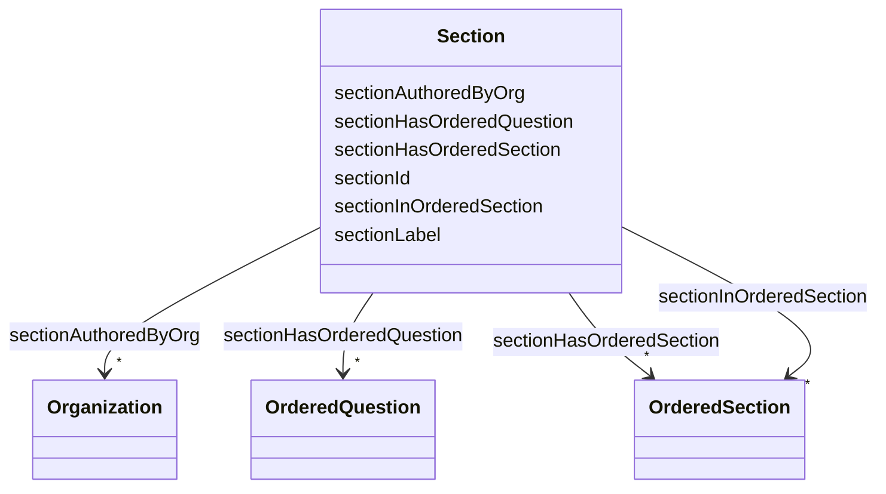

# Class: Section 


_A section of questions in the questionnaire._


URI: [faqir:Section](https://faqir.org/datamodel/Section)





<!-- no inheritance hierarchy -->


## Slots

| Name | Cardinality and Range | Description | Inheritance |
| ---  | --- | --- | --- |
| [sectionHasOrderedQuestion](sectionHasOrderedQuestion.md) | * <br/> [OrderedQuestion](OrderedQuestion.md) | The Question that is part of this Section, with their display order | direct |
| [sectionHasOrderedSection](sectionHasOrderedSection.md) | * <br/> [OrderedSection](OrderedSection.md) | The Section that is part of this Section | direct |
| [sectionInOrderedSection](sectionInOrderedSection.md) | * <br/> [OrderedSection](OrderedSection.md) | OrderedSections that this Section is indexed in | direct |
| [sectionAuthoredByOrg](sectionAuthoredByOrg.md) | * <br/> [Organization](Organization.md) | The Organization that has created this Section | direct |
| [sectionId](sectionId.md) | 1 <br/> [Uriorcurie](Uriorcurie.md) | The unique identifier for a section in the questionnaire | direct |
| [sectionLabel](sectionLabel.md) | 1 <br/> [String](String.md) | The label or title of the section, which is displayed to the user | direct |


## Usages

| used by | used in | type | used |
| ---  | --- | --- | --- |
| [Organization](Organization.md) | [organizationAuthorsSection](organizationAuthorsSection.md) | range | [Section](Section.md) |
| [OrderedQuestion](OrderedQuestion.md) | [orderedQuestionPartOfSection](orderedQuestionPartOfSection.md) | range | [Section](Section.md) |
| [OrderedSection](OrderedSection.md) | [orderedSectionHasSection](orderedSectionHasSection.md) | range | [Section](Section.md) |
| [OrderedSection](OrderedSection.md) | [orderedSectionPartOfSection](orderedSectionPartOfSection.md) | range | [Section](Section.md) |
| [Section](Section.md) | [sectionHasOrderedQuestion](sectionHasOrderedQuestion.md) | domain | [Section](Section.md) |
| [Section](Section.md) | [sectionHasOrderedSection](sectionHasOrderedSection.md) | domain | [Section](Section.md) |
| [Section](Section.md) | [sectionInOrderedSection](sectionInOrderedSection.md) | domain | [Section](Section.md) |
| [Section](Section.md) | [sectionAuthoredByOrg](sectionAuthoredByOrg.md) | domain | [Section](Section.md) |


## Identifier and Mapping Information


### Schema Source


* from schema: https://w3id.org/faqir/datamodel


## Mappings

| Mapping Type | Mapped Value |
| ---  | ---  |
| self | faqir:Section |
| native | https://w3id.org/faqir/datamodel/Section |
| undefined | fhir:Questionnaire.item.where(type='group') |


## LinkML Source

<!-- TODO: investigate https://stackoverflow.com/questions/37606292/how-to-create-tabbed-code-blocks-in-mkdocs-or-sphinx -->

### Direct

<details>
```yaml
name: Section
description: A section of questions in the questionnaire.
from_schema: https://w3id.org/faqir/datamodel
mappings:
- fhir:Questionnaire.item.where(type='group')
slots:
- sectionHasOrderedQuestion
- sectionHasOrderedSection
- sectionInOrderedSection
- sectionAuthoredByOrg
attributes:
  sectionId:
    name: sectionId
    description: The unique identifier for a section in the questionnaire.
    from_schema: https://w3id.org/faqir/datamodel/questionnaire/classes
    rank: 1000
    identifier: true
    domain_of:
    - Section
    range: uriorcurie
    required: true
  sectionLabel:
    name: sectionLabel
    description: The label or title of the section, which is displayed to the user.
    from_schema: https://w3id.org/faqir/datamodel/questionnaire/classes
    rank: 1000
    domain_of:
    - Section
    range: string
    required: true
class_uri: faqir:Section

```
</details>

### Induced

<details>
```yaml
name: Section
description: A section of questions in the questionnaire.
from_schema: https://w3id.org/faqir/datamodel
mappings:
- fhir:Questionnaire.item.where(type='group')
attributes:
  sectionId:
    name: sectionId
    description: The unique identifier for a section in the questionnaire.
    from_schema: https://w3id.org/faqir/datamodel/questionnaire/classes
    rank: 1000
    identifier: true
    alias: sectionId
    owner: Section
    domain_of:
    - Section
    range: uriorcurie
    required: true
  sectionLabel:
    name: sectionLabel
    description: The label or title of the section, which is displayed to the user.
    from_schema: https://w3id.org/faqir/datamodel/questionnaire/classes
    rank: 1000
    alias: sectionLabel
    owner: Section
    domain_of:
    - Section
    range: string
    required: true
  sectionHasOrderedQuestion:
    name: sectionHasOrderedQuestion
    description: The Question that is part of this Section, with their display order.
    from_schema: https://w3id.org/faqir/datamodel
    mappings:
    - fhir:Questionnaire.item.where(type='question')
    rank: 1000
    domain: Section
    slot_uri: faqir:sectionHasOrderedQuestion
    alias: sectionHasOrderedQuestion
    owner: Section
    domain_of:
    - Section
    inverse: orderedQuestionPartOfSection
    range: OrderedQuestion
    required: false
    multivalued: true
    inlined: true
    inlined_as_list: true
  sectionHasOrderedSection:
    name: sectionHasOrderedSection
    description: The Section that is part of this Section.
    from_schema: https://w3id.org/faqir/datamodel
    mappings:
    - fhir:Questionnaire.item.where(type='group')
    rank: 1000
    domain: Section
    slot_uri: faqir:sectionHasOrderedSection
    alias: sectionHasOrderedSection
    owner: Section
    domain_of:
    - Section
    inverse: orderedSectionPartOfSection
    range: OrderedSection
    required: false
    multivalued: true
    inlined: true
    inlined_as_list: true
  sectionInOrderedSection:
    name: sectionInOrderedSection
    description: OrderedSections that this Section is indexed in.
    from_schema: https://w3id.org/faqir/datamodel
    rank: 1000
    domain: Section
    slot_uri: faqir:sectionInOrderedSection
    alias: sectionInOrderedSection
    owner: Section
    domain_of:
    - Section
    inverse: orderedSectionHasSection
    range: OrderedSection
    required: false
    multivalued: true
  sectionAuthoredByOrg:
    name: sectionAuthoredByOrg
    description: The Organization that has created this Section.
    from_schema: https://w3id.org/faqir/datamodel
    mappings:
    - fhir:Questionnaire.author
    rank: 1000
    domain: Section
    slot_uri: faqir:sectionAuthoredByOrg
    alias: sectionAuthoredByOrg
    owner: Section
    domain_of:
    - Section
    inverse: organizationAuthorsSection
    range: Organization
    required: false
    multivalued: true
class_uri: faqir:Section

```
</details>