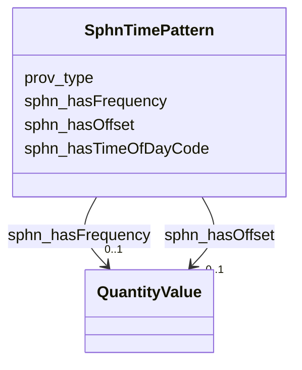

# Class: SphnTimePattern 


_sequence or regularity in the occurrence of events over time_


URI: [sphn:TimePattern](https://biomedit.ch/rdf/sphn-schema/sphn#TimePattern)





<!-- no inheritance hierarchy -->


## Slots

| Name | Cardinality and Range | Description | Inheritance |
| ---  | --- | --- | --- |
| [prov_type](prov_type.md) | * <br/> [Uriorcurie](Uriorcurie.md) | The attribute prov:type provides further typing information for any construct... | direct |
| [sphn_hasFrequency](sphn_hasFrequency.md) | 0..1 <br/> [QuantityValue](QuantityValue.md) | number of events per unit of time | direct |
| [sphn_hasOffset](sphn_hasOffset.md) | 0..1 <br/> [QuantityValue](QuantityValue.md) | time between events associated to the concept | direct |
| [sphn_hasTimeOfDayCode](sphn_hasTimeOfDayCode.md) | 0..1 <br/> [Uriorcurie](Uriorcurie.md) | coded information specifying the temporal period of the day associated to the... | direct |


## Identifier and Mapping Information


### Schema Source


* from schema: https://ns.faqir.org/q-o


## Mappings

| Mapping Type | Mapped Value |
| ---  | ---  |
| self | sphn:TimePattern |
| native | qo:SphnTimePattern |
| undefined | snomed:272103003 |


## LinkML Source

<!-- TODO: investigate https://stackoverflow.com/questions/37606292/how-to-create-tabbed-code-blocks-in-mkdocs-or-sphinx -->

### Direct

<details>
```yaml
name: sphn_TimePattern
description: sequence or regularity in the occurrence of events over time
from_schema: https://ns.faqir.org/q-o
mappings:
- snomed:272103003
slots:
- prov_type
attributes:
  sphn_hasFrequency:
    name: sphn_hasFrequency
    description: number of events per unit of time
    from_schema: https://ns.faqir.org/phr-o/core/value_types
    rank: 1000
    slot_uri: sphn:hasFrequency
    domain_of:
    - sphn_TimePattern
    range: QuantityValue
    required: false
    multivalued: false
  sphn_hasOffset:
    name: sphn_hasOffset
    description: time between events associated to the concept
    from_schema: https://ns.faqir.org/phr-o/core/value_types
    rank: 1000
    slot_uri: sphn:hasOffset
    domain_of:
    - sphn_TimePattern
    range: QuantityValue
    required: false
    multivalued: false
  sphn_hasTimeOfDayCode:
    name: sphn_hasTimeOfDayCode
    description: coded information specifying the temporal period of the day associated
      to the concept
    from_schema: https://ns.faqir.org/phr-o/core/value_types
    rank: 1000
    slot_uri: sphn:hasTimeOfDayCode
    domain_of:
    - sphn_TimePattern
    range: uriorcurie
    required: false
    multivalued: false
class_uri: sphn:TimePattern

```
</details>

### Induced

<details>
```yaml
name: sphn_TimePattern
description: sequence or regularity in the occurrence of events over time
from_schema: https://ns.faqir.org/q-o
mappings:
- snomed:272103003
attributes:
  sphn_hasFrequency:
    name: sphn_hasFrequency
    description: number of events per unit of time
    from_schema: https://ns.faqir.org/phr-o/core/value_types
    rank: 1000
    slot_uri: sphn:hasFrequency
    alias: sphn_hasFrequency
    owner: sphn_TimePattern
    domain_of:
    - sphn_TimePattern
    range: QuantityValue
    required: false
    multivalued: false
  sphn_hasOffset:
    name: sphn_hasOffset
    description: time between events associated to the concept
    from_schema: https://ns.faqir.org/phr-o/core/value_types
    rank: 1000
    slot_uri: sphn:hasOffset
    alias: sphn_hasOffset
    owner: sphn_TimePattern
    domain_of:
    - sphn_TimePattern
    range: QuantityValue
    required: false
    multivalued: false
  sphn_hasTimeOfDayCode:
    name: sphn_hasTimeOfDayCode
    description: coded information specifying the temporal period of the day associated
      to the concept
    from_schema: https://ns.faqir.org/phr-o/core/value_types
    rank: 1000
    slot_uri: sphn:hasTimeOfDayCode
    alias: sphn_hasTimeOfDayCode
    owner: sphn_TimePattern
    domain_of:
    - sphn_TimePattern
    range: uriorcurie
    required: false
    multivalued: false
  prov_type:
    name: prov_type
    description: The attribute prov:type provides further typing information for any
      construct with an optional set of attribute-value pairs.
    from_schema: https://ns.faqir.org/q-o
    exact_mappings:
    - rdf:type
    - sphn:hasTypeCode
    narrow_mappings:
    - schema:procedureType
    rank: 1000
    domain: owl_Thing
    slot_uri: prov:type
    alias: prov_type
    owner: sphn_TimePattern
    domain_of:
    - owl_Thing
    - sphn_TimePattern
    range: uriorcurie
    required: false
    multivalued: true
class_uri: sphn:TimePattern

```
</details>