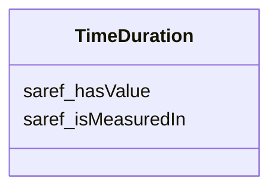

# Class: TimeDuration 


_Duration of a temporal extent expressed as a decimal number scaled by a temporal unit_


URI: [time:Duration](http://www.w3.org/2006/time#Duration)





<!-- no inheritance hierarchy -->


## Slots

| Name | Cardinality and Range | Description | Inheritance |
| ---  | --- | --- | --- |
| [saref_hasValue](saref_hasValue.md) | 0..1 <br/> [String](String.md)&nbsp;or&nbsp;<br />[Integer](Integer.md)&nbsp;or&nbsp;<br />[Float](Float.md)&nbsp;or&nbsp;<br />[Double](Double.md)&nbsp;or&nbsp;<br />[Decimal](Decimal.md)&nbsp;or&nbsp;<br />[Date](Date.md)&nbsp;or&nbsp;<br />[Datetime](Datetime.md)&nbsp;or&nbsp;<br />[Uriorcurie](Uriorcurie.md)&nbsp;or&nbsp;<br />[String](String.md) | Value of a property value expressed as an RDF literal | direct |
| [saref_isMeasuredIn](saref_isMeasuredIn.md) | 0..1 <br/> [Uriorcurie](Uriorcurie.md) | A relationship identifying the unit of measure used for a certain entity | direct |


## Usages

| used by | used in | type | used |
| ---  | --- | --- | --- |
| [QoOrderedQuestion](QoOrderedQuestion.md) | [qo_temporalValidity](qo_temporalValidity.md) | range | [TimeDuration](TimeDuration.md) |


## Identifier and Mapping Information


### Schema Source


* from schema: https://ns.faqir.org/q-o


## Mappings

| Mapping Type | Mapped Value |
| ---  | ---  |
| self | time:Duration |
| native | qo:TimeDuration |


## LinkML Source

<!-- TODO: investigate https://stackoverflow.com/questions/37606292/how-to-create-tabbed-code-blocks-in-mkdocs-or-sphinx -->

### Direct

<details>
```yaml
name: time_Duration
description: Duration of a temporal extent expressed as a decimal number scaled by
  a temporal unit
from_schema: https://ns.faqir.org/q-o
slots:
- saref_hasValue
- saref_isMeasuredIn
class_uri: time:Duration

```
</details>

### Induced

<details>
```yaml
name: time_Duration
description: Duration of a temporal extent expressed as a decimal number scaled by
  a temporal unit
from_schema: https://ns.faqir.org/q-o
attributes:
  saref_hasValue:
    name: saref_hasValue
    description: Value of a property value expressed as an RDF literal. Note that,
      even if decimal values are expected, values could use other datatypes.
    from_schema: https://ns.faqir.org/q-o
    rank: 1000
    slot_uri: saref:hasValue
    alias: saref_hasValue
    owner: time_Duration
    domain_of:
    - saref_PropertyValue
    - QuantityValue
    - time_Duration
    range: string
    required: false
    multivalued: false
    any_of:
    - range: integer
    - range: float
    - range: double
    - range: decimal
    - range: date
    - range: datetime
    - range: uriorcurie
    - range: string
  saref_isMeasuredIn:
    name: saref_isMeasuredIn
    description: A relationship identifying the unit of measure used for a certain
      entity.
    from_schema: https://ns.faqir.org/q-o
    rank: 1000
    slot_uri: saref:isMeasuredIn
    alias: saref_isMeasuredIn
    owner: time_Duration
    domain_of:
    - QuantityValue
    - time_Duration
    range: uriorcurie
    required: false
    multivalued: false
    pattern: '^ucum:'
class_uri: time:Duration

```
</details>