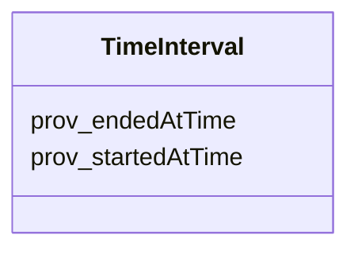

# Class: TimeInterval 


_A temporal entity with an extent or duration_


URI: [time:Interval](http://www.w3.org/2006/time#Interval)





<!-- no inheritance hierarchy -->


## Slots

| Name | Cardinality and Range | Description | Inheritance |
| ---  | --- | --- | --- |
| [prov_startedAtTime](prov_startedAtTime.md) | 0..1 <br/> [Datetime](Datetime.md) | The time at which an activity started | direct |
| [prov_endedAtTime](prov_endedAtTime.md) | 0..1 <br/> [Datetime](Datetime.md) | The time at which an activity ended | direct |


## Usages

| used by | used in | type | used |
| ---  | --- | --- | --- |
| [SarefPropertyValue](SarefPropertyValue.md) | [fhir_valuePeriod](fhir_valuePeriod.md) | range | [TimeInterval](TimeInterval.md) |
| [QoQuestionnaireStatus](QoQuestionnaireStatus.md) | [fhir_valuePeriod](fhir_valuePeriod.md) | range | [TimeInterval](TimeInterval.md) |
| [QoQuestionnaireResponseStatus](QoQuestionnaireResponseStatus.md) | [fhir_valuePeriod](fhir_valuePeriod.md) | range | [TimeInterval](TimeInterval.md) |


## Identifier and Mapping Information


### Schema Source


* from schema: https://ns.faqir.org/q-o


## Mappings

| Mapping Type | Mapped Value |
| ---  | ---  |
| self | time:Interval |
| native | qo:TimeInterval |


## LinkML Source

<!-- TODO: investigate https://stackoverflow.com/questions/37606292/how-to-create-tabbed-code-blocks-in-mkdocs-or-sphinx -->

### Direct

<details>
```yaml
name: time_Interval
description: A temporal entity with an extent or duration
from_schema: https://ns.faqir.org/q-o
slots:
- prov_startedAtTime
- prov_endedAtTime
class_uri: time:Interval

```
</details>

### Induced

<details>
```yaml
name: time_Interval
description: A temporal entity with an extent or duration
from_schema: https://ns.faqir.org/q-o
attributes:
  prov_startedAtTime:
    name: prov_startedAtTime
    description: The time at which an activity started.
    from_schema: https://ns.faqir.org/q-o
    rank: 1000
    domain: sulo_Process
    slot_uri: prov:startedAtTime
    alias: prov_startedAtTime
    owner: time_Interval
    domain_of:
    - time_Interval
    range: datetime
    required: false
    multivalued: false
  prov_endedAtTime:
    name: prov_endedAtTime
    description: The time at which an activity ended.
    from_schema: https://ns.faqir.org/q-o
    rank: 1000
    domain: sulo_Process
    slot_uri: prov:endedAtTime
    alias: prov_endedAtTime
    owner: time_Interval
    domain_of:
    - time_Interval
    range: datetime
    required: false
    multivalued: false
class_uri: time:Interval

```
</details>