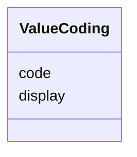

# Class: ValueCoding 


_A coded value with a unique code for each display text, typically used for standardized questionnaires._


URI: [faqir:ValueCoding](https://faqir.org/datamodel/ValueCoding)





<!-- no inheritance hierarchy -->


## Slots

| Name | Cardinality and Range | Description | Inheritance |
| ---  | --- | --- | --- |
| [code](code.md) | 1 <br/> [String](String.md) | The code representing the value (e | direct |
| [display](display.md) | 1 <br/> [String](String.md) | The human-readable display text for the code (e | direct |


## Usages

| used by | used in | type | used |
| ---  | --- | --- | --- |
| [Question](Question.md) | [questionCodingParams](questionCodingParams.md) | range | [ValueCoding](ValueCoding.md) |


## Identifier and Mapping Information


### Schema Source


* from schema: https://w3id.org/faqir/datamodel


## Mappings

| Mapping Type | Mapped Value |
| ---  | ---  |
| self | faqir:ValueCoding |
| native | https://w3id.org/faqir/datamodel/ValueCoding |
| undefined | fhir:Coding |


## LinkML Source

<!-- TODO: investigate https://stackoverflow.com/questions/37606292/how-to-create-tabbed-code-blocks-in-mkdocs-or-sphinx -->

### Direct

<details>
```yaml
name: ValueCoding
description: A coded value with a unique code for each display text, typically used
  for standardized questionnaires.
from_schema: https://w3id.org/faqir/datamodel
mappings:
- fhir:Coding
attributes:
  code:
    name: code
    description: The code representing the value (e.g. code '1' for display 'Yes').
    from_schema: https://w3id.org/faqir/datamodel/core/types
    rank: 1000
    domain_of:
    - ValueCoding
    range: string
    required: true
  display:
    name: display
    description: The human-readable display text for the code (e.g. code '1' for display
      'Yes').
    from_schema: https://w3id.org/faqir/datamodel/core/types
    rank: 1000
    domain_of:
    - ValueCoding
    range: string
    required: true
class_uri: faqir:ValueCoding

```
</details>

### Induced

<details>
```yaml
name: ValueCoding
description: A coded value with a unique code for each display text, typically used
  for standardized questionnaires.
from_schema: https://w3id.org/faqir/datamodel
mappings:
- fhir:Coding
attributes:
  code:
    name: code
    description: The code representing the value (e.g. code '1' for display 'Yes').
    from_schema: https://w3id.org/faqir/datamodel/core/types
    rank: 1000
    alias: code
    owner: ValueCoding
    domain_of:
    - ValueCoding
    range: string
    required: true
  display:
    name: display
    description: The human-readable display text for the code (e.g. code '1' for display
      'Yes').
    from_schema: https://w3id.org/faqir/datamodel/core/types
    rank: 1000
    alias: display
    owner: ValueCoding
    domain_of:
    - ValueCoding
    range: string
    required: true
class_uri: faqir:ValueCoding

```
</details>