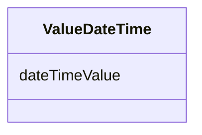

# Class: ValueDateTime 


_A date and time value, typically in ISO 8601 format._


URI: [faqir:ValueDateTime](https://faqir.org/datamodel/ValueDateTime)





<!-- no inheritance hierarchy -->


## Slots

| Name | Cardinality and Range | Description | Inheritance |
| ---  | --- | --- | --- |
| [dateTimeValue](dateTimeValue.md) | 0..1 <br/> [Datetime](Datetime.md) | The date and time value in ISO 8601 format | direct |


## Usages

| used by | used in | type | used |
| ---  | --- | --- | --- |
| [Answer](Answer.md) | [answerValueDateTime](answerValueDateTime.md) | range | [ValueDateTime](ValueDateTime.md) |
| [ScoreParameter](ScoreParameter.md) | [scoreParameterValueDateTime](scoreParameterValueDateTime.md) | range | [ValueDateTime](ValueDateTime.md) |


## Identifier and Mapping Information


### Schema Source


* from schema: https://w3id.org/faqir/datamodel


## Mappings

| Mapping Type | Mapped Value |
| ---  | ---  |
| self | faqir:ValueDateTime |
| native | https://w3id.org/faqir/datamodel/ValueDateTime |
| undefined | xsd:dateTime |


## LinkML Source

<!-- TODO: investigate https://stackoverflow.com/questions/37606292/how-to-create-tabbed-code-blocks-in-mkdocs-or-sphinx -->

### Direct

<details>
```yaml
name: ValueDateTime
description: A date and time value, typically in ISO 8601 format.
from_schema: https://w3id.org/faqir/datamodel
mappings:
- xsd:dateTime
attributes:
  dateTimeValue:
    name: dateTimeValue
    description: The date and time value in ISO 8601 format.
    from_schema: https://w3id.org/faqir/datamodel/core/types
    rank: 1000
    domain_of:
    - ValueDateTime
    range: datetime
class_uri: faqir:ValueDateTime

```
</details>

### Induced

<details>
```yaml
name: ValueDateTime
description: A date and time value, typically in ISO 8601 format.
from_schema: https://w3id.org/faqir/datamodel
mappings:
- xsd:dateTime
attributes:
  dateTimeValue:
    name: dateTimeValue
    description: The date and time value in ISO 8601 format.
    from_schema: https://w3id.org/faqir/datamodel/core/types
    rank: 1000
    alias: dateTimeValue
    owner: ValueDateTime
    domain_of:
    - ValueDateTime
    range: datetime
class_uri: faqir:ValueDateTime

```
</details>