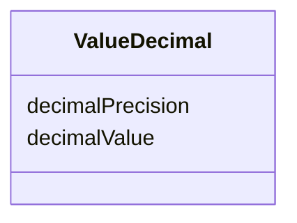

# Class: ValueDecimal 


_A decimal value, either integer or float._


URI: [xsd:decimal](http://www.w3.org/2001/XMLSchema#decimal)





<!-- no inheritance hierarchy -->


## Slots

| Name | Cardinality and Range | Description | Inheritance |
| ---  | --- | --- | --- |
| [decimalValue](decimalValue.md) | 0..1 <br/> [Decimal](Decimal.md) | The decimal value, which can be an integer or a float | direct |
| [decimalPrecision](decimalPrecision.md) | 0..1 <br/> [Integer](Integer.md) | The precision of the decimal value, e | direct |


## Usages

| used by | used in | type | used |
| ---  | --- | --- | --- |
| [ValueNumberInInterval](ValueNumberInInterval.md) | [minValue](minValue.md) | range | [ValueDecimal](ValueDecimal.md) |
| [ValueNumberInInterval](ValueNumberInInterval.md) | [maxValue](maxValue.md) | range | [ValueDecimal](ValueDecimal.md) |


## Identifier and Mapping Information


### Schema Source


* from schema: https://w3id.org/faqir/datamodel


## Mappings

| Mapping Type | Mapped Value |
| ---  | ---  |
| self | xsd:decimal |
| native | https://w3id.org/faqir/datamodel/ValueDecimal |


## LinkML Source

<!-- TODO: investigate https://stackoverflow.com/questions/37606292/how-to-create-tabbed-code-blocks-in-mkdocs-or-sphinx -->

### Direct

<details>
```yaml
name: ValueDecimal
description: A decimal value, either integer or float.
from_schema: https://w3id.org/faqir/datamodel
attributes:
  decimalValue:
    name: decimalValue
    description: The decimal value, which can be an integer or a float.
    from_schema: https://w3id.org/faqir/datamodel/core/types
    rank: 1000
    domain_of:
    - ValueDecimal
    range: decimal
  decimalPrecision:
    name: decimalPrecision
    description: The precision of the decimal value, e.g. number of decimal places.
    from_schema: https://w3id.org/faqir/datamodel/core/types
    rank: 1000
    domain_of:
    - ValueDecimal
    range: integer
    minimum_value: 0
class_uri: xsd:decimal

```
</details>

### Induced

<details>
```yaml
name: ValueDecimal
description: A decimal value, either integer or float.
from_schema: https://w3id.org/faqir/datamodel
attributes:
  decimalValue:
    name: decimalValue
    description: The decimal value, which can be an integer or a float.
    from_schema: https://w3id.org/faqir/datamodel/core/types
    rank: 1000
    alias: decimalValue
    owner: ValueDecimal
    domain_of:
    - ValueDecimal
    range: decimal
  decimalPrecision:
    name: decimalPrecision
    description: The precision of the decimal value, e.g. number of decimal places.
    from_schema: https://w3id.org/faqir/datamodel/core/types
    rank: 1000
    alias: decimalPrecision
    owner: ValueDecimal
    domain_of:
    - ValueDecimal
    range: integer
    minimum_value: 0
class_uri: xsd:decimal

```
</details>