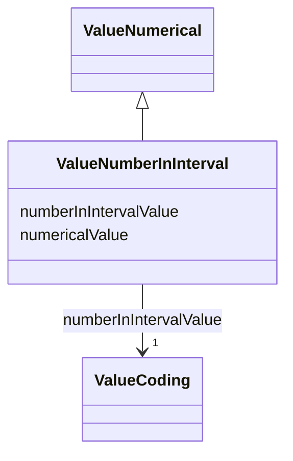

# Class: ValueNumberInInterval 


_A number that falls within a specified interval, with a coding for the value._


URI: [datamodel:ValueNumberInInterval](https://w3id.org/faqir/datamodel/ValueNumberInInterval)





## Inheritance
* [ValueNumerical](ValueNumerical.md)
    * **ValueNumberInInterval**


## Slots

| Name | Cardinality and Range | Description | Inheritance |
| ---  | --- | --- | --- |
| [numberInIntervalValue](numberInIntervalValue.md) | 1 <br/> [ValueCoding](ValueCoding.md) | The actual number that falls within the specified interval | direct |
| [numericalValue](numericalValue.md) | 1 <br/> [Decimal](Decimal.md) | The quantitative value, which can be an integer or a float | [ValueNumerical](ValueNumerical.md) |


## Identifier and Mapping Information


### Schema Source


* from schema: https://w3id.org/faqir/datamodel


## Mappings

| Mapping Type | Mapped Value |
| ---  | ---  |
| self | datamodel:ValueNumberInInterval |
| native | https://w3id.org/faqir/datamodel/ValueNumberInInterval |


## LinkML Source

<!-- TODO: investigate https://stackoverflow.com/questions/37606292/how-to-create-tabbed-code-blocks-in-mkdocs-or-sphinx -->

### Direct

<details>
```yaml
name: ValueNumberInInterval
description: A number that falls within a specified interval, with a coding for the
  value.
from_schema: https://w3id.org/faqir/datamodel
is_a: ValueNumerical
attributes:
  numberInIntervalValue:
    name: numberInIntervalValue
    description: The actual number that falls within the specified interval.
    from_schema: https://w3id.org/faqir/datamodel/core/types
    rank: 1000
    domain_of:
    - ValueNumberInInterval
    range: ValueCoding
    required: true
class_uri: datamodel:ValueNumberInInterval

```
</details>

### Induced

<details>
```yaml
name: ValueNumberInInterval
description: A number that falls within a specified interval, with a coding for the
  value.
from_schema: https://w3id.org/faqir/datamodel
is_a: ValueNumerical
attributes:
  numberInIntervalValue:
    name: numberInIntervalValue
    description: The actual number that falls within the specified interval.
    from_schema: https://w3id.org/faqir/datamodel/core/types
    rank: 1000
    alias: numberInIntervalValue
    owner: ValueNumberInInterval
    domain_of:
    - ValueNumberInInterval
    range: ValueCoding
    required: true
  numericalValue:
    name: numericalValue
    description: The quantitative value, which can be an integer or a float.
    from_schema: https://w3id.org/faqir/datamodel/core/types
    rank: 1000
    alias: numericalValue
    owner: ValueNumberInInterval
    domain_of:
    - ValueNumerical
    range: decimal
    required: true
class_uri: datamodel:ValueNumberInInterval

```
</details>