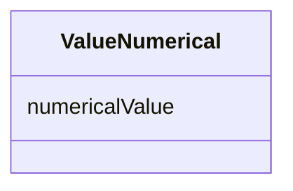

# Class: ValueNumerical 


URI: [phro:ValueNumerical](https://ns.faqir.org/phr-o#ValueNumerical)





<!-- no inheritance hierarchy -->


## Slots

| Name | Cardinality and Range | Description | Inheritance |
| ---  | --- | --- | --- |
| [numericalValue](numericalValue.md) | 1 <br/> [Decimal](Decimal.md) | The quantitative value, which can be an integer or a float | direct |


## Usages

| used by | used in | type | used |
| ---  | --- | --- | --- |
| [QoAnswer](QoAnswer.md) | [qo_answerValue](qo_answerValue.md) | any_of[range] | [ValueNumerical](ValueNumerical.md) |


## Identifier and Mapping Information


### Schema Source


* from schema: https://ns.faqir.org/q-o


## Mappings

| Mapping Type | Mapped Value |
| ---  | ---  |
| self | phro:ValueNumerical |
| native | qo:ValueNumerical |


## LinkML Source

<!-- TODO: investigate https://stackoverflow.com/questions/37606292/how-to-create-tabbed-code-blocks-in-mkdocs-or-sphinx -->

### Direct

<details>
```yaml
name: ValueNumerical
description: ''
from_schema: https://ns.faqir.org/q-o
attributes:
  numericalValue:
    name: numericalValue
    description: The quantitative value, which can be an integer or a float.
    from_schema: https://ns.faqir.org/q-o
    rank: 1000
    slot_uri: phro:numericalValue
    domain_of:
    - ValueNumerical
    range: decimal
    required: true
class_uri: phro:ValueNumerical

```
</details>

### Induced

<details>
```yaml
name: ValueNumerical
description: ''
from_schema: https://ns.faqir.org/q-o
attributes:
  numericalValue:
    name: numericalValue
    description: The quantitative value, which can be an integer or a float.
    from_schema: https://ns.faqir.org/q-o
    rank: 1000
    slot_uri: phro:numericalValue
    alias: numericalValue
    owner: ValueNumerical
    domain_of:
    - ValueNumerical
    range: decimal
    required: true
class_uri: phro:ValueNumerical

```
</details>