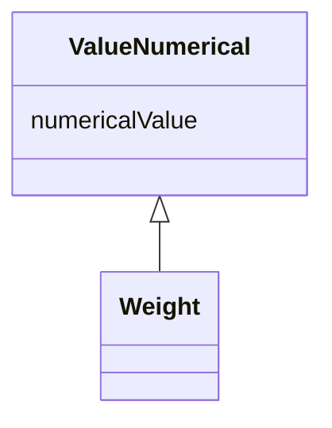

# Class: ValueNumerical 


_Base class for quantitative values, they may have units and precision._


URI: [faqir:ValueNumerical](https://faqir.org/datamodel/ValueNumerical)





## Inheritance
* **ValueNumerical**
    * [Weight](Weight.md)


## Slots

| Name | Cardinality and Range | Description | Inheritance |
| ---  | --- | --- | --- |
| [numericalValue](numericalValue.md) | 1 <br/> [Decimal](Decimal.md) | The quantitative value, which can be an integer or a float | direct |


## Usages

| used by | used in | type | used |
| ---  | --- | --- | --- |
| [Answer](Answer.md) | [answerValueNumerical](answerValueNumerical.md) | range | [ValueNumerical](ValueNumerical.md) |
| [ScoreParameter](ScoreParameter.md) | [scoreParameterValueNumerical](scoreParameterValueNumerical.md) | range | [ValueNumerical](ValueNumerical.md) |
| [ScoreValue](ScoreValue.md) | [scoreValueNumerical](scoreValueNumerical.md) | range | [ValueNumerical](ValueNumerical.md) |


## Identifier and Mapping Information


### Schema Source


* from schema: https://w3id.org/faqir/datamodel


## Mappings

| Mapping Type | Mapped Value |
| ---  | ---  |
| self | faqir:ValueNumerical |
| native | https://w3id.org/faqir/datamodel/ValueNumerical |


## LinkML Source

<!-- TODO: investigate https://stackoverflow.com/questions/37606292/how-to-create-tabbed-code-blocks-in-mkdocs-or-sphinx -->

### Direct

<details>
```yaml
name: ValueNumerical
description: Base class for quantitative values, they may have units and precision.
from_schema: https://w3id.org/faqir/datamodel
attributes:
  numericalValue:
    name: numericalValue
    description: The quantitative value, which can be an integer or a float.
    from_schema: https://w3id.org/faqir/datamodel/core/types
    rank: 1000
    domain_of:
    - ValueNumerical
    range: decimal
    required: true
class_uri: faqir:ValueNumerical

```
</details>

### Induced

<details>
```yaml
name: ValueNumerical
description: Base class for quantitative values, they may have units and precision.
from_schema: https://w3id.org/faqir/datamodel
attributes:
  numericalValue:
    name: numericalValue
    description: The quantitative value, which can be an integer or a float.
    from_schema: https://w3id.org/faqir/datamodel/core/types
    rank: 1000
    alias: numericalValue
    owner: ValueNumerical
    domain_of:
    - ValueNumerical
    range: decimal
    required: true
class_uri: faqir:ValueNumerical

```
</details>