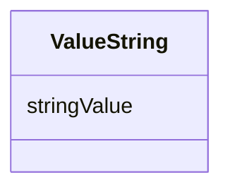

# Class: ValueString 


_A string value, typically used for text or identifiers._


URI: [faqir:ValueString](https://faqir.org/datamodel/ValueString)





<!-- no inheritance hierarchy -->


## Slots

| Name | Cardinality and Range | Description | Inheritance |
| ---  | --- | --- | --- |
| [stringValue](stringValue.md) | 1 <br/> [String](String.md) | The string value, which can be any text | direct |


## Usages

| used by | used in | type | used |
| ---  | --- | --- | --- |
| [Answer](Answer.md) | [answerValueString](answerValueString.md) | range | [ValueString](ValueString.md) |
| [ScoreValue](ScoreValue.md) | [scoreValueString](scoreValueString.md) | range | [ValueString](ValueString.md) |


## Identifier and Mapping Information


### Schema Source


* from schema: https://w3id.org/faqir/datamodel


## Mappings

| Mapping Type | Mapped Value |
| ---  | ---  |
| self | faqir:ValueString |
| native | https://w3id.org/faqir/datamodel/ValueString |
| undefined | xsd:string |


## LinkML Source

<!-- TODO: investigate https://stackoverflow.com/questions/37606292/how-to-create-tabbed-code-blocks-in-mkdocs-or-sphinx -->

### Direct

<details>
```yaml
name: ValueString
description: A string value, typically used for text or identifiers.
from_schema: https://w3id.org/faqir/datamodel
mappings:
- xsd:string
attributes:
  stringValue:
    name: stringValue
    description: The string value, which can be any text.
    from_schema: https://w3id.org/faqir/datamodel/core/types
    rank: 1000
    domain_of:
    - ValueString
    range: string
    required: true
class_uri: faqir:ValueString

```
</details>

### Induced

<details>
```yaml
name: ValueString
description: A string value, typically used for text or identifiers.
from_schema: https://w3id.org/faqir/datamodel
mappings:
- xsd:string
attributes:
  stringValue:
    name: stringValue
    description: The string value, which can be any text.
    from_schema: https://w3id.org/faqir/datamodel/core/types
    rank: 1000
    alias: stringValue
    owner: ValueString
    domain_of:
    - ValueString
    range: string
    required: true
class_uri: faqir:ValueString

```
</details>