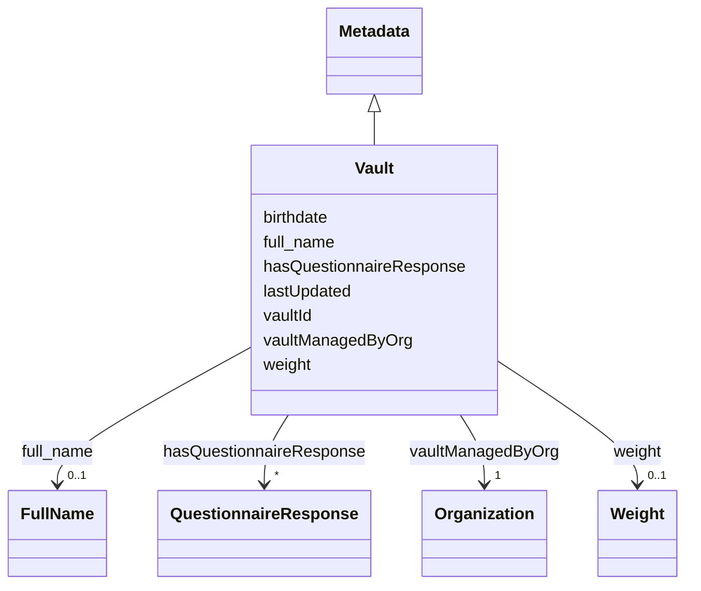

# Class: Vault 


_The FAQIR healthdata vault._


URI: [faqir:vault](https://faqir.org/datamodel/vault)





## Inheritance
* [Metadata](Metadata.md)
    * **Vault**


## Slots

| Name | Cardinality and Range | Description | Inheritance |
| ---  | --- | --- | --- |
| [hasQuestionnaireResponse](hasQuestionnaireResponse.md) | * <br/> [QuestionnaireResponse](QuestionnaireResponse.md) | QuestionnaireResponse authored by this vault's user | direct |
| [vaultManagedByOrg](vaultManagedByOrg.md) | 1 <br/> [Organization](Organization.md) | Organization managing this vault | direct |
| [vaultId](vaultId.md) | 1 <br/> [Uriorcurie](Uriorcurie.md) | The unique identifier for a vault | direct |
| [birthdate](birthdate.md) | 0..1 <br/> [Datetime](Datetime.md) | The date of birth | direct |
| [weight](weight.md) | 0..1 <br/> [Weight](Weight.md) | The weight of the vault's user | direct |
| [full_name](full_name.md) | 0..1 <br/> [FullName](FullName.md) | The full name of the vault's user | direct |
| [lastUpdated](lastUpdated.md) | 1 <br/> [Datetime](Datetime.md) | The date and time when the entity was last updated | [Metadata](Metadata.md) |


## Usages

| used by | used in | type | used |
| ---  | --- | --- | --- |
| [Vault](Vault.md) | [hasQuestionnaireResponse](hasQuestionnaireResponse.md) | domain | [Vault](Vault.md) |
| [Vault](Vault.md) | [vaultManagedByOrg](vaultManagedByOrg.md) | domain | [Vault](Vault.md) |
| [Organization](Organization.md) | [organizationManagesVault](organizationManagesVault.md) | range | [Vault](Vault.md) |
| [QuestionnaireResponse](QuestionnaireResponse.md) | [questionnaireResponseBySubject](questionnaireResponseBySubject.md) | range | [Vault](Vault.md) |


## Identifier and Mapping Information


### Schema Source


* from schema: https://w3id.org/faqir/datamodel


## Mappings

| Mapping Type | Mapped Value |
| ---  | ---  |
| self | faqir:vault |
| native | https://w3id.org/faqir/datamodel/Vault |


## LinkML Source

<!-- TODO: investigate https://stackoverflow.com/questions/37606292/how-to-create-tabbed-code-blocks-in-mkdocs-or-sphinx -->

### Direct

<details>
```yaml
name: Vault
description: The FAQIR healthdata vault.
from_schema: https://w3id.org/faqir/datamodel
is_a: Metadata
slots:
- hasQuestionnaireResponse
- vaultManagedByOrg
attributes:
  vaultId:
    name: vaultId
    description: The unique identifier for a vault.
    from_schema: https://w3id.org/faqir/datamodel/vault
    rank: 1000
    identifier: true
    domain_of:
    - Vault
    range: uriorcurie
    required: true
  birthdate:
    name: birthdate
    description: The date of birth.
    from_schema: https://w3id.org/faqir/datamodel/vault
    rank: 1000
    domain_of:
    - Vault
    range: datetime
  weight:
    name: weight
    description: The weight of the vault's user.
    from_schema: https://w3id.org/faqir/datamodel/vault
    rank: 1000
    domain_of:
    - Vault
    range: Weight
  full_name:
    name: full_name
    description: The full name of the vault's user.
    from_schema: https://w3id.org/faqir/datamodel/vault
    rank: 1000
    domain_of:
    - Vault
    range: FullName
class_uri: faqir:vault

```
</details>

### Induced

<details>
```yaml
name: Vault
description: The FAQIR healthdata vault.
from_schema: https://w3id.org/faqir/datamodel
is_a: Metadata
attributes:
  vaultId:
    name: vaultId
    description: The unique identifier for a vault.
    from_schema: https://w3id.org/faqir/datamodel/vault
    rank: 1000
    identifier: true
    alias: vaultId
    owner: Vault
    domain_of:
    - Vault
    range: uriorcurie
    required: true
  birthdate:
    name: birthdate
    description: The date of birth.
    from_schema: https://w3id.org/faqir/datamodel/vault
    rank: 1000
    alias: birthdate
    owner: Vault
    domain_of:
    - Vault
    range: datetime
  weight:
    name: weight
    description: The weight of the vault's user.
    from_schema: https://w3id.org/faqir/datamodel/vault
    rank: 1000
    alias: weight
    owner: Vault
    domain_of:
    - Vault
    range: Weight
  full_name:
    name: full_name
    description: The full name of the vault's user.
    from_schema: https://w3id.org/faqir/datamodel/vault
    rank: 1000
    alias: full_name
    owner: Vault
    domain_of:
    - Vault
    range: FullName
  hasQuestionnaireResponse:
    name: hasQuestionnaireResponse
    description: QuestionnaireResponse authored by this vault's user.
    from_schema: https://w3id.org/faqir/datamodel
    rank: 1000
    domain: Vault
    alias: hasQuestionnaireResponse
    owner: Vault
    domain_of:
    - Vault
    inverse: questionnaireResponseBySubject
    range: QuestionnaireResponse
    required: false
    multivalued: true
  vaultManagedByOrg:
    name: vaultManagedByOrg
    description: Organization managing this vault.
    from_schema: https://w3id.org/faqir/datamodel
    rank: 1000
    domain: Vault
    alias: vaultManagedByOrg
    owner: Vault
    domain_of:
    - Vault
    inverse: organizationManagesVault
    range: Organization
    required: true
    multivalued: false
  lastUpdated:
    name: lastUpdated
    description: The date and time when the entity was last updated.
    from_schema: https://w3id.org/faqir/datamodel/core/versions
    rank: 1000
    alias: lastUpdated
    owner: Vault
    domain_of:
    - Metadata
    range: datetime
    required: true
class_uri: faqir:vault

```
</details>