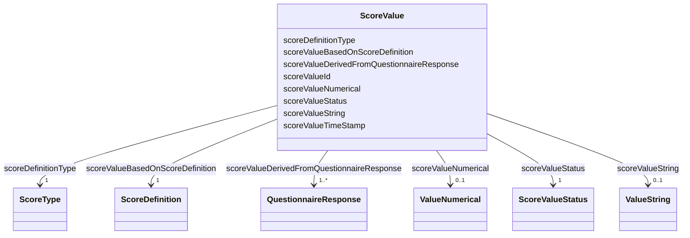

# Class: ScoreValue 


_The score value calculated from a QuestionnaireResponse following a ScoreDefinition._


URI: [faqir:ScoreValue](https://faqir.org/datamodel/ScoreValue)





<!-- no inheritance hierarchy -->


## Slots

| Name | Cardinality and Range | Description | Inheritance |
| ---  | --- | --- | --- |
| [scoreDefinitionType](scoreDefinitionType.md) | 1 <br/> [ScoreType](ScoreType.md) | Type of score: numerical_continuous, numerical_integer, numerical_percentage,... | direct |
| [scoreValueBasedOnScoreDefinition](scoreValueBasedOnScoreDefinition.md) | 1 <br/> [ScoreDefinition](ScoreDefinition.md) | The ScoreDefinition that this ScoreValue is based on | direct |
| [scoreValueDerivedFromQuestionnaireResponse](scoreValueDerivedFromQuestionnaireResponse.md) | 1..* <br/> [QuestionnaireResponse](QuestionnaireResponse.md) | The QuestionnaireResponse that contains the answers this ScoreValue is calcul... | direct |
| [scoreValueId](scoreValueId.md) | 1 <br/> [Uriorcurie](Uriorcurie.md) | Unique identifier for the score value | direct |
| [scoreValueString](scoreValueString.md) | 0..1 <br/> [ValueString](ValueString.md) | String representation of the score value, used for categorical scores | direct |
| [scoreValueNumerical](scoreValueNumerical.md) | 0..1 <br/> [ValueNumerical](ValueNumerical.md) | Numerical value of the score, used for numerical scores | direct |
| [scoreValueTimeStamp](scoreValueTimeStamp.md) | 1 <br/> [Datetime](Datetime.md) | Timestamp when the score value was calculated | direct |
| [scoreValueStatus](scoreValueStatus.md) | 1 <br/> [ScoreValueStatus](ScoreValueStatus.md) | Status of the score value, e | direct |


## Usages

| used by | used in | type | used |
| ---  | --- | --- | --- |
| [QuestionnaireResponse](QuestionnaireResponse.md) | [questionnaireResponseHasDerivedScoreValue](questionnaireResponseHasDerivedScoreValue.md) | range | [ScoreValue](ScoreValue.md) |
| [ScoreDefinition](ScoreDefinition.md) | [scoreDefinitionHasScoreValue](scoreDefinitionHasScoreValue.md) | range | [ScoreValue](ScoreValue.md) |
| [ScoreValue](ScoreValue.md) | [scoreValueBasedOnScoreDefinition](scoreValueBasedOnScoreDefinition.md) | domain | [ScoreValue](ScoreValue.md) |
| [ScoreValue](ScoreValue.md) | [scoreValueDerivedFromQuestionnaireResponse](scoreValueDerivedFromQuestionnaireResponse.md) | domain | [ScoreValue](ScoreValue.md) |


## Identifier and Mapping Information


### Schema Source


* from schema: https://w3id.org/faqir/datamodel


## Mappings

| Mapping Type | Mapped Value |
| ---  | ---  |
| self | faqir:ScoreValue |
| native | https://w3id.org/faqir/datamodel/ScoreValue |


## LinkML Source

<!-- TODO: investigate https://stackoverflow.com/questions/37606292/how-to-create-tabbed-code-blocks-in-mkdocs-or-sphinx -->

### Direct

<details>
```yaml
name: ScoreValue
description: The score value calculated from a QuestionnaireResponse following a ScoreDefinition.
from_schema: https://w3id.org/faqir/datamodel
slots:
- scoreDefinitionType
- scoreValueBasedOnScoreDefinition
- scoreValueDerivedFromQuestionnaireResponse
attributes:
  scoreValueId:
    name: scoreValueId
    description: Unique identifier for the score value.
    from_schema: https://w3id.org/faqir/datamodel/questionnaire/classes
    rank: 1000
    identifier: true
    domain_of:
    - ScoreValue
    range: uriorcurie
    required: true
  scoreValueString:
    name: scoreValueString
    description: String representation of the score value, used for categorical scores.
    from_schema: https://w3id.org/faqir/datamodel/questionnaire/classes
    rank: 1000
    domain_of:
    - ScoreValue
    range: ValueString
    required: false
  scoreValueNumerical:
    name: scoreValueNumerical
    description: Numerical value of the score, used for numerical scores.
    from_schema: https://w3id.org/faqir/datamodel/questionnaire/classes
    rank: 1000
    domain_of:
    - ScoreValue
    range: ValueNumerical
    required: false
  scoreValueTimeStamp:
    name: scoreValueTimeStamp
    description: Timestamp when the score value was calculated.
    from_schema: https://w3id.org/faqir/datamodel/questionnaire/classes
    rank: 1000
    domain_of:
    - ScoreValue
    range: datetime
    required: true
  scoreValueStatus:
    name: scoreValueStatus
    description: Status of the score value, e.g., draft, final.
    from_schema: https://w3id.org/faqir/datamodel/questionnaire/classes
    rank: 1000
    domain_of:
    - ScoreValue
    range: ScoreValueStatus
    required: true
class_uri: faqir:ScoreValue
rules:
- preconditions:
    slot_conditions:
      scoreDefinitionType:
        name: scoreDefinitionType
        equals_string_in:
        - categorical
  postconditions:
    slot_conditions:
      scoreValueString:
        name: scoreValueString
        required: true
  description: If scoreDefinitionType is 'categorical', scoreValueString is required.
- preconditions:
    slot_conditions:
      scoreDefinitionType:
        name: scoreDefinitionType
        equals_string_in:
        - numerical_continuous
        - numerical_integer
        - numerical_percentage
        - numerical_z_score
        - numerical_t_score
  postconditions:
    slot_conditions:
      scoreValueNumerical:
        name: scoreValueNumerical
        required: true
  description: If scoreDefinitionType is 'numerical_continuous', 'numerical_integer',
    'numerical_percentage', 'numerical_z_score' or 'numerical_t_score', scoreValueNumerical
    is required.

```
</details>

### Induced

<details>
```yaml
name: ScoreValue
description: The score value calculated from a QuestionnaireResponse following a ScoreDefinition.
from_schema: https://w3id.org/faqir/datamodel
attributes:
  scoreValueId:
    name: scoreValueId
    description: Unique identifier for the score value.
    from_schema: https://w3id.org/faqir/datamodel/questionnaire/classes
    rank: 1000
    identifier: true
    alias: scoreValueId
    owner: ScoreValue
    domain_of:
    - ScoreValue
    range: uriorcurie
    required: true
  scoreValueString:
    name: scoreValueString
    description: String representation of the score value, used for categorical scores.
    from_schema: https://w3id.org/faqir/datamodel/questionnaire/classes
    rank: 1000
    alias: scoreValueString
    owner: ScoreValue
    domain_of:
    - ScoreValue
    range: ValueString
    required: false
  scoreValueNumerical:
    name: scoreValueNumerical
    description: Numerical value of the score, used for numerical scores.
    from_schema: https://w3id.org/faqir/datamodel/questionnaire/classes
    rank: 1000
    alias: scoreValueNumerical
    owner: ScoreValue
    domain_of:
    - ScoreValue
    range: ValueNumerical
    required: false
  scoreValueTimeStamp:
    name: scoreValueTimeStamp
    description: Timestamp when the score value was calculated.
    from_schema: https://w3id.org/faqir/datamodel/questionnaire/classes
    rank: 1000
    alias: scoreValueTimeStamp
    owner: ScoreValue
    domain_of:
    - ScoreValue
    range: datetime
    required: true
  scoreValueStatus:
    name: scoreValueStatus
    description: Status of the score value, e.g., draft, final.
    from_schema: https://w3id.org/faqir/datamodel/questionnaire/classes
    rank: 1000
    alias: scoreValueStatus
    owner: ScoreValue
    domain_of:
    - ScoreValue
    range: ScoreValueStatus
    required: true
  scoreDefinitionType:
    name: scoreDefinitionType
    description: 'Type of score: numerical_continuous, numerical_integer, numerical_percentage,
      numerical_z_score, numerical_t_score or categorical. Determines valid score
      values.'
    from_schema: https://w3id.org/faqir/datamodel
    rank: 1000
    slot_uri: faqir:scoreDefinitionType
    alias: scoreDefinitionType
    owner: ScoreValue
    domain_of:
    - ScoreDefinition
    - ScoreValue
    range: ScoreType
    required: true
  scoreValueBasedOnScoreDefinition:
    name: scoreValueBasedOnScoreDefinition
    description: The ScoreDefinition that this ScoreValue is based on.
    from_schema: https://w3id.org/faqir/datamodel
    rank: 1000
    domain: ScoreValue
    slot_uri: faqir:scoreValueBasedOnScoreDefinition
    alias: scoreValueBasedOnScoreDefinition
    owner: ScoreValue
    domain_of:
    - ScoreValue
    inverse: scoreDefinitionHasScoreValue
    range: ScoreDefinition
    required: true
    multivalued: false
  scoreValueDerivedFromQuestionnaireResponse:
    name: scoreValueDerivedFromQuestionnaireResponse
    description: The QuestionnaireResponse that contains the answers this ScoreValue
      is calculated from.
    from_schema: https://w3id.org/faqir/datamodel
    rank: 1000
    domain: ScoreValue
    slot_uri: faqir:scoreValueDerivedFromQuestionnaireResponse
    alias: scoreValueDerivedFromQuestionnaireResponse
    owner: ScoreValue
    domain_of:
    - ScoreValue
    inverse: questionnaireResponseHasDerivedScoreValue
    range: QuestionnaireResponse
    required: true
    multivalued: true
class_uri: faqir:ScoreValue
rules:
- preconditions:
    slot_conditions:
      scoreDefinitionType:
        name: scoreDefinitionType
        equals_string_in:
        - categorical
  postconditions:
    slot_conditions:
      scoreValueString:
        name: scoreValueString
        required: true
  description: If scoreDefinitionType is 'categorical', scoreValueString is required.
- preconditions:
    slot_conditions:
      scoreDefinitionType:
        name: scoreDefinitionType
        equals_string_in:
        - numerical_continuous
        - numerical_integer
        - numerical_percentage
        - numerical_z_score
        - numerical_t_score
  postconditions:
    slot_conditions:
      scoreValueNumerical:
        name: scoreValueNumerical
        required: true
  description: If scoreDefinitionType is 'numerical_continuous', 'numerical_integer',
    'numerical_percentage', 'numerical_z_score' or 'numerical_t_score', scoreValueNumerical
    is required.

```
</details>